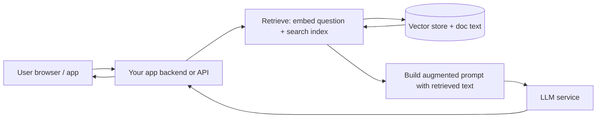

# Recovered chat transcript — Testing RAG / Elastic / ELSER

Source: Cursor agent transcript `5dff9490-59f3-40d9-8ed4-65f272829d07`

---

## Turn 1 — **You:**

RAG: I understrand the basic concept. But I don't know how to test the experience. Ihave my Mac. I have public repository clone (Elastic documentation). 

What I can do to test RAG?.. simple but an eye-opener end-to-end experience>

---

## Turn 2 — **Assistant:**

Checking your repo structure so we can tailor a minimal end-to-end RAG path to your Elastic docs clone.

[REDACTED]

---

## Turn 3 — **Assistant:**

You already have ideal RAG fuel: lots of clean Markdown in `docs-content`. Here is a **small, end-to-end** way to *feel* RAG on your Mac without building a product.

## What “testing RAG” actually means

You are checking three things at once:

1. **Retrieval** — Does the right passage show up in the top few chunks for your question?  
2. **Grounding** — Does the model stick to those passages (and cite them), or drift?  
3. **Failure modes** — Empty retrieval, wrong topic, outdated path, “confident nonsense.”

If you only call an LLM with no retrieval, you are not testing RAG; you are testing a chat model.

## A simple but eye-opening loop (half a day, mostly copy-paste)

**1. Shrink the corpus on purpose**  
Index **one subtree** first, for example only `get-started/` or only `reference/fleet/` (still many files, but bounded). Full-repo search teaches scaling, not intuition.

**2. Build the smallest real pipeline**  
On a Mac, the path of least resistance is usually:

- Walk `.md` files in that folder.  
- **Chunk** (e.g. 500–1000 tokens with overlap, or split on headings).  
- **Embed** chunks (local: Ollama + an embedding model, or Python `sentence-transformers`; or a hosted embeddings API if you use one).  
- **Store** vectors (Chroma, LanceDB, or FAISS — any is fine for learning).  
- **Query**: embed the question → **top-k** (e.g. k=5) → concatenate chunk text into the prompt → LLM answers **only using that context** and lists **which file/heading** each claim came from.

You do not need Elasticsearch itself to learn RAG; a notebook or 80-line script is enough. (Using Elasticsearch as the vector store is a fine “chapter two” once the loop clicks.)

**3. Run three deliberate experiments** (this is the eye-opener)

| Experiment | What you do | What you learn |
|------------|-------------|----------------|
| **A. In-corpus** | Ask something clearly answered in an indexed page (e.g. a Fleet install detail if you indexed `reference/fleet/`). | When retrieval works, answers feel “surgical” and match the docs. |
| **B. Out-of-corpus** | Ask something **not** in your indexed folder (or disable retrieval and use the same prompt). | You see hallucination or hedging; RAG’s value is obvious when you turn retrieval back on. |
| **C. Citations / trace** | Print the **top-k chunks** next to the answer every time. | You catch bad RAG early: right-sounding answers built from the **wrong** chunk. |

**4. One metric that matters before “accuracy”**  
For a handful of questions you care about, manually mark “the gold chunk exists in top-5?” If that fails, **better prompts won’t fix it** — you need chunking, metadata (path, product, version), or query rewriting.

## Why your Elastic clone is a good playground

Pages are standalone Markdown under clear paths (e.g. `deploy-manage/...`, `reference/fleet/...`). Putting the **file path** into each chunk’s metadata makes citations readable and debugging fast.

## Minimal tooling bias

- **All-local, no API keys**: Ollama (chat + embeddings) + a tiny vector store in Python.  
- **Fastest “product-shaped” demo**: LlamaIndex or LangChain tutorials that ingest a folder of Markdown — swap their sample docs for one subdirectory of this repo.

If you tell me whether you prefer **100% local (Ollama)** or **one API key (OpenAI-style)**, I can outline an exact folder layout and a minimal Python script tailored to that choice (still without dumping a giant project into your repo unless you want it).

[REDACTED]

---

## Turn 4 — **You:**

If you guide me I am willing to give this a try. Note the following:
* I am not a developer but need to learn how AI integrates with technical writing
* I am not familiar with Elastic. But I have explored fundamentals https://www.elastic.co/docs/get-started  and explored Elasticsearch, Observability, and Security quickstarts in https://www.elastic.co/docs/solutions . I am trying to get a job (technical writer or mgr) at Elastic. 

Does this help? should we try the simple RAG experince?

---

## Turn 5 — **Assistant:**

Yes, it helps a lot — and yes, trying a **simple RAG experiment** is worth it for your goals, with one important reframe.

## Why your situation is a good fit

RAG is not mainly a coding story. It is a **documentation and information architecture** story:

- Someone turns your pages into **chunks** (what counts as one “passage”?).
- A question becomes a **search** over those chunks.
- The model’s job is to **summarize and connect** what was retrieved — not to invent product facts from memory.

As a technical writer (or manager), the skills that matter are exactly yours: **structure, clarity, consistency, metadata (titles, products, versions), and knowing when an answer is unsupported.** A tiny RAG demo makes that concrete in a way reading blog posts does not.

Your Elastic fundamentals and solutions orientation is enough “domain” to ask sensible questions and judge whether the system is **grounded** vs **smooth but wrong**. The [Elastic fundamentals](https://www.elastic.co/docs/get-started) hub and [Solutions and use cases](https://www.elastic.co/docs/solutions) overview are the right mental map for what the docs corpus is trying to organize.

## What I suggest you try (simple, end-to-end, low code)

**Goal for one afternoon:** Ask 5–10 questions against a **small folder** of your local clone (for example only `get-started/` in `docs-content`), and for each answer **always look at the retrieved passages** the system used — not only the polished answer.

**The eye-opener:** Run the **same question twice** — once with retrieval **on** and once **off** (or with retrieval pointed at the wrong folder). You will see why companies care about **citations, chunk boundaries, and “we don’t have that in the indexed docs.”**

**Low-friction tooling on a Mac (pick one):**

1. **Notebook Assistant route (least “developer”):** Use something like **Google Colab** or **Jupyter** with a short tutorial that ingests a folder of Markdown and does retrieval + generation. You mostly run cells in order and change the folder path to your clone’s `get-started/` (or similar). You learn the pipeline without maintaining a project.

2. **Local, no API keys:** Install **[Ollama](https://ollama.com)** on your Mac, pull a small chat model and an embedding model, and follow any “RAG on your files” quickstart that uses a **small** vector store. Same workflow: index one subtree, ask questions, **inspect retrieved chunks**.

If you hit a wall installing things, stopping after **“I successfully indexed 20–50 pages and I can see the top 5 chunks for each question”** is already a win — generation is optional for learning retrieval.

## How this ties to Elastic specifically (useful for interviews)

You can speak from experience about:

- **Grounding and risk:** When answers sound good but the cited chunk does not support them.
- **Doc design for AI:** Headings, self-contained sections, explicit product/deployment scope (you already see that pattern in published docs like the fundamentals page).
- **Ops reality:** Freshness, versioning, and **what is not in the corpus** matter as much as model choice.

You do not need deep Elasticsearch internals to discuss that credibly.

## Should “we” try it?

If you want to proceed **here in chat**, say which you prefer:

- **A)** Colab / Jupyter (copy-paste cells, minimal install on the Mac), or  
- **B)** Ollama-only on the Mac (all local).

Reply with **A or B**, and whether you are okay using a **free cloud notebook** (simplest) or you want **everything local**. I will give you a **step-by-step checklist** (including exactly which subfolder of your `docs-content` clone to use first and which 5 questions to ask) sized for a non-developer first run.

[REDACTED]

---

## Turn 6 — **You:**

OK... let us give this a try. I have not use Jupyter but I have some familiarity. And I am not familiar with Ollama.

---

## Turn 7 — **Assistant:**

Creating a single Jupyter notebook you can run locally: retrieval with small dependencies, plus optional local generation via Ollama (clearly marked). Checking the repo for a sensible place to add it.

[REDACTED]

---

## Turn 8 — **Assistant:**

Adding a small `learning-rag` folder with one notebook: retrieval works after `pip install`; Ollama is optional for the final “answer” step.

[REDACTED]

---

## Turn 9 — **Assistant:**

Making path detection robust whether Jupyter is started from the repo root or from `learning-rag`.

[REDACTED]

---

## Turn 10 — **Assistant:**

Here is a concrete way to run the experiment on your Mac.

## What was added

In your clone:

- [`learning-rag/minimal-rag-on-elastic-docs.ipynb`](file:///Users/mohan/repos/docs-content/learning-rag/minimal-rag-on-elastic-docs.ipynb) — walkthrough: install → index `get-started/` → retrieve → build a RAG-style prompt → optional Ollama answer  
- [`learning-rag/requirements.txt`](file:///Users/mohan/repos/docs-content/learning-rag/requirements.txt) — dependencies  
- [`learning-rag/.gitignore`](file:///Users/mohan/repos/docs-content/learning-rag/.gitignore) — ignores `chroma_rag_demo/`, `.venv/`, checkpoints so you do not commit the vector DB

The notebook finds the repo root by walking up from the current working directory until it sees `get-started/` and `README.md`, so you can start Jupyter from the repo root or from `learning-rag`.

## What you do (first time)

1. **Open Terminal** and run:

```bash
cd /Users/mohan/repos/docs-content/learning-rag
python3 -m venv .venv
source .venv/bin/activate
pip install -r requirements.txt
jupyter notebook minimal-rag-on-elastic-docs.ipynb
```

(If `jupyter` is not found, use `python3 -m jupyter notebook ...` instead.)

2. In the notebook, **run cells from top to bottom** on the first run. The first run downloads the embedding model and builds `chroma_rag_demo/` (may take several minutes).

3. **Focus on section 5** — the ranked chunks and `source` paths. That is the “R” in RAG.

4. **Section 6** prints a full prompt. If you skip Ollama, copy that block into any chat UI and compare the reply to the chunks.

5. **Ollama (optional):** Install from [ollama.com](https://ollama.com), run the app, then in Terminal: `ollama pull llama3.2`, and run section 7. If it errors, retrieval + prompt alone are still enough for the exercise.

## License

The repo is **CC BY-NC-ND**; use this for **personal learning** and avoid republishing large doc excerpts outside what the license allows.

## If something breaks

- **`assert CORPUS_SUBDIR`** fails → you are not inside the `docs-content` clone (or paths are wrong). `cd` to the clone and open the notebook again.  
- **Slow or large downloads** → `sentence-transformers` pulls PyTorch; first install is normal to be heavy.  
- **Want a smaller corpus** → lower `MAX_FILES` in section 2 (e.g. `15`).

When you have run through section 5 once, say what you saw (e.g. whether the top chunk matched your question), and we can tune chunk size, `TOP_K`, or point the corpus at `reference/fleet` for the “out of scope” experiment from the notebook.

[REDACTED]

---

## Turn 11 — **You:**

I am done with step 1, working on step 2.

NOTE: All this is happening on my person Mac (M5)

---

## Turn 12 — **Assistant:**

Step 2 in the notebook is the short **configuration cell**: it sets `REPO_ROOT`, `CORPUS_SUBDIR` (`get-started`), and `MAX_FILES`, then checks that `get-started` exists.

**On your M5 Mac:** the same stack (Python, Chroma, `sentence-transformers` / PyTorch) is normal on Apple Silicon. Nothing special is required for M5 beyond a recent Python (3.10+). First-time indexing can make the machine warm and take a few minutes; that is expected.

**Quick checks while you work through step 2:**

1. After you run that cell, you should see something like:  
   `Indexing under: /Users/mohan/repos/docs-content/get-started`  
   If the path looks wrong, say what printed.

2. If the **`assert`** fails (`Missing folder`), Jupyter’s current folder is probably not inside your clone. Fix: in the notebook, add one line **temporarily** at the top of that cell (or run in a new cell first):

```python
import os
os.chdir("/Users/mohan/repos/docs-content/learning-rag")
```

Then re-run the step 2 cell so `find_repo_root()` can walk up and find `get-started`.

3. **Optional override** if you ever want to skip auto-detection:

```python
from pathlib import Path
REPO_ROOT = Path("/Users/mohan/repos/docs-content")
CORPUS_SUBDIR = REPO_ROOT / "get-started"
MAX_FILES = 50
assert CORPUS_SUBDIR.is_dir()
print("Indexing under:", CORPUS_SUBDIR)
```

When step 2 prints the correct `get-started` path, go on to **step 3** (load/chunk) and **step 4** (embed + Chroma)—that is where time and downloads happen. If anything errors, paste the **full error message** (or a screenshot of the last few lines) and we can narrow it down.

[REDACTED]

---

## Turn 13 — **You:**

Step "7. (Optional) Local answer with Ollama" in the notebook returned the following: 

"Ollama not reachable: <urlopen error [Errno 61] Connection refused>
Skip this cell or install/start Ollama and pull llama3.2"

Is this ok?

---

## Turn 14 — **Assistant:**

Yes, that is OK.

**What it means:** Step 7 tries to talk to Ollama at `http://127.0.0.1:11434`. `Connection refused` means **nothing is listening on that port**—usually the Ollama app is not running, or Ollama is not installed yet. It is not a problem with your notebook or your RAG indexing.

**For the exercise:** Steps 1–6 are the important part (chunk → embed → retrieve → read chunks → copy the prompt). Step 7 is only an extra convenience so the same prompt can be answered **locally** without pasting into a browser chat.

**If you want Step 7 to work later:**

1. Install Ollama from [https://ollama.com](https://ollama.com) and **open the Ollama app** (it should appear in the menu bar).
2. In Terminal: `ollama pull llama3.2` (or another model you prefer; if you use a different name, change `OLLAMA_MODEL` in the notebook cell to match).
3. Confirm it responds: `ollama run llama3.2` then type `/bye` to exit.
4. Run the Step 7 cell again while the app is running.

If you are happy pasting the **BEGIN PROMPT … END PROMPT** block from Step 6 into ChatGPT or another assistant, you can **skip Step 7 entirely** and still call the RAG demo complete.

[REDACTED]

---

## Turn 15 — **You:**

OK. in "What you do (first time)", I completed all steps 1-4. Also completed optional step 5 (Ollama (optional)).

I completed the steps (not sure I understand)

---

## Turn 16 — **Assistant:**

You did complete the flow. Here is what actually happened, in one straight story, without tying it to “step numbers” (the notebook has its own numbering, which is easy to mix up).

## The story in plain language

1. **You chose a slice of the docs**  
   Only `get-started/` (and a limited number of files). That is your **corpus**: everything the system is allowed to “know” for this demo.

2. **You split pages into chunks**  
   Long Markdown files became shorter passages. RAG almost never sends a whole book to the model; it sends **small pieces**. Chunk boundaries matter for technical writing later (headings, self-contained sections, etc.).

3. **You turned each chunk into a vector (embedding)**  
   Each passage became a list of numbers that roughly means “what this passage is about.” Similar meaning → numerically closer in that space.

4. **You saved those vectors in Chroma**  
   That is your **tiny search engine** over meaning, not over exact keywords.

5. **When you typed a question, the notebook did retrieval**  
   It embedded the question the same way, then asked Chroma: “which stored chunks are closest?” Those are the **top results** you saw with **source** paths. That step is the **R** in RAG (retrieval). If the wrong chunks float to the top, any answer built on them will be shaky.

6. **The long “CONTEXT + QUESTION” block is the augmented prompt**  
   The model is not supposed to invent Elastic facts from memory; it is supposed to use **only** that context. That is the **A** in RAG (augmentation): *answer using these passages.*

7. **Ollama (optional)**  
   That was just **one possible “answerer”** running on your Mac. Same prompt could go to ChatGPT in the browser; the important part is still **which chunks were retrieved**.

So yes: you ran an end-to-end **index → retrieve → (generate)** path on real Elastic docs content.

## A simple test of “do I get it?”

If you can answer these in your own words, you understand the demo:

- **What would change if you only indexed 10 files instead of 50?**  
  (Fewer possible chunks; more questions might retrieve nothing useful.)

- **Why did the notebook print the top chunks *before* the answer?**  
  (So you can judge whether retrieval is trustworthy.)

- **If you asked about Fleet but never indexed `reference/fleet/`, what would you expect?**  
  (Weak or wrong retrieval — a corpus / scope problem, not “the AI is dumb.”)

If you want, paste **one** question you used and whether the **top chunk’s `source` file** felt like the right place to answer it; we can interpret that together as a “retrieval worked / didn’t” example.

[REDACTED]

---

## Turn 17 — **You:**

Thanks. Easy questions:
1. The get-started/ data pages -> chunks -> vector (embedding) that gets saved to Chroma. Is this the "domain-specific" data that RAG provides the model access to (as a search engine). Is this the retrieved data that gets passed as augmentation to the model along with the prompt?

---

## Turn 18 — **Assistant:**

Almost exactly right, with one small distinction.

**What lives in Chroma**  
Those pages, after chunking, are turned into embeddings and stored **with the original chunk text** (Chroma keeps both the vector for search and the passage you will show the model). That collection is your **private / corpus-specific knowledge base** for this app. People often call that “domain-specific” when the corpus is your product docs—but strictly speaking it is **whatever you indexed**, not “the whole domain in the world.”

**How the model sees it**  
The model does **not** get the entire Chroma database on each question. It only gets what **retrieval** returns for *that* question: typically the **top‑k** chunks (passages) whose embeddings are closest to the question embedding.

So in one sentence:

- **Chroma** = the **searchable store** of all those chunks (your “search engine over the corpus”).  
- **Augmentation** = the **retrieved** top‑k passages from that store, pasted into the prompt together with the user’s question (and usually instructions like “use only this context”).

So: same *kind* of data (your doc chunks), but **augmentation** is only the **retrieved slice** for each query, not every vector you ever saved.

[REDACTED]

---

## Turn 19 — **You:**

Ah.. I am getting it... 

* Without RAG, a typical model looks in the source files for answer to user prompt. 
* But in RAG
   * You generate embeddings/vector representing what each passage is about (meaning). Both vector and passages are stored in Chroma
   * When I type a prompt (ask a question), in this RAG system, the question, embedding is generated for the question. The question embedding is sent to Chroma asking: which are the stored chunks are closest. This is the Retrieval step in RAG.

So instead of searching the source text directly, embedding/vector (that provided meaning) was used to find a passage whose vector come close to the vector associated with question.

Is this RAG? ..sorry I am rambling.

---

## Turn 20 — **Assistant:**

You are not rambling; your retrieval picture is basically right. One correction keeps the whole model clean.

**Without RAG:** a normal chat model does **not** read your source files. It only sees (1) what it learned during training, plus (2) whatever text you put in that one prompt. It has no built-in “open `the-stack.md` and search it” step unless some other tool does that for you.

**With RAG:** you add a **retrieval** step *before* the model answers. In your demo that retrieval is: question → embedding → “which stored passage embeddings are closest?” → pull those passages’ **text** into the prompt. The model still only sees the prompt, but now that prompt **includes** the retrieved passages, so the answer can be **grounded** in your docs.

**“Instead of searching source text directly”:** in your notebook you used **semantic** search (vectors / meaning). Another RAG pipeline might use **keyword** search (BM25, etc.) or **both** (hybrid). Vectors are a common choice because wording in the question often does not match wording in the doc.

So yes: **R** = that nearest-neighbor step over embeddings (then you pass the matching **passages**, not just the numbers, to the model). **A** = stuffing those passages into the prompt. **G** = the model generates an answer. Together that is the RAG pattern you walked through.

[REDACTED]

---

## Turn 21 — **You:**

So
* "R", retrieve, in RAG is the step of first retrieving the passages whose vectors come close to the question vector.
* "A", augment, in RAG refers to augmenting the promt before sending it to the model. We "stuff" both the  passages that are nearest neighbor to the question vector. So we are augmenting the prompt
* "G", generate in RAG is where the model looks at the augmented prompt and generates response.

Is is close?

---

## Turn 22 — **Assistant:**

Yes, that is close, and you can use it as your working definition.

Two small refinements people sometimes add:

- **R (retrieve):** In practice it is usually the **top‑k** closest chunks (not only one passage), unless the system explicitly uses a single best hit.
- **A (augment):** The augmented prompt is almost always **instructions** (for example, “answer only from the context”) **plus** the retrieved passages **plus** the user’s question—not only the passages.

**G (generate):** The model reads that full augmented prompt and produces the reply. It is still not “opening files”; it is only conditioned on whatever text is in that prompt.

So your three bullets are right; the tweaks above are optional precision, not a different story.

[REDACTED]

---

## Turn 23 — **You:**

so in Practical world, we have model that are pre-trained from data they see on the internet. Consider Elastic Documentation ... how a user prompt actually augmented with embedding/vectors? Who creates the vector database (Chroma?) for the .md files in Elastic database? At least Elastic is an open source repository. Most production documentation source is in Private repositories.

---

## Turn 24 — **Assistant:**

Here is how those pieces fit together in the real world.

## Do we “augment the prompt with embeddings / vectors”?

Usually **no**—not in the literal sense.

- **Embeddings** are used **inside the retrieval system** to compare the question to stored chunks.
- What gets **added to the prompt** is almost always **plain text**: the retrieved passages (plus your instructions and the user question).

The model reads **tokens of text**, not the float vectors. So in practice: **vectors find the passages; text augments the prompt.**

## Who creates the “vector database” for Elastic’s docs?

**Whoever builds and operates the RAG application** (product team, platform team, or a customer building their own assistant).

That team runs an **indexing pipeline**, for example on a schedule or on every publish:

1. Read sources (Markdown in Git, a CMS, HTML from a build, etc.)  
2. Chunk, optionally enrich with metadata (product, version, path)  
3. Call an **embedding model** (hosted API or self-hosted)  
4. Write vectors + text + metadata into a **vector store**

**Chroma** is only one possible store. In production you also see managed vector DBs, object stores + ANN libraries, or **Elasticsearch itself** as the retrieval layer (very natural in the Elastic world: same platform for keyword + vector + metadata filters).

For **elastic.co** public docs, the **content** can come from an open repo (as you saw), but a **live assistant** would still be fed by whatever **build and access pipeline** Elastic runs—not “the internet” indexing itself automatically.

## Public open repo vs private company docs

The **pattern is the same**; only **access and governance** change.

| Situation | What changes |
|-----------|----------------|
| **Public docs (open Git)** | Easy to clone and experiment (like you did). A product might still use internal builds, staging, or licensed content not in Git. |
| **Private repos / internal wikis** | Same indexing code ideas, but runs **inside** the company network with credentials, often **per-user or per-team** access so retrieval does not leak other departments’ docs. |
| **Customer-specific** | Strong **tenant isolation**: one vector index (or filtered index) per customer, plus auth at query time. |

So: **open source docs** lower the barrier to learn and prototype; **production RAG** is still “some engineering + content pipeline + permissions,” whether the source is public or private.

If you want one sentence for interviews: **RAG separates “where knowledge lives” (your indexed corpus + retrieval) from “how language is produced” (the model); embeddings power search, retrieved text powers grounding.**

[REDACTED]

---

## Turn 25 — **You:**

Back to our exercise - what we are doing to test RAG.... few questions

1. ou added a folder in "doc-content" repository. learning-rag. And then added these files to it.
   * Added a Jupyter notebook ( minimal-rag-on-elastic-docs.ipynb). 
   * requirements.txt - not sure what this is? Is this what we used in "pip install..."? Did it install Jupyter on my Mac?

2. Ollama - So we used this tool to run LLMs directly on my Mac? Am I right that this tool Is it based on LLama (Large Language Model Architecture). It is an AI system to understand and generate human language with impressive accuracy. What exactly we did with this?

3. Earlier in "Should “we” try it?" you asked me to pick A (Colab/Jupyter) or B (Ollama-only). What did I use?

---

## Turn 26 — **Assistant:**

Here are direct answers.

## 1. `learning-rag/` and `requirements.txt`

**What we added**

- **`learning-rag/`** — a small sandbox *inside* your `docs-content` clone so the tutorial lives next to the Markdown you index. It is not part of Elastic’s official docs build; it is your learning folder.
- **`minimal-rag-on-elastic-docs.ipynb`** — the Jupyter notebook that loads `get-started/`, chunks, embeds, writes Chroma, retrieves, builds the prompt, and optionally calls Ollama.
- **`requirements.txt`** — a **list of Python packages** (with optional version hints) so one command can install everything the notebook needs.

**Is that what you used with pip?**

If you ran:

```bash
pip install -r requirements.txt
```

then yes: pip read `requirements.txt` and installed those packages **into the active environment** (your `.venv` if you created one).

**Did it install Jupyter on your Mac?**

It installed Jupyter **into that environment** (the venv), not as a separate “Mac app” in the sense of dragging something into Applications. While `.venv` is activated, `jupyter` is available; if you use a different Python without that venv, you might not see the same `jupyter` unless installed there too.

The notebook’s first cell can also run `%pip install ...`, which installs into **the kernel’s** Python (usually the same venv you picked in Jupyter).

---

## 2. Ollama — what it is and what we did

**Roughly right:** Ollama is a **local runtime** that downloads and runs **open-weight models** on your machine (CPU/GPU), and exposes a simple **HTTP API** (what the notebook used on port 11434).

**Naming clarification:** **Ollama** is the **product / app** (runner + model hub style workflow). **Llama** (e.g. Meta’s **LLaMA**, and names like `llama3.2`) is a **family of models** you can run *through* Ollama. Ollama is not “short for LLaMA”; it can run other models too (Mistral, Gemma, etc.), depending what you `ollama pull`.

**What we did with it in the exercise:**  
After retrieval built the big **CONTEXT + QUESTION** prompt, the optional cell sent that **text** to Ollama. Ollama ran your chosen model (e.g. `llama3.2`) and returned a **generated answer**. The embeddings stayed inside Chroma; Ollama only saw the **augmented text prompt**, not the vectors.

---

## 3. Did you pick A or B?

You used **A (Jupyter / notebook path)** as the main setup: venv, `pip install`, open the `.ipynb`, run cells.

**B** was described as an **Ollama-only** path for people who wanted to avoid Jupyter and use another “RAG on files” flow. You did **not** do B as your primary approach.

You then **added** the optional Ollama step **inside** the same notebook (A + optional local generator), which is a common combination.

---

**Short summary**

| Item | Role in your exercise |
|------|-------------------------|
| `requirements.txt` | Recipe for `pip install` into your venv (includes Jupyter if you used the file we added). |
| Notebook | Where RAG (index → retrieve → augment) happens. |
| Ollama | Optional local **answer** step; model name like `llama3.2` is the **weights**, not “the architecture” in the abstract sense. |

[REDACTED]

---

## Turn 27 — **You:**

What is Chroma and what did we use it for?

---

## Turn 28 — **Assistant:**

**Chroma** is an open-source **vector database** (or “embedding store”): a small specialized database that stores, for each chunk of your docs:

- the **text** of the chunk  
- its **embedding** (a long list of numbers)  
- optional **metadata** (in our notebook: the `source` file path)

and can quickly answer: “given this **question embedding**, which stored chunks are **nearest**?”

**What we used it for in your exercise**

1. **At index time** — after we chunked the `get-started` Markdown, we sent each chunk through an embedding model and **added** those vectors + text + metadata into a Chroma **collection** (`elastic_get_started`), saved on disk under `learning-rag/chroma_rag_demo/`.

2. **At query time** — we embedded your **question**, asked Chroma for the **top‑k** closest chunks, and used **their text** (and sources) for retrieval and for building the augmented prompt.

So Chroma’s job was: **persist and search “meaning space”** over your doc chunks. It is not the LLM; it is the **retrieval engine** backing the **R** in RAG. You could swap Chroma for another store (e.g. Elasticsearch with dense vectors, Pinecone, pgvector, etc.) and keep the same idea.

[REDACTED]

---

## Turn 29 — **You:**

I followed all your steps in "What you do (first time)"

I will come back tomorrow morning and test the RAG. I am bit tired but I want to make sure I get the last RAG testing part right.

See you tomorrow. Thank you so much.

---

## Turn 30 — **Assistant:**

Glad it helped. Rest well.

**Tomorrow morning — “the RAG testing part” in a nutshell**

1. **Activate the same environment** (so the same Python and packages load):

   `cd /Users/mohan/repos/docs-content/learning-rag` → `source .venv/bin/activate` → open the notebook (or `jupyter notebook ...`).

2. **If Chroma is already built** from today, you can often **skip re-running the long index cell** (the one that deletes the collection and re-adds all chunks) unless you changed `MAX_FILES`, `CORPUS_SUBDIR`, or want a clean rebuild. If unsure, re-running the full notebook top-to-bottom is still fine; it just takes longer.

3. **The part that is “testing RAG”:** change **`QUESTION`** in the retrieve cell, then **re-run** (in order): the **retrieve** cell → the **build prompt** cell → **optional Ollama** cell. Always **read the printed top chunks and `source` paths first** and ask yourself whether they actually answer the question.

4. **One deliberate experiment:** ask something that is **not** in `get-started/` (e.g. a very Fleet-specific detail) with the corpus still set to `get-started/` — you should see weak or misleading retrieval. That contrast is the point.

See you tomorrow when you are back on it.

[REDACTED]

---

## Turn 31 — **You:**

Hi, I am back. I read once the setup you helped me with so I can test RAG. I focused on the big picture about RAG and have not yet read the notebook in detail. However, I ran the steps in the notebook including the optional step 7 (installed Ollama. 

Now I want to test ... should I simply type the prompts in section 8 in the notebook?

---

## Turn 32 — **Assistant:**

Checking how section 8 is set up in the notebook so we can give precise testing steps.

[REDACTED]

---

## Turn 33 — **Assistant:**

Welcome back.

Section 8 is a **guide only** (markdown). You do not type questions there. Use it as a list of ideas, then put each question in **section 5**.

## How to test (each question)

1. **Start Jupyter** with your venv active (same as before):
   ```bash
   cd /Users/mohan/repos/docs-content/learning-rag
   source .venv/bin/activate
   jupyter notebook minimal-rag-on-elastic-docs.ipynb
   ```

2. **If you restarted the Mac or closed Jupyter**, run the notebook **from the top through section 4** once so `collection` exists in memory. If you only left the notebook open and never restarted the kernel, you can skip re-indexing.

3. In **section 5** (Retrieve), change this line:
   ```python
   QUESTION = "What is the Elastic Stack and which products are part of it?"
   ```
   to one of the section 8 examples, e.g.:
   ```python
   QUESTION = "What does Kibana do in the Elastic Stack?"
   ```

4. **Re-run these cells in order** (not section 8):
   - **Section 5** — retrieve (read the top chunks and `source` paths first)
   - **Section 6** — build the prompt
   - **Section 7** — Ollama answer (with the Ollama app running)

5. **Judge retrieval before the answer:** Do the top chunks look like the right pages? If not, the model answer is not trustworthy even if it sounds good.

## Try the three section 8 experiments

| Test | Set `QUESTION` to something like… | What to notice |
|------|-----------------------------------|----------------|
| **1. In-corpus** | `"What does Kibana do in the Elastic Stack?"` | Top chunks should mention Kibana; `source` might be `the-stack.md` or similar. |
| **2. Vague** | `"How do I deploy Elastic?"` | Chunks may be scattered; answer may be generic. |
| **3. Out of scope** | e.g. `"How do I install Elastic Agent with Fleet?"` while corpus is still only `get-started/` | Weak or wrong retrieval — corpus does not contain Fleet install docs. |

For test 3, **do not** re-index `reference/fleet/` unless you want a second experiment later; the point is to see failure with a too-small corpus.

## Quick checklist

- Change **`QUESTION`** in section **5**, not in section 8.
- Re-run **5 → 6 → 7** after each change.
- Read **chunks first**, then the Ollama reply.
- Compare: good retrieval + good answer vs bad retrieval + confident wrong answer.

If anything errors (e.g. `collection` not defined), say what you see and we can fix it.

[REDACTED]

---

## Turn 34 — **You:**

It worked.. wow.. so this is end-to-end RAG in action. Wow, super cool.

---

## Turn 35 — **Assistant:**

That reaction is exactly right — you did run **end-to-end RAG** on your Mac:

**Your docs → chunks → embeddings in Chroma → question → retrieve top passages → augment the prompt → generate an answer (Ollama).**

The “wow” usually lands when you change `QUESTION`, watch **different chunks** surface, and see the answer **follow** (or fail to follow) what was retrieved. That is the whole loop in one place.

**What you proved (worth remembering):**

- The model did not “know” Elastic from magic — it was **grounded** in whatever your index contained (`get-started/` in your case).
- **Retrieval quality** drives answer quality. Good chunks → plausible answer; wrong or missing chunks → confident nonsense.

For your Elastic / technical-writing angle, that is the practical lesson: docs structure, scope, metadata, and corpus boundaries matter as much as which LLM you pick.

Glad it clicked. If you want to go one level deeper later, the natural next experiment is indexing a second folder (e.g. `solutions/`) and repeating the same three questions to see retrieval improve or change.

[REDACTED]

---

## Turn 36 — **You:**

Good idea about indexing another folder. Let me think... my current thinking is I need to get first-hand experience using RAG. Not being a developer, not familiar with AI (although I am learning)... simply reading books about RAG wasn't helping. But your first-hand experience gave me exactly I needed.. I now really understand RAG and it's impact.

I also have to learn few things about AI. Next thing on my mind is to learn - 

* learn about /prompts (try few things)
* learn how to create skills in Cursor
* learn about Claude code CLI 

I have only 3 days to learn these things and explore first-hand.

---

## Turn 37 — **Assistant:**

Checking Cursor's skill-creation guidance so we can give you a practical 3-day plan.

[REDACTED]

---

## Turn 38 — **Assistant:**

You already did the hard part: **hands-on beat reading** for RAG. Use the same rule for the next three topics — one small artifact per day, not a textbook sprint.

## How to use 3 days (realistic for a non-developer)

| Day | Focus | Success = you can say… |
|-----|--------|-------------------------|
| **1** | Prompts | “I changed instructions/constraints and saw the output change.” |
| **2** | Cursor skills | “I wrote a skill file and the agent followed my workflow once.” |
| **3** | Claude Code CLI | “I ran one task from the terminal and understood how it differs from Cursor chat.” |

Roughly **2–3 hours of focused play per day** is enough if you stay narrow.

---

### Day 1 — Prompts (build on what you already did)

You already wrote a RAG prompt in the notebook: *role + rules + CONTEXT + QUESTION*. General prompting is the same pattern.

**Do this (no new tools):**

1. Take the **section 6** prompt from your notebook (or a short Elastic paragraph you wrote).
2. Run the **same question** three times in Ollama or any chat, changing only the **instructions**:
   - **A:** “Answer in 3 bullet points. Cite [Source N] after each bullet.”
   - **B:** “If context is insufficient, say exactly what’s missing. Do not guess.”
   - **C:** “Explain like I’m new to Elastic; max 120 words.”
3. Note what changed: length, hedging, citations, hallucinations.

**Concepts to internalize (10 minutes of reading max):**

- **System / role** — who the model is  
- **Task** — what to do  
- **Constraints** — length, tone, “only use context”  
- **Format** — bullets, table, JSON  
- **Examples** (optional) — one good answer shape  

**Stretch:** Paste the same retrieved chunks from your notebook into a chat and compare answers with retrieval **on** vs **off** (empty context). That ties prompts to RAG again.

---

### Day 2 — Cursor skills (one skill, one use case)

A **skill** is a markdown file that teaches the agent *your* workflow (like a mini playbook).

**Do this:**

1. Pick **one** repeatable task, e.g. “Review a doc page for clarity and flag `{{placeholders}}`” or “Summarize a Markdown page for interview talking points.”
2. Create a folder and file (personal = all projects):
   - `~/.cursor/skills/elastic-doc-review/SKILL.md`
3. Use this skeleton:

```markdown
---
name: elastic-doc-review
description: Review Elastic Markdown for clarity, structure, and placeholder tokens. Use when the user asks to review docs or .md files in docs-content.
---

# Elastic doc review

When reviewing a Markdown file:
1. Summarize the page purpose in one sentence.
2. List unclear headings or jargon without definition.
3. Flag any `{{...}}` placeholders.
4. Suggest one improvement for search/RAG (self-contained section, explicit product scope).
```

4. **Test:** In Cursor, open a small `.md` file and ask: *“Review this page using my elastic-doc-review skill.”*

**Important:** Do **not** put skills in `~/.cursor/skills-cursor/` — that’s for Cursor’s built-in skills. Use `~/.cursor/skills/` for yours.

**Optional:** Ask Cursor chat: *“Help me create a personal skill for [your task]”* — you already have the `create-skill` skill available to the agent in this environment.

---

### Day 3 — Claude Code CLI

**Claude Code** is Anthropic’s **terminal-based** coding agent (separate from Cursor). Good for: “work in a repo from the shell,” batch edits, exploring a codebase with an agent that sees files and runs commands.

**Do this:**

1. Install from Anthropic’s docs: [Claude Code](https://docs.anthropic.com/en/docs/claude-code) (follow their current install steps for macOS).
2. `cd` into a **small** folder (e.g. `learning-rag/` or one `get-started/` page’s directory).
3. Run **one** bounded task, e.g.:
   - “Explain what `minimal-rag-on-elastic-docs.ipynb` does in 5 bullets.”
   - “Add a comment at the top of section 5 explaining what QUESTION does.”
4. Compare mentally:

| | **Cursor (what you use now)** | **Claude Code CLI** |
|---|------------------------------|---------------------|
| Where | IDE, chat, edits in place | Terminal, repo-centric |
| Best for | Writing, reviewing, skills, notebooks | Shell-first workflows, quick repo tasks |

You do **not** need to master both tools in three days — one successful CLI session is enough.

---

## What to skip (so three days don’t evaporate)

- Long courses on “prompt engineering” or RAG theory  
- Building a second vector DB or production pipeline  
- Many skills — **one** skill beats five half-finished ones  
- Chasing every model name (Llama, Claude, etc.) — you already know: **retrieval + prompt + generator**

---

## Tie-in to Elastic / technical writing

You can mention in conversations:

- You ran **RAG on real Elastic docs** and judged **retrieval before generation**.  
- You understand **prompt structure** (role, constraints, context, format).  
- You know **Cursor skills** as “repeatable agent instructions” for doc workflows.  
- You’ve **tried** a CLI coding agent as a second interface to the same ideas.

That’s credible without being a developer.

If you want, tomorrow we can **draft your first real skill** together (e.g. “prep me for Elastic doc interviews” or “review a page like an Elastic TW”) — you’d only need to say which workflow you want the agent to repeat.

[REDACTED]

---

## Turn 39 — **You:**

Before I talk with you about RAG, I also explored MCP. I was able to connect Google doc MCP server to Cursor IDE and access information is specific Google docs. Later I also want to try connecting to JIRA system...and develop prompts that use these integration. 

But I will take your advice and create initial prompts/skills so I know that works.

---

## Turn 40 — **Assistant:**

That sequencing is sound, and your Google Docs MCP experiment already taught you something important: **the model does not “log into Google” by itself** — Cursor exposes **tools** (list doc, read doc, etc.) and the agent decides when to call them based on your request and its instructions.

## How this fits together (simple map)

| Piece | What it is | Your experience |
|--------|------------|-----------------|
| **RAG** | Search *your indexed corpus* (chunks → vectors → retrieve → augment prompt) | Notebook + Chroma on `get-started/` |
| **MCP** | Live **connectors** to systems (Google Docs, later Jira) | Google Docs MCP in Cursor |
| **Prompts** | What you ask + rules for each turn | RAG prompt in section 6; chat experiments |
| **Skills** | **Reusable** instructions so the agent does the same workflow every time | Next step you planned |

**MCP is not RAG.** RAG is “search a prepared index.” MCP is “call an API when needed.” You can combine them later (e.g. “search our docs, then pull the linked Jira ticket”), but you do not need that on day one.

## Why prompts/skills first (before Jira MCP)

1. **Skills encode *how* to use tools** — e.g. “When I say ‘weekly status,’ read doc X via MCP, summarize, output bullets.” Without that, every chat is reinvented.
2. **MCP adds failure modes** — auth, wrong doc, rate limits, huge pages. A skill can say: confirm doc title, cap length, cite doc name, never paste secrets.
3. **Interview-friendly** — “I built a doc-review skill” and “I connected MCP for read-only Google Docs” are two clear stories; “I have 12 integrations” is not.

So: **get one skill working in plain Cursor + files**, then **add MCP steps into that skill** when Google Docs (and later Jira) are stable.

## Sensible path when you’re ready for Jira

1. **Jira MCP** (or official/atlassian connector if that’s what you use) — read-only first: get issue, search issues.
2. **One prompt pattern** — e.g. “Given ticket PROJ-123, summarize acceptance criteria in 5 bullets for a doc update.”
3. **One skill** — e.g. `jira-to-doc-brief`: when user gives a ticket ID → fetch via MCP → output a brief template for a TW (no auto-editing Jira at first).

Google Docs MCP + a skill could look like: “Read doc *X*, list H2s, flag jargon” — same shape as Jira later.

## What to do in the next few days (aligned with your plan)

- **Day 1:** Prompt variants (constraints, format, “only from context”) — you already have RAG context to reuse.
- **Day 2:** **One** personal skill in `~/.cursor/skills/` (doc review or interview prep from a local `.md` file — no MCP required).
- **Day 3:** Claude Code CLI — one small repo task.
- **After that:** Extend the skill with **one** Google Docs MCP step (“also read [doc name] via MCP when I say ‘status doc’”).

You do not need to disconnect MCP; just **don’t depend on it** until your skill/prompt habit is solid.

When you want to draft that first skill (with or without Google Docs), say the exact workflow — e.g. “review Elastic Markdown” or “summarize my Google Doc for a standup” — and we can write the `SKILL.md` text together.

[REDACTED]

---

## Turn 41 — **You:**

THANK YOU.. you are very helpful. I will take 1 hour break, and start a new chat.

---

## Turn 42 — **Assistant:**

You’re welcome — and nice work getting RAG working end-to-end.

When you start the new chat, you can paste something like this if you want to pick up fast:

> I completed hands-on RAG on Elastic `docs-content` (`learning-rag/minimal-rag-on-elastic-docs.ipynb`, Chroma, Ollama). Next I want help with: (1) prompt practice, (2) my first Cursor skill in `~/.cursor/skills/`, (3) later MCP (Google Docs done; Jira planned).

Enjoy your break.

[REDACTED]

---

## Turn 43 — **You:**

I am back.. do you prefer me to stay in this chat for the next learning - Prompt practive (Week 1 plan you suggested)..or start another Chat window?

---

## Turn 44 — **Assistant:**

Either works. Here is a simple way to choose.

## Stay in **this** chat if…
- You want prompts tied to **what you already did** (RAG section 6, Ollama, `get-started/` chunks) without re-explaining.
- You might ask “change the notebook prompt” or “compare this to my retrieve cell.”

## Start a **new** chat if…
- You want a **clean focus** on “Day 1: prompt practice only” (less RAG/MCP noise in the thread).
- This thread feels long or slow.

**Practical recommendation:** start a **new** chat for Week 1 Day 1 (prompts), and paste a short opener so context carries over:

> Completed RAG lab: `learning-rag/minimal-rag-on-elastic-docs.ipynb` (Chroma + Ollama on `get-started/`). Today: **prompt practice** — same context, vary instructions (bullets, “don’t guess,” length). Non-developer; learning for technical writing / Elastic. Guide me through 2–3 hands-on exercises.

If the new chat needs notebook details, you can `@` the notebook or this repo.

**Skills / Claude Code later:** new chat per topic is fine too, with a one-line “what I already did” each time.

Whenever you are ready, say **stay here** or **new chat** and we can do the first prompt exercise (about 20–30 minutes).

[REDACTED]

---

## Turn 45 — **You:**

...thinking loud .. FYI.. RAG happens to be the last thing I explored. It just happened that about a week ago I started focusing on AI and did these things- a) read about Agentic AI, introductory theory b) How LLMs work, again simple intro c) Boost LLM perf (basic reading, where I was first introduced RAG) d) MCP, and I setup Google doc MCP server so I could access google doc from Cursor.. hand-on practice helps me, e) Finally, with your helped I also explored RAG.

Now I want to do those 3 things you are suggesting....

---

## Turn 46 — **Assistant:**

Your path makes sense, and the order you did things in is fine — many people read RAG in a “boost LLM perf” article before they ever index a folder. What changed last week is you now have **two live patterns** on your machine:

| What you explored | What it really is |
|-------------------|-------------------|
| **Agentic AI (theory)** | An agent **plans → uses tools → observes → continues** (not one-shot chat). |
| **LLMs (intro)** | Models predict text from training; they don’t automatically see your private docs. |
| **RAG (reading + your notebook)** | **Retrieve** passages from *your* index → **augment** prompt → **generate**. |
| **MCP (Google Docs)** | **Tools** at question time: “fetch this doc now” (no pre-built chunk index required). |
| **RAG (hands-on)** | You felt retrieval quality drive answers. |

**Prompts** and **skills** sit on top of all of that: they tell the model *how* to behave when it has (or doesn’t have) context, MCP results, or RAG chunks.

## The 3 things — still the right next step

| Day | Topic | Builds on |
|-----|--------|-----------|
| **1** | **Prompt practice** | Your RAG prompt (section 6) + plain chat; change instructions, watch output change. |
| **2** | **Cursor skill** | One repeatable workflow (e.g. doc review); later you can add “also use Google Docs MCP when I say X.” |
| **3** | **Claude Code CLI** | Same “agent in a repo” idea as Cursor, but terminal-first; one small task. |

You do **not** need more theory before Day 1. You already have enough vocabulary.

## Chat window

- **New chat** for Day 1 prompts = cleaner focus (recommended).  
- **This chat** = fine if you want RAG/notebook references without re-explaining.

Paste this in a new chat when you start:

> Non-developer, learning for technical writing / Elastic. Done: agentic AI + LLM intro (reading), Google Docs MCP in Cursor, RAG hands-on (`learning-rag/minimal-rag-on-elastic-docs.ipynb`, Chroma, Ollama). **Today: Day 1 prompt practice** — hands-on, 2–3 exercises using my RAG context or a short doc excerpt.

## When you’re ready

Reply with **“Day 1 — start”** (here or in the new chat). We’ll do **Exercise 1** together: same retrieved context from your notebook (or a short paste from `evaluate-elastic.md`), three prompt variants, and what to notice — about 25 minutes, no new installs.

[REDACTED]

---

## Turn 47 — **You:**

Hi, I am back to exploring RAG again. Earlier, you gave me guidance to setup RAG where we did the following
* created learning-rag/  directory in local repo (doc-content)
* added 2 files (@docs-content/learning-rag/minimal-rag-on-elastic-docs.ipynb and learning-rag/requirements.txt)

For testing, we embedded the .md files in the getting-started/ folder used the embeddings to improve search. 

Now I want to try this exercise again but this time I want to use chunk and embed .md files in a different folder - solutions/

I request help... 

I think we Create a copy of the Python notebook because
1) the directory we chunk/embed is different
2) the questions we test (in section "5. Retrieve: always inspect these passages" in the notebook) will be different

or may be keep the same notebook? What do you think?

---

## Turn 48 — **Assistant:**

Reviewing the notebook structure to recommend the cleanest way to switch the corpus to `solutions/`.

[REDACTED]

---

## Turn 49 — **Assistant:**

Recommend keeping one notebook with a config switch—not a copy. Updating the notebook so we can switch corpora without overwriting the `get-started` index.

[REDACTED]

---

## Turn 50 — **Assistant:**

**Recommendation: keep one notebook.** A copy would duplicate the same code and drift out of sync. What actually changes is configuration at the top — folder path, Chroma collection name, and test questions.

I updated your existing notebook so switching corpora is straightforward.

## What changed

In **section 2**, you now set:

```python
CORPUS_FOLDER = "solutions"   # or "get-started", "solutions/observability", etc.
MAX_FILES = 100               # solutions has 600+ files; start bounded
```

Each corpus gets its **own** Chroma store (e.g. `chroma_elastic_solutions/`), so your earlier `get-started` index is not overwritten.

Section **8** now has suggested questions for both `solutions/` and `get-started/`.

## When a second notebook *would* make sense

Only if you want **both corpora open side-by-side** in two Jupyter tabs without re-running index cells. For learning, one notebook + config switch is enough.

## How to run `solutions/` today

1. Open the notebook, **restart kernel** (clean start).
2. Run **sections 1 → 4** (install if needed, config, chunk, embed/index).
   - First `solutions/` run may take **several minutes** (more files than `get-started/`).
3. In **section 5**, use a solutions question, e.g.:
   - `"What are the three main Elastic use cases and what should I use for each?"`
4. Re-run **5 → 6 → 7** for each new question.

## Practical tip for `solutions/`

The full folder is large (~679 `.md` files). Good progression:

| Step | `CORPUS_FOLDER` | Why |
|------|-----------------|-----|
| 1 | `"solutions"` with `MAX_FILES = 100` | Same pattern as before, bigger corpus |
| 2 | `"solutions/search/get-started"` | Focused search quickstarts |
| 3 | Raise `MAX_FILES` or remove the cap | Fuller index when you are ready |

## Compare corpora (optional)

Ask the **same question** twice: once with `CORPUS_FOLDER = "get-started"`, once with `"solutions"`. Re-run sections 2–4 each time, then compare which chunks win — that is a strong “corpus design” lesson.

If anything errors on the first `solutions/` index run, paste the message and we can tune `MAX_FILES` or pick a subfolder.

[REDACTED]

---

## Turn 51 — **You:**

I section 2, I see you changed value of CORPUS_FOLDER TO "solutions"

But in this section, this line still refers to "get-started" ..is this ok? I am not a developer (can read code).. so just checking

        if (p / "get-started").is_dir() and (p / "README.md").is_file():

---

## Turn 52 — **Assistant:**

**Yes, that is OK.** Those two lines do different jobs.

## Two different ideas

| Line | What it does |
|------|----------------|
| `CORPUS_FOLDER = "solutions"` | **What you index** — which folder of docs to chunk and embed. |
| `if (p / "get-started").is_dir() ...` | **Where the repo is** — “Am I inside the `docs-content` clone?” |

`find_repo_root()` walks up from your current folder until it finds a directory that looks like this repo. It uses `get-started/` plus `README.md` as a **signature**, not as the folder you index.

Your clone still has `get-started/` even when you index `solutions/`. So the check still works.

## Simple analogy

- **`get-started` in `find_repo_root`** = “This is the Elastic docs repo.”
- **`CORPUS_FOLDER = "solutions"`** = “Use the `solutions/` pages for RAG this time.”

You are not indexing `get-started` unless you set `CORPUS_FOLDER = "get-started"`.

## Optional improvement (not required)

We could change the finder to also accept `solutions/` as a repo marker, but it is not needed today because `get-started/` is still there.

**Bottom line:** leave that line as-is; your `solutions` run is configured correctly in `CORPUS_FOLDER`.

[REDACTED]

---

## Turn 53 — **You:**

I just opened the notebook in the browser .. what do I do to "restart the kernel"?

---

## Turn 54 — **Assistant:**

In the **browser** (classic Jupyter Notebook), use the menu:

**Kernel → Restart Kernel…**

(or **Restart & Clear Output** if you want a clean slate without old printouts)

Confirm if it asks.

Then run cells **from the top**: section 1 (install, if needed) → 2 → 3 → 4 → 5…

---

**Quick checks**

- After restart, variables like `collection` are gone until you re-run the index cell (section 4).
- If the menu says **Restart Kernel and Run All Cells**, that runs everything in one go — fine for a full fresh run, but slower on first index.

---

**If your UI looks different**

| Where you opened it | Restart |
|---------------------|---------|
| **Jupyter Notebook** (browser, `localhost:8888`) | **Kernel → Restart Kernel** |
| **JupyterLab** | **Kernel → Restart Kernel** (left sidebar) |
| **Cursor / VS Code** notebook | Command palette: **“Notebook: Restart Kernel”** or toolbar restart icon |

Since you said browser, use **Kernel → Restart Kernel** in the top menu bar.

[REDACTED]

---

## Turn 55 — **You:**

sections 1-3 ran fine. Section 4 (4. Embed and store in Chroma (on-disk)), gave the following error: 

/Users/mohan/repos/docs-content/learning-rag/.venv/lib/python3.9/site-packages/urllib3/__init__.py:35: NotOpenSSLWarning: urllib3 v2 only supports OpenSSL 1.1.1+, currently the 'ssl' module is compiled with 'LibreSSL 2.8.3'. See: https://github.com/urllib3/urllib3/issues/3020
  warnings.warn(
---------------------------------------------------------------------------
NotFoundError                             Traceback (most recent call last)
Cell In[4], line 14
     12 # Reset each full re-index so you do not duplicate rows while experimenting
     13 try:
---> 14     client.delete_collection(COLLECTION_NAME)
     15 except ValueError:
     16     pass

File ~/repos/docs-content/learning-rag/.venv/lib/python3.9/site-packages/chromadb/api/client.py:405, in Client.delete_collection(self, name)
    400 @override
    401 def delete_collection(
    402     self,
    403     name: str,
    404 ) -> None:
--> 405     return self._server.delete_collection(
    406         name=name,
    407         tenant=self.tenant,
    408         database=self.database,
    409     )

File ~/repos/docs-content/learning-rag/.venv/lib/python3.9/site-packages/chromadb/api/rust.py:324, in RustBindingsAPI.delete_collection(self, name, tenant, database)
    317 @override
    318 def delete_collection(
    319     self,
   (...)
    322     database: str = DEFAULT_DATABASE,
    323 ) -> None:
--> 324     self.bindings.delete_collection(name, tenant, database)

NotFoundError: Collection [elastic_solutions] does not exist

---

## Turn 56 — **Assistant:**

First run with `solutions` has no collection yet — Chroma raises `NotFoundError`, but the notebook only catches `ValueError`. Fixing that.

[REDACTED]

---

## Turn 57 — **Assistant:**

That error is harmless on a **first** `solutions` run — not a problem with your setup.

## What happened

Section 4 tries to **delete the old collection** before re-indexing (so you do not get duplicate chunks).  
For `solutions`, you have never built `elastic_solutions` before, so Chroma says: **collection does not exist**.

The notebook was only ignoring `ValueError`, but Chroma actually raises **`NotFoundError`**. I fixed the notebook to handle that.

## What to do now

1. **Reload the notebook in the browser** (refresh the page, or close and reopen it) so you get the updated cell.
2. Re-run **section 2** (config) and **section 3** (load chunks) — quick.
3. Re-run **section 4**. It should continue past delete and show a progress bar, then `Indexed into: .../chroma_elastic_solutions`.

You do **not** need a full kernel restart unless section 4 still shows the old `except ValueError` line.

## About the yellow warning

The `NotOpenSSLWarning` / LibreSSL message is a **warning**, not the failure. You can ignore it for this learning exercise.

If section 4 still errors after refresh, paste the new message and we will fix it.

[REDACTED]

---

## Turn 58 — **You:**

Section 4 ran - gave this message "Indexed into: /Users/mohan/repos/docs-content/learning-rag/chroma_elastic_solutions"

---

## Turn 59 — **Assistant:**

That message means section 4 **succeeded**. Your `solutions/` docs are chunked, embedded, and stored in Chroma at:

`/Users/mohan/repos/docs-content/learning-rag/chroma_elastic_solutions`

## What to do next

1. **Section 5** — Run the retrieve cell.  
   - Check the printed **top chunks** and **`source`** paths first.  
   - Default question should be something like: *“What are the three main Elastic use cases…”*

2. **Section 6** — Run to build the full **CONTEXT + QUESTION** prompt.

3. **Section 7** (optional) — Run if Ollama is open, for the generated answer.

## What “good” looks like in section 5

For the default solutions question, you’d hope to see chunks from paths like:

- `index.md`
- or other top-level `solutions/` pages

If the top chunks look relevant, retrieval is working — then section 7 (or pasting the prompt elsewhere) is worth comparing to those chunks.

## Try a few more questions

Change `QUESTION` in section 5, then re-run **5 → 6 → 7** each time. Section 8 in the notebook has more ideas for `solutions/`.

If you paste what section 5 prints for the top 2–3 `source` files, we can interpret whether retrieval looks strong or shaky.

[REDACTED]

---

## Turn 60 — **You:**

Ran all the steps and i got good answer for the question (What are the three main Elastic use cases and what should I use for each?)

Section 5 printed the following for top 3 source files:

QUESTION: What are the three main Elastic use cases and what should I use for each?

--- TOP CHUNKS (read these first) ---

### 1. observability/ai/llm-performance-matrix.md  (distance: 0.5665)
for the use case.

Recommended models are those rated **Excellent** or **Great** for the particular use case.
::::

## Proprietary models [_proprietary_models]

Models from third-party LLM providers.

| Provider | Model | **Alert questions** | **APM questions** | **Contextual insights** | **Documentation retrieval** | **Elasticsearch operations** | **{{esql}} generation** | **Execute connector** | **Knowledge retrieval** |
| --- | --- | --- | --- | --- | --- | --- | --- | --- | --- |
| Amazon Bedrock | **Claude Sonnet 3.5** | Excellent | Excellent | Excellent | Excellent | Excellent | Excellent | Good | Excellent |
| Amazon Bedrock | **Claude Sonnet 3.7** | Excellent | Excellent | Excellent | Excellent | Excellent | Excellent | Great | Excellent |
| Amazon Bedrock | **Claude Sonnet 4**   | Excellent | Excellent | Excellent | Excellent | Excellent | Excellent | Great | Excellent |
| Amazo…

### 2. index.md  (distance: 0.6254)
# Solutions and use cases

:::{tip}
New to Elastic? Refer to [Elastic Fundamentals](/get-started/index.md) to understand the {{stack}}, its components, and your deployment options.
:::

Elastic helps you build applications for three main use cases: search, observability, and security. You can work directly with platform capabilities through APIs, use pre-built solutions with integrated UIs, or combine both approaches.

## Choose your path

| Your use case | What to use | Description |
| --- | --- | --- |
| Building search-powered applications | 1. [Core search capabilities](/solutions/search.md)<br><br> 2. [Elasticsearch solution](/solutions/elasticsearch-solution-project.md) | 1. Core {{es}} search features available across all deployment types, solutions, and project types<br><br>2. Additional UI tools that complement the core search features |
| Monitoring applications or infrastructu…

### 3. _snippets/obs-apm-project.md  (distance: 0.6412)
Bring traces, logs, and metrics into Elastic APM to help you troubleshoot and optimize your applications. You can collect this data using OpenTelemetry or {{product.apm-server}}.

:::::{dropdown} Steps for collecting application traces, metrics, and logs

::::{tab-set}
:::{tab-item} OpenTelemetry

The [{{product.edot-collector}} SDKs](opentelemetry://reference/edot-sdks/index.md) facilitate the collection of traces, metrics, and logs in OpenTelemetry format into Elastic {{product.apm}}.

1. Select **Add data** from the main menu and then select **Application**.
2. Select **OpenTelemetry**.
3. Follow the instructions for your platform.
:::

:::{tab-item} APM agents

Use the [APM agents](/solutions/observability/apm/apm-agents/index.md) to collect traces, metrics, and logs through {{apm-server-or-mis}}.

1. Select **Add data** from the main menu and then select **Application**.
2. Select *…

---

## Turn 61 — **Assistant:**

This is a strong result — and the retrieval list is worth studying, not just the final answer.

## What went well

**Chunk #2 (`index.md`)** is exactly the right page. It states the three use cases (search, observability, security) and the “what to use” table. That is why your answer was good: the model had the correct passage in context (in the top‑k set).

So end-to-end RAG worked: index → retrieve → augment → generate.

## What is also worth noticing (important RAG lesson)

**Chunk #1 is not the best source for this question.**  
It is from `observability/ai/llm-performance-matrix.md` — a table about LLM models and “use case” columns. It is *semantically* related (words like “use case”, observability, AI) but it does **not** answer “what are the three main Elastic use cases?”

**Chunk #3** is observability-specific (APM traces/logs) — useful for observability detail, not for the high-level three-way overview.

So retrieval gave you:

| Rank | Source | Good for this question? |
|------|--------|-------------------------|
| 1 | LLM performance matrix | Weak / misleading |
| 2 | `solutions/index.md` | **Perfect** |
| 3 | Observability APM snippet | Partial (one pillar only) |

That pattern is normal in real RAG: **the right answer can still appear even when rank #1 is wrong**, as long as the gold chunk is in the top‑k (you used 5). The model leaned on #2; if #2 had been rank 6, the answer might have been wrong or vague.

## One sentence you can use in interviews

> “I tested RAG on Elastic `solutions/` docs. The model answered correctly because `index.md` was retrieved, but the top-ranked chunk was a tangentially related observability AI page — which showed me that retrieval quality and chunk metadata matter as much as the LLM.”

That is a credible, first-hand observation.

## Optional next experiments (5 minutes each)

1. **Same question, `TOP_K = 3`** — does the answer stay good without `index.md` if it drops out?  
2. **Ask only from chunk #1’s world:** e.g. “Which LLM models are rated Excellent for documentation retrieval?” — see if rank #1 becomes more appropriate.  
3. **Compare to `get-started`:** same three-use-cases question with `CORPUS_FOLDER = "get-started"` — weaker retrieval is expected.

If you want to go further, we can tweak the notebook to **print whether `index.md` appears in top‑k** or filter by path — but for learning, what you saw already is the eye-opener.

[REDACTED]

---

## Turn 62 — **You:**

Before we go any deep.. my silly question:
* so far we tested this on my Mac. Everything is on my Mac. The the docs pages that we embedded, the test prompt, we then updated the prompt by adding embeddings, and then model gave us answer.

How does this work in real world?
* user can be anywhere in the world asking a question (sending a prompt)
* where do  create/save the (for example) the Elastic docs embeddings
* where does the prompt gets updated and sent back for LLM for answer?

---

## Turn 63 — **Assistant:**

Not a silly question — this is the bridge from “it worked on my Mac” to “how products do it.”

## What you did on your Mac (same pattern, one machine)

Everything lived on your laptop:

| Piece | On your Mac |
|--------|-------------|
| **Docs** | `solutions/*.md` in your clone |
| **Index job** | Notebook cells: chunk → embed → save to **Chroma** |
| **Vector store** | Folder `chroma_elastic_solutions/` |
| **User question** | You typing `QUESTION` in the notebook |
| **Retrieve** | Notebook asks Chroma for nearest chunks |
| **Augment** | Notebook builds one big text prompt (instructions + passages + question) |
| **Generate** | **Ollama** on your Mac reads that text and answers |

Important: the model never received “embeddings” in the prompt. **Vectors find the passages; plain text goes to the LLM.**

---

## Real world: same steps, split across services

A user in Tokyo (or anywhere) usually does **not** run your notebook. They use a **website or chat app**. Behind that app, a **server** (or several) runs the RAG pipeline.



### 1. Where are Elastic doc embeddings created and stored?

**Created** by an **indexing pipeline** (not when the user asks a question):

- Reads sources: Git, CMS, published HTML, etc.
- Chunks pages, calls an **embedding model**, writes to a **vector database** (or search engine with vector fields).

**Stored** on **servers Elastic (or a customer) operates**, for example:

- A vector DB (Pinecone, pgvector, Chroma in a container, etc.), or  
- **Elasticsearch** with dense vectors (very natural in Elastic’s world), or  
- A cloud-managed search index.

That index is updated on a **schedule** (nightly) or on **every doc publish** — not rebuilt for each user question.

Your local folder `chroma_elastic_solutions/` is the **mini version** of that production index.

### 2. Where does the prompt get updated?

On a **backend application server** (or serverless function), at **query time**, when the user submits a question:

1. Embed the user’s question (same kind of embedding model as indexing, usually).
2. Query the vector store: “top 5 closest chunks.”
3. **Assemble the prompt in memory** on that server: rules + retrieved **text** + user question.
4. Send that **text** to the LLM API (OpenAI, Anthropic, Bedrock, self-hosted Ollama in a datacenter, etc.).
5. Return the answer (and often **citations**) to the user’s browser.

The user’s machine only sends the **question** (and maybe session id). It does **not** hold the whole doc index or run embedding over all docs.

### 3. Where does the LLM run?

Usually **hosted inference** in the cloud (vendor API or Elastic/your company’s GPU servers). Sometimes **on-prem** for regulated customers. Same idea as Ollama on your Mac, but scaled and always on.

---

## Local vs production (one table)

| | **Your Mac lab** | **Production (e.g. docs assistant)** |
|--|------------------|--------------------------------------|
| **User** | You in Jupyter | Anyone with a browser / API client |
| **Doc corpus** | Your clone, `MAX_FILES = 100` | Full published docs, versioned |
| **Embeddings built** | When you run section 4 | Batch job on publish / cron |
| **Stored where** | `learning-rag/chroma_elastic_solutions/` | Cloud DB / Elasticsearch cluster |
| **Question handled** | Section 5 cell | App server when user hits “Ask” |
| **Prompt assembled** | Section 6 cell | Same logic, in backend code |
| **Answer** | Section 7 Ollama | LLM API → UI |

---

## Private docs (your earlier concern)

Same architecture; **access control** is added:

- Index only what that user/org may see.
- At query time, filter retrieval by **tenant, role, product, version** (metadata on each chunk).
- Private Git repos are indexed **inside** the company network — embeddings do not magically become public.

---

## One sentence summary

**Indexing** (offline): docs → chunks → embeddings → stored in a shared index.  
**Query** (online): user question → embed → retrieve passages → **augment prompt on a server** → LLM → answer back to the user.

Your notebook is a **single-process demo** of that two-phase split; production just separates those phases onto different machines and keeps the index warm for millions of questions.

If you want, next we can sketch “Elastic docs assistant” as a labeled diagram (indexing job vs chat request) without going deeper into code.

[REDACTED]

---

## Turn 64 — **You:**

Hi again, I am back. today I think of doing two things about this RAG learning.

* Agree with you - please sketch the "Elastic docs assistant”
* Review Notebook code: I am not a developer (can read code) but I want to spend some time reviewing the Notebook code you provided. I will review the Notebook and ask you questions/clarifications as needed.

OK?

---

## Turn 65 — **Assistant:**

Yes — that’s a good plan for today.

1. **Sketch** — below (indexing vs chat, mapped to what you ran on your Mac).  
2. **Notebook review** — read at your pace; ask anything section by section. No need to understand every line before your first question.

---

## Elastic docs assistant (conceptual sketch)

Think of **two phases**: **build the index** (offline, occasional) and **answer a question** (online, every time someone asks).

### Phase A — Indexing (when docs change)

Happens on a **schedule** or **after publish** — not when the user types.

```
┌─────────────────────────────────────────────────────────────────┐
│  SOURCES                                                         │
│  • docs-content Git (Markdown)                                     │
│  • Build output / CMS / versioned snapshots                      │
│  • Metadata: product, version, deployment type, URL path         │
└────────────────────────────┬────────────────────────────────────┘
                             │
                             ▼
┌─────────────────────────────────────────────────────────────────┐
│  INGEST & CHUNK (your notebook §3)                               │
│  • Strip frontmatter, split by size/headings                     │
│  • One “chunk” ≈ one retrievable passage + source path           │
└────────────────────────────┬────────────────────────────────────┘
                             │
                             ▼
┌─────────────────────────────────────────────────────────────────┐
│  EMBED (your notebook §4)                                        │
│  • Embedding model turns each chunk → vector                     │
│  • Same model family used later for questions (usually)          │
└────────────────────────────┬────────────────────────────────────┘
                             │
                             ▼
┌─────────────────────────────────────────────────────────────────┐
│  VECTOR / SEARCH INDEX (your Chroma folder)                      │
│  • Stores: vector + chunk text + metadata (path, version, …)     │
│  • In production: often Elasticsearch, managed vector DB, etc.   │
└─────────────────────────────────────────────────────────────────┘
```

**Your Mac equivalent:** sections 2–4 → `chroma_elastic_solutions/` on disk.

---

### Phase B — Chat / ask a question (every user request)

Happens **when someone asks** on elastic.co, in-product help, or an internal tool.

```
  User (anywhere)                    Your services (cloud / datacenter)
  ─────────────                      ───────────────────────────────────

  "What are the three                ┌──────────────────┐
   main Elastic use cases?"    ───►  │  Docs assistant  │
                                     │  API / backend   │
                                     └────────┬─────────┘
                                              │
                    ┌─────────────────────────┼─────────────────────────┐
                    │                         │                         │
                    ▼                         ▼                         ▼
             Embed question            Query index with            Optional:
             (same kind of              question vector +           filters:
              embedding)                top-k + metadata            version,
                    │                   (product, locale)           permissions
                    │                         │
                    └────────────┬────────────┘
                                 ▼
                    Retrieved passages (plain text)
                    e.g. solutions/index.md chunk
                                 │
                                 ▼
                    ┌────────────────────────────┐
                    │  AUGMENT PROMPT            │  ← your notebook §6
                    │  • System rules            │
                    │  • Retrieved CONTEXT       │
                    │  • User QUESTION           │
                    │  • "Cite sources" etc.     │
                    └────────────┬───────────────┘
                                 │
                                 ▼
                    ┌────────────────────────────┐
                    │  LLM (hosted or on-prem)   │  ← Ollama on Mac; API in prod
                    └────────────┬───────────────┘
                                 │
                                 ▼
  Answer + citations         ◄───┘
  (and maybe links to doc pages)
```

**Your Mac equivalent:** sections 5 → 6 → 7 in one notebook, all on one machine.

---

### How this maps to your lab

| Production piece | Your notebook |
|------------------|---------------|
| Doc sources | `CORPUS_FOLDER` (`get-started`, `solutions`) |
| Chunking | §3 `load_corpus`, `chunk_text` |
| Embeddings + store | §4 Chroma + `COLLECTION_NAME` |
| User question | §5 `QUESTION` |
| Retrieve top-k | §5 `collection.query(...)` |
| Augment | §6 `build_rag_prompt(...)` |
| Generate | §7 Ollama (or paste prompt elsewhere) |

**What the user never sees:** embeddings, Chroma, or the full corpus — only the question in and the answer (and ideally citations) out.

---

### Extra pieces production adds (you didn’t build — that’s normal)

- **Auth & permissions** — only retrieve docs the user may see.  
- **Version / product filters** — “Elastic 8.x, Security solution only.”  
- **Freshness** — re-index when docs ship.  
- **Guardrails** — refuse if retrieval is empty; don’t invent when context is weak.  
- **Observability** — log which chunks were used (like your §5 printout).  
- **Hybrid search** — keywords + vectors (common with Elasticsearch).

For a **technical writing / Elastic** conversation, the story is: **docs structure and metadata improve retrieval; retrieval quality bounds the answer.**

---

## How to review the notebook (suggested order)

| Section | Read for… |
|--------|-----------|
| **§2** | Config: which folder, collection name, `MAX_FILES` |
| **§3** | How Markdown becomes chunks (`chunk_text`, frontmatter) |
| **§4** | Embeddings + Chroma write; delete collection on re-index |
| **§5** | Retrieval only — the heart of **R** |
| **§6** | What actually goes to the LLM — **A** |
| **§7** | Optional **G** |

When you review, note **one line you don’t understand per section** and send those — that’s enough for a useful walkthrough.

When you’re ready, start with whichever section you opened first, or say “walk me through §3” and we’ll go line by line in plain language.

[REDACTED]

---

## Turn 66 — **You:**

OK.. let us follow your guidance -  walk me through 1 section at a time.

walk me through §1

---

## Turn 67 — **Assistant:**

## §1 — Install packages

Section 1 is only about **getting the Python tools** the rest of the notebook needs. It does **not** touch Elastic docs, embeddings, or RAG logic yet.

---

### What §1 contains (two parts)

**Part A — Markdown instructions (the text cell)**

It tells you two ways to install the same libraries:

**Option 1 — Terminal (what you likely did first time)**

```bash
cd .../learning-rag
python3 -m venv .venv
source .venv/bin/activate
pip install ...
```

| Piece | Plain meaning |
|--------|----------------|
| **`venv` (.venv folder)** | A **private toolbox** for this project only, so packages don’t mix with other Python on your Mac. |
| **`source .venv/bin/activate`** | “Use this toolbox for this Terminal session.” |
| **`pip install`** | Download and install Python libraries from the internet. |

**Option 2 — Run the code cell in the notebook**

```python
%pip install -q chromadb sentence-transformers tqdm
```

| Piece | Plain meaning |
|--------|----------------|
| **`%pip`** | Jupyter magic: “run pip **inside the kernel’s** Python” (the one running the notebook). |
| **`-q`** | Quiet — less log spam. |
| **Three package names** | See below. |

You only need **one** path (Terminal *or* notebook cell), not both every time — unless you’re fixing a missing package.

---

### What each package is for (later sections)

| Package | Role in *your* RAG lab |
|---------|-------------------------|
| **`chromadb`** | Vector database — store embeddings + chunk text (§4, §5). |
| **`sentence-transformers`** | Turn text into embedding vectors (used by Chroma in §4). |
| **`tqdm`** | Progress bar while indexing many chunks (§4). |

**Not in this line (but used later):**

- **Ollama** — separate Mac app, not installed by pip; optional answer step (§7).
- **Jupyter** — if you used `pip install -r requirements.txt`, Jupyter may already be in `.venv`; §1 doesn’t install it in the `%pip` cell.

---

### The warning you may have seen

Something like:

> `Note: you may need to restart the kernel to use updated packages.`

**Meaning:** You installed libraries **while** the notebook was open. Sometimes the running kernel must **restart** (Kernel → Restart) so it picks up new installs. If §2–4 already ran fine, you can ignore it.

The **urllib3 / LibreSSL** warning is also unrelated to §1’s job — noisy but usually harmless for this exercise.

---

### How §1 fits the big picture

```
§1  Install tools     ← you are here (one-time setup per environment)
§2  Pick doc folder
§3  Chunk Markdown
§4  Embed + save to Chroma
§5  Retrieve
§6  Build prompt
§7  Ollama answer (optional)
```

§1 = **prerequisites**, like installing an app before you use it. No RAG yet.

---

### When to run §1 again

- **New Mac / new clone** — yes.  
- **New `.venv`** — yes.  
- **Normal testing** (new `QUESTION`, same corpus) — **no**, skip to §5.

---

### Quick check (optional)

After §1, you don’t “see” RAG output yet. Success = cell finishes without red **Error**, and later sections can `import chromadb`.

---

When you’re ready, say **“walk me through §2”** and we’ll cover `CORPUS_FOLDER`, `find_repo_root()`, and `MAX_FILES`.

[REDACTED]

---

## Turn 68 — **You:**

walk me through §2, please.

---

## Turn 69 — **Assistant:**

## §2 — Choose which docs to index

Section 2 is **configuration only**: it answers “which Elastic docs are in scope for this RAG run?” and “what should we call the index?” It does **not** read files or build embeddings yet — that is §3 and §4.

---

### What the markdown cell says (the text above the code)

- **`CORPUS_FOLDER`** — folder name (or path) inside your clone, e.g. `get-started` or `solutions`.
- **Separate Chroma collection per corpus** — so `get-started` and `solutions` indexes do not overwrite each other.
- **`{{es}}` placeholders** — normal in this repo’s source; you may see them in retrieved chunks.

---

### The code cell, piece by piece

#### `from pathlib import Path`

Python’s way to work with **file paths** in a portable way (`/Users/.../solutions`, etc.). No RAG logic here — just tooling.

---

#### `find_repo_root()`

```python
def find_repo_root() -> Path:
    here = Path.cwd().resolve()
    for p in [here, *here.parents]:
        if (p / "get-started").is_dir() and (p / "README.md").is_file():
            return p
    return (here / "..").resolve()
```

| Line | Meaning |
|------|--------|
| `Path.cwd()` | “Where is Jupyter running **from** right now?” (often `learning-rag/`). |
| `for p in [here, *here.parents]` | Walk **up** the folder tree: `learning-rag` → `docs-content` → … |
| `get-started` + `README.md` | Fingerprint: “this folder is the **docs-content** clone.” |
| `return (here / "..")` | Fallback if nothing matched (rare if you’re in the right repo). |

**Important:** `get-started` here is **not** “index only get-started.” It only **finds the repo root**. Your actual index folder is set next.

**Production parallel:** the indexing job knows “repo root” or “content bucket”; users do not choose this at question time.

---

#### `REPO_ROOT = find_repo_root()`

One variable: absolute path to the clone, e.g.  
`/Users/mohan/repos/docs-content`

---

#### The two lines you change most often

```python
CORPUS_FOLDER = "solutions"
MAX_FILES = 100
```

| Setting | Role |
|---------|------|
| **`CORPUS_FOLDER`** | **Which docs** go into RAG this run. `"solutions"` → all `.md` under `docs-content/solutions/` (subject to `MAX_FILES`). |
| **`MAX_FILES`** | **Cap** on how many `.md` files to load (sorted order). Keeps first runs fast; `solutions` has ~600+ files. |

Examples you can try later:

- `"get-started"` — smaller fundamentals set  
- `"solutions/search/get-started"` — narrower slice  

**Production parallel:** “index only Security 8.x docs” or “only public docs” — same idea as choosing a corpus + filters.

---

#### `CORPUS_SUBDIR = (REPO_ROOT / CORPUS_FOLDER).resolve()`

Builds the full path to the folder to scan, e.g.  
`/Users/mohan/repos/docs-content/solutions`

§3 will read `.md` files from here.

---

#### `COLLECTION_NAME = "elastic_" + CORPUS_FOLDER.replace(...)`

Turns the folder name into a **safe Chroma collection id**, e.g.:

- `"solutions"` → `elastic_solutions`
- `"solutions/observability"` → `elastic_solutions_observability` (slashes and hyphens normalized)

**Why it matters:** Chroma can hold multiple collections; this name labels **this** index so it does not clash with `elastic_get_started` from an earlier run.

**Production parallel:** separate index names per product, locale, or environment (`docs-en-8.17`, etc.).

---

#### `assert CORPUS_SUBDIR.is_dir(), ...`

**Safety check:** if the folder does not exist, stop immediately with a clear error instead of failing mysteriously in §3.

---

#### The two `print` lines

You should see something like:

```
Indexing under: /Users/mohan/repos/docs-content/solutions
Chroma collection: elastic_solutions
```

That confirms §2 ran correctly before you continue.

---

### How §2 fits the pipeline

```
§2  WHERE to read + WHAT to name the index
     ↓
§3  Read .md files from CORPUS_SUBDIR, make chunks
     ↓
§4  Embed chunks → save under COLLECTION_NAME in chroma_elastic_solutions/
```

---

### What to change when you experiment

| Goal | Change |
|------|--------|
| Switch from solutions to fundamentals | `CORPUS_FOLDER = "get-started"`, re-run **§2 → §4** |
| Index more of solutions | Raise `MAX_FILES` (e.g. `200`) or remove cap later in §3 |
| Compare corpora | Same `QUESTION` in §5, but different `CORPUS_FOLDER` + full re-index §2–4 |

Changing §2 alone **without** re-running §3–4 leaves you querying an **old** index — a common gotcha.

---

### One-line summary

**§2 = “Index these Elastic docs from this folder, and store them under this collection name.”**

When you’re ready: **“walk me through §3”** — that is where Markdown becomes chunks (`strip_yaml_frontmatter`, `chunk_text`, `load_corpus`).

[REDACTED]

---

## Turn 70 — **You:**

walk me through §3

---

## Turn 71 — **Assistant:**

## §3 — Load Markdown, strip frontmatter, chunk

Section 3 turns **files on disk** into a **list of small passages** in memory. Those passages are what get embedded in §4 and retrieved in §5.

**Input (from §2):** `CORPUS_SUBDIR`, `MAX_FILES`  
**Output:** `documents` — a list of records, each with text + `source` path + unique `id`

You saw something like: `Chunks ready: 665 (from up to 100 .md files)` — many chunks from fewer files.

---

### Big picture

```
One .md file  →  strip YAML header  →  split into 1–many chunks  →  many rows in `documents`
```

**Why chunk?** Models and retrieval work on **passage-sized** text, not 50-page files. Chunk boundaries strongly affect what shows up in search — a core technical-writing concern.

---

### Function 1: `strip_yaml_frontmatter`

Elastic docs often start with metadata between `---` lines:

```yaml
---
title: Solutions and use cases
products:
  - id: cloud-hosted
---
# Solutions and use cases
Elastic helps you build...
```

| Step | Code idea | Purpose |
|------|-----------|--------|
| Remove BOM | `lstrip("\ufeff")` | Hidden character some editors add |
| No `---` at start? | return whole file | Not all files have frontmatter |
| Split on `---` | `split("---", 2)` | Get **body** after the closing `---` |
| Return | `parts[2].strip()` | What humans read (headings, paragraphs) |

**Why strip it for RAG?** Frontmatter is useful for **metadata** (product, version) in production; here we drop it so embeddings focus on **body text**. In a real pipeline you might **keep** some YAML fields as filters (`product: security`) without embedding them as prose.

---

### Function 2: `chunk_text`

Splits one long page into overlapping pieces.

**Parameters:**

| Parameter | Default | Meaning |
|-----------|---------|--------|
| `max_chars` | 1200 | Rough max size per chunk (~hundreds of words) |
| `overlap` | 200 | Next chunk starts **200 characters before** the previous chunk ended |

**Logic in plain language:**

1. Start at the beginning of the page.
2. Take up to ~1200 characters.
3. If not at the end, try to **break at a paragraph** (`\n\n`) so you do not cut mid-sentence when possible.
4. Keep the piece only if it is longer than 80 characters (skip tiny scraps).
5. Move forward, but **overlap** 200 chars so ideas split across boundaries still appear in at least one chunk.

**Example (conceptual):**

```
[chunk 0: chars 0–1200]
[chunk 1: chars 1000–2200]   ← overlaps with chunk 0
[chunk 2: chars 2000–end]
```

**TW angle:** A page with one H2 and a tight table might land in one chunk; a long guide becomes many. That is why `index.md` can win retrieval while a random AI matrix page ranks first for the wrong reason — chunk **content**, not just file name.

---

### Function 3: `load_corpus`

Walks the folder and builds the full list.

```python
paths = sorted(root.rglob("*.md"))[:max_files]
```

| Piece | Meaning |
|-------|--------|
| `rglob("*.md")` | All `.md` files under `solutions/` (any subfolder), recursively |
| `sorted(...)` | Predictable order (alphabetical by path) |
| `[:max_files]` | Only first **100** files (from §2’s `MAX_FILES`) |

**Per file:**

1. **Read** file as UTF-8 text (`errors="replace"` = bad bytes won’t crash the run).
2. **Strip** frontmatter → `body`.
3. **`rel = path.relative_to(root)`** → e.g. `observability/ai/llm-performance-matrix.md` (this becomes **`source`** in §5).
4. **Chunk** the body; for each chunk, append one dict:

```python
{
    "id": "observability/ai/foo.md#0",   # file + chunk number
    "document": "<passage text>",         # what gets embedded & retrieved
    "metadata": {"source": "observability/ai/foo.md"},
}
```

**`id`:** Unique key for Chroma so the same file’s chunks do not collide.

**`document`:** The actual text stored and shown in retrieval.

**`metadata`:** Extra labels; we only store `source` here, but production might add `product`, `version`, `url`.

---

### Last two lines of the cell

```python
documents = load_corpus(CORPUS_SUBDIR, MAX_FILES)
print(f"Chunks ready: {len(documents)} ...")
```

- **`documents`** — Python list kept in memory for §4.
- **665 chunks from 100 files** — average ~6–7 chunks per file (varies by length).

§3 does **not** call any AI model yet — only file I/O and string splitting.

---

### How §3 fits the pipeline

```
§2  Which folder?     CORPUS_SUBDIR, MAX_FILES
§3  Prepare passages  documents[]  ← you are here
§4  Embed + Chroma    uses documents["document"], id, metadata
§5  Retrieve          returns same text + source
```

---

### Production vs this notebook

| This notebook | Real docs assistant |
|---------------|---------------------|
| Fixed character chunks | Often chunk by **heading**, code blocks, or CMS “sections” |
| `source` = file path | URL, title, version, product |
| `MAX_FILES` cap | Full published corpus |
| Frontmatter dropped | Often **parsed** for filters |

---

### Things worth noticing when you experiment

- **Same file, multiple chunks** — `the-stack.md#0`, `#1`, `#2` can all appear in top-k for one question.
- **Changing `max_chars` / `overlap`** in `chunk_text` changes retrieval without changing the LLM — good interview talking point.
- **Re-run §3 after changing `CORPUS_FOLDER` or `MAX_FILES`**, then **§4**, or the index will be out of date.

---

### One-line summary

**§3 = read Markdown files, remove YAML headers, split each page into overlapping passages, tag each passage with its file path — ready for embedding.**

Say **“walk me through §4”** when you want the embedding + Chroma step explained the same way.

[REDACTED]

---

## Turn 72 — **You:**

One Question: I don't understand this text: "That is why index.md can win retrieval while a random AI matrix page ranks first for the wrong reason — chunk content, not just file name." Please clarify.

---

## Turn 73 — **Assistant:**

Your question is about **how retrieval picks passages**, not file names.

## Retrieval does not read filenames

Chroma does **not** think:

- “The user asked about use cases → give me `index.md`.”

It compares **the meaning of your question** to **the meaning of each chunk’s text** (via embeddings). The filename only appears because we attached it as `source` metadata — it is **not** what drives the match score.

So both of these can be retrieved from the same `solutions/` folder:

| Rank (your run) | `source` file | What the chunk actually contains |
|-----------------|---------------|----------------------------------|
| **1** | `observability/ai/llm-performance-matrix.md` | Tables about LLM models and columns like “use case”, “documentation retrieval” |
| **2** | `index.md` | “Elastic helps you build applications for **three main use cases**: search, observability, and security…” plus the “Choose your path” table |

Rank **1** is not “because the file is wrong”; it is because **that chunk’s words** are semantically close to your question in embedding space (shared ideas: use cases, observability, AI, documentation).

Rank **2** is the chunk that **actually answers** the question — but it scored **second** on distance, not first.

---

## What “win retrieval” means here

Two different ideas:

1. **Rank #1 (highest retrieval score)** — matrix page “won” the ordering.  
2. **Answer quality (right information in context)** — `index.md` “won” because it was still in the **top 5** chunks sent to the model, and the model used it.

Your **good answer** happened because of **#2**, not because `index.md` was ranked first.

If `TOP_K` had been **1** and only the matrix chunk were sent, the answer would likely have been weak or wrong — even though the filename `index.md` “sounds” more relevant to a human.

---

## “Chunk content, not just file name”

- **File name:** `index.md` — sounds perfect for “overview of solutions.”  
- **What retrieval uses:** the **paragraphs inside each chunk** after splitting.

A long repo has many chunks. Some chunks from obscure paths can still rank high if their **text** overlaps the question (e.g. many mentions of “use case”). The overview page can rank lower if its chunk is shorter, split across chunks, or embedding-wise slightly farther from your exact wording.

So the lesson for technical writing / RAG:

- **Good:** clear, self-contained sections (like the opening of `solutions/index.md`).  
- **Risky:** pages that repeat generic phrases (“use case”, “documentation”) in tables — they can **steal** rank #1 from the page humans would choose by filename alone.

---

## Short version

**Filenames help humans; retrieval scores chunks by text meaning.**  
Your run was a real example: rank #1 ≠ best source; rank #2 (`index.md`) carried the answer because it was still retrieved in the top‑k set.

If you want, next we can walk through **§4** and tie this to where embeddings are created and stored.

[REDACTED]

---

## Turn 74 — **You:**

walk me through §4. Please.

---

## Turn 75 — **Assistant:**

## §4 — Embed and store in Chroma (on-disk)

Section 4 is the **indexing** step: it takes the `documents` list from §3 and builds a **searchable store** on your Mac. After this runs, you do not need to re-read all `.md` files on every question — §5 only searches what was saved here.

**Input:** `documents` from §3, plus `COLLECTION_NAME` from §2  
**Output:** A folder on disk (e.g. `chroma_elastic_solutions/`) and a Chroma **collection** ready for §5

---

### What the markdown cell says

> First run downloads the small `all-MiniLM-L6-v2` model (~80MB).

The **embedding model** is downloaded once (via `sentence-transformers`). Later runs reuse it. First §4 after install can take a few minutes; you saw a progress bar (`0/11` batches for ~665 chunks).

---

### Imports

```python
import chromadb
from chromadb.errors import NotFoundError
from chromadb.utils import embedding_functions
from tqdm.auto import tqdm
```

| Import | Role |
|--------|------|
| `chromadb` | Vector database library |
| `NotFoundError` | Thrown when deleting a collection that does not exist yet (first `solutions` run) |
| `embedding_functions` | Hook that turns text → vectors using a chosen model |
| `tqdm` | Progress bar for the upload loop |

---

### Choose the embedding model

```python
ef = embedding_functions.SentenceTransformerEmbeddingFunction(
    model_name="all-MiniLM-L6-v2"
)
```

**Embedding model** = program that converts a passage (or question) into a long list of numbers (a **vector**) that captures meaning roughly.

- **`all-MiniLM-L6-v2`** — small, fast, good for learning; widely used for demos.
- **`ef`** — Chroma will call this model whenever you **add** chunks or **query** with text.

**Important:** The **same** model family should be used at index time and query time (here, both go through Chroma + `ef`).

**Production:** Often a hosted embeddings API or a larger model; same idea.

---

### Where data lives on disk

```python
chroma_dir = Path(".").resolve() / f"chroma_{COLLECTION_NAME}"
client = chromadb.PersistentClient(path=str(chroma_dir))
```

| Piece | Meaning |
|-------|--------|
| `chroma_elastic_solutions` | Folder under `learning-rag/` (because `COLLECTION_NAME` is `elastic_solutions`) |
| `PersistentClient` | Data **survives** after you close Jupyter — unlike a purely in-memory DB |

**Your Mac:** This folder **is** your mini “Elastic docs embeddings store” for the `solutions` corpus.

**Production:** Same role, but on a server/cluster (or Elasticsearch indices), not your laptop.

---

### Delete old collection, then create fresh

```python
try:
    client.delete_collection(COLLECTION_NAME)
except NotFoundError:
    pass  # first run — nothing to delete yet
```

**Why delete?** If you re-run §4 without deleting, you could **duplicate** the same chunk IDs or mix old and new data.

- **First time** for `elastic_solutions` → nothing to delete → `NotFoundError` → ignored (this was the error you hit before we fixed the notebook).
- **Second re-index** → old collection removed → clean rebuild.

---

### Create the collection

```python
collection = client.get_or_create_collection(
    name=COLLECTION_NAME,
    embedding_function=ef,
    metadata={"hnsw:space": "cosine"},
)
```

| Piece | Meaning |
|-------|--------|
| `name=COLLECTION_NAME` | Logical bucket, e.g. `elastic_solutions` (separate from `elastic_get_started`) |
| `embedding_function=ef` | “When I add or query text, embed it with MiniLM” |
| `hnsw:space": "cosine"` | How **similarity** is measured between vectors (angle/direction, common for text) |

Think of a **collection** as one searchable index for one corpus configuration.

---

### Add all chunks in batches

```python
batch_size = 64
for i in tqdm(range(0, len(documents), batch_size)):
    batch = documents[i : i + batch_size]
    collection.add(
        ids=[d["id"] for d in batch],
        documents=[d["document"] for d in batch],
        metadatas=[d["metadata"] for d in batch],
    )
```

For each batch of up to **64** chunks, Chroma:

1. Takes the **text** in `document`.
2. Runs the **embedding model** → vector.
3. Stores **vector + text + metadata + id**.

| Field from §3 | Stored as |
|---------------|-----------|
| `id` | Unique key, e.g. `index.md#0` |
| `document` | Passage text (what you see in §5) |
| `metadata` | e.g. `{"source": "index.md"}` |

**Why batches?** More efficient than one chunk at a time; progress bar shows 11 steps for ~665 chunks.

**What is *not* sent to the LLM here:** §4 only builds the index. No Ollama, no user question yet.

---

### Final print

```python
print("Indexed into:", chroma_dir)
```

Confirms the on-disk path, e.g.  
`/Users/mohan/repos/docs-content/learning-rag/chroma_elastic_solutions`

---

### How §4 fits the pipeline

```
§3  documents[]  (text in RAM)
      ↓
§4  For each chunk: embed → save vector + text + source  ← indexing (offline phase)
      ↓
§5  User QUESTION → embed question → find nearest vectors → return text
```

| Phase | When | Your notebook |
|-------|------|----------------|
| **Indexing** | When corpus or chunking changes | §2 → §3 → §4 |
| **Query** | Each question | §5 (uses existing index) |

---

### What gets saved vs what the model sees later

| Stored in Chroma | Used in §5 retrieve | Sent to LLM in §6 |
|------------------|---------------------|-------------------|
| Vector (numbers) | Yes — to find neighbors | **No** |
| Chunk text | Yes — returned as passages | **Yes** — in CONTEXT |
| `source` metadata | Yes — printed as filename | **Yes** — in prompt labels |

The LLM never sees the raw embedding numbers — only the **retrieved text**.

---

### When to re-run §4

| Situation | Re-run §4? |
|-----------|------------|
| New `QUESTION` only | **No** — just §5–7 |
| Changed `CORPUS_FOLDER` or `MAX_FILES` | **Yes** — after §2–3 |
| Changed chunk size in §3 | **Yes** |
| Closed laptop, same index, same corpus | **No** — index is on disk; re-run §2–4 only if kernel lost `collection` and you need it in memory (or restart and run through §4 once to reload) |

After kernel restart, variables like `collection` are empty until you run §4 again (or load client + get collection) — but the **files** in `chroma_elastic_solutions/` may still be there.

---

### Production parallel (Elastic docs assistant)

| Your §4 | Production |
|---------|------------|
| `documents` from Git Markdown | CMS / build pipeline output |
| `all-MiniLM-L6-v2` | Chosen embedding service |
| `chroma_elastic_solutions/` | Managed vector store or Elasticsearch |
| Run manually in notebook | Scheduled job on every doc publish |

---

### One-line summary

**§4 = turn every chunk’s text into a vector, save vector + text + source in Chroma on disk, so §5 can search by meaning instead of re-scanning all Markdown files.**

When you’re ready: **“walk me through §5”** — that is pure **R** (retrieve): your question, top chunks, and distances.

[REDACTED]

---

## Turn 76 — **You:**

walk me through §5

---

## Turn 77 — **Assistant:**

## §5 — Retrieve: always inspect these passages

Section 5 is the **R** in RAG. No new indexing, no LLM answer yet — only: **given your question, which stored chunks are closest in meaning?**

**Needs from earlier cells:** `collection` (from §4), and ideally you already ran §2–4 in this kernel session.

**Output:** Printed list of top passages + `source` paths + **distance** scores — the part you should read before trusting §6 or §7.

---

### What the markdown cell says

> Change `QUESTION` and re-run.

For testing, you usually **only re-run §5 → §6 → §7** after changing the question. You re-run §4 only if the index changed.

> If the wrong chunks float to the top, the “RAG answer” will be unreliable…

That is the main skill of this section: **judge retrieval**, not the polished answer.

---

### Set the question and how many chunks to fetch

```python
QUESTION = "What are the three main Elastic use cases and what should I use for each?"
TOP_K = 5
```

| Variable | Role |
|----------|------|
| **`QUESTION`** | What a user would type in a docs assistant |
| **`TOP_K`** | How many chunks to retrieve (here, 5) |

Commented lines above are **alternates** — uncomment one, comment out the current line, re-run the cell.

**Experiment idea:** Set `TOP_K = 1` and see if the answer in §7 degrades when `index.md` is not rank #1.

---

### The core retrieval call

```python
results = collection.query(query_texts=[QUESTION], n_results=TOP_K)
```

What happens inside (conceptually):

1. Chroma embeds **`QUESTION`** with the **same model** as in §4 (`all-MiniLM-L6-v2`).
2. It compares that vector to every stored chunk vector in `elastic_solutions`.
3. It returns the **`TOP_K`** nearest matches.

**`query_texts=[QUESTION]`** — list form because Chroma can handle multiple questions at once; we send one.

**`results`** — a dictionary (structured box of lists), not plain prose. Important keys:

| Key | What you get |
|-----|----------------|
| `results["documents"][0]` | List of chunk **texts** (best first) |
| `results["metadatas"][0]` | List of dicts, e.g. `{"source": "index.md"}` |
| `results["distances"][0]` | List of **distance** numbers (lower = closer for cosine setup) |

The `[0]` means “results for the first (only) question in the batch.”

---

### Print the question and a header

```python
print("QUESTION:", QUESTION)
print("\n--- TOP CHUNKS (read these first) ---\n")
```

Just labels so your output is easy to read.

---

### Loop over ranks and display each chunk

```python
for rank, (doc, meta, dist) in enumerate(
    zip(
        results["documents"][0],
        results["metadatas"][0],
        results["distances"][0],
    ),
    start=1,
):
    print(f"### {rank}. {meta.get('source', '?')}  (distance: {dist:.4f})")
    print(doc[:900] + ("…" if len(doc) > 900 else ""))
    print()
```

| Piece | Meaning |
|-------|--------|
| `enumerate(..., start=1)` | Rank 1, 2, 3… |
| `zip(...)` | Pair text + metadata + distance for the same chunk |
| `meta.get('source', '?')` | File path from §3 (`index.md`, `observability/ai/...`) |
| `distance: 0.5665` | Similarity score — **lower is closer** with cosine distance in this setup |
| `doc[:900]` | First 900 characters only (keeps notebook output readable) |

**Nothing here calls Ollama.** This cell only **shows** what would be passed to §6 as CONTEXT.

---

### How to read *your* real output

You had something like:

| Rank | Source | Distance | Good for your question? |
|------|--------|----------|-------------------------|
| 1 | `llm-performance-matrix.md` | 0.5665 | Weak — “use case” in tables, not the three pillars |
| 2 | `index.md` | 0.6254 | **Strong** — explicit three use cases + table |
| 3–5 | Observability / APM pages | higher | Partial — one solution area only |

**Note:** Rank 1 has **lower** distance (0.5665) than rank 2 (0.6254) — so the matrix page “won” similarity even though `index.md` is the right **answer** page for humans.

That is why §5 matters: you caught that retrieval is **imperfect** but still **good enough** because `index.md` was in the top 5.

---

### How §5 fits the pipeline

```
§4  Index built (vectors + text on disk)
      ↓
§5  QUESTION → embed → nearest TOP_K chunks  ← R (retrieve)
      ↓
§6  Stuff those chunks into a prompt          ← A (augment)
      ↓
§7  LLM writes answer                         ← G (generate)
```

| Phase | §5 role |
|-------|--------|
| **Indexing (offline)** | Done in §4 |
| **Query (online)** | §5 runs every new question |

**Production:** A user in a browser hits an API; the server runs the same logic as this cell, then §6–7 on the backend.

---

### What §5 does *not* do

- Does not read `.md` files from disk again  
- Does not change the index  
- Does not send anything to the LLM  
- Does not use the filename to rank (only chunk **text** + embeddings)

---

### Practical testing workflow

1. Edit **`QUESTION`** (or swap commented examples).  
2. Run **this cell only** (if `collection` still exists).  
3. Read ranks 1–5: would **you** answer from these passages?  
4. Then run **§6** and **§7**.

If you see `NameError: collection` → kernel was restarted; run **§2 → §4** once (index on disk may still exist, but Python needs `collection` loaded again).

---

### One-line summary

**§5 = embed the user’s question, ask Chroma for the TOP_K closest stored passages, and print them so you can judge retrieval before any AI answer.**

When you’re ready: **“walk me through §6”** — how those chunks become the augmented prompt (the **A** step).

[REDACTED]

---

## Turn 78 — **You:**

walk me through §6

---

## Turn 79 — **Assistant:**

## §6 — Build the “RAG prompt” (context + question)

Section 6 is the **A** in RAG: **augmentation**. It takes what §5 retrieved and assembles one big text string — the **prompt** — that §7 (Ollama) or any chat tool will read.

**Input:** `QUESTION`, `results` from §5 (must run §5 first in this kernel session)  
**Output:** `prompt` — printed between `BEGIN PROMPT` and `END PROMPT`

**Important:** The model receives **plain text only** here. No embedding vectors, no Chroma API — just words.

---

### What the markdown cell says

> This is what a downstream model receives in a typical RAG app.

So §6 is the handoff from **search** (§5) to **language model** (§7).

> If you do not install Ollama, copy … into ChatGPT … and compare the reply to the chunks above.

Same prompt works in any LLM UI — useful for testing retrieval without local Ollama.

You also have `sample-context.md` in `learning-rag/` — that file is essentially a saved slice of CONTEXT for offline reading; the notebook builds it fresh each time from live retrieval.

---

### The function: `build_rag_prompt`

```python
def build_rag_prompt(question: str, retrieved_docs: list[str], sources: list[str]) -> str:
```

| Argument | What it is |
|----------|------------|
| `question` | Your `QUESTION` from §5 |
| `retrieved_docs` | List of chunk texts (`results["documents"][0]`) |
| `sources` | Parallel list of file paths (`index.md`, etc.) |

Returns one string: instructions + all sources + question.

---

### Step 1 — Label each retrieved chunk

```python
blocks = []
for i, (text, src) in enumerate(zip(retrieved_docs, sources), start=1):
    blocks.append(f"[Source {i}: {src}]\n{text}")
```

For each of the **TOP_K** chunks from §5:

- **`Source 1`**, **`Source 2`**, … match retrieval **rank order** (1 = closest vector, not necessarily the “best” human answer).
- **`src`** is the path from metadata, e.g. `observability/ai/llm-performance-matrix.md`, `index.md`.
- **`text`** is the full chunk body (not truncated like §5’s printout).

Example shape:

```
[Source 1: observability/ai/llm-performance-matrix.md]
<chunk text>

[Source 2: index.md]
<chunk text>
...
```

That is your **CONTEXT** block — the retrieved evidence the model is allowed to use.

---

### Step 2 — Join blocks and add instructions + question

```python
context = "\n\n".join(blocks)
return (
    "You are assisting a reader of Elastic documentation. "
    "Answer ONLY using the CONTEXT below. If the context is insufficient, say what is missing. "
    "After each factual claim, add [Source N] matching the source blocks.\n\n"
    f"CONTEXT:\n{context}\n\nQUESTION: {question}"
)
```

Four prompt parts:

| Part | Purpose |
|------|--------|
| **Role** | “Assisting a reader of Elastic documentation” |
| **Constraint** | “Answer ONLY using the CONTEXT” — reduces inventing facts |
| **Honesty rule** | If context is not enough, say what is missing |
| **Citation rule** | Tag claims with `[Source N]` so you can trace answers |
| **CONTEXT** | All `[Source N: path]` blocks from retrieval |
| **QUESTION** | The user’s question repeated at the end |

**Production note:** Prompt engineering often lives here — tone, “do not hallucinate,” format (bullets vs table), product/version rules. Same retrieval, different instructions → different answers.

---

### Step 3 — Call the function and print

```python
sources = [m["source"] for m in results["metadatas"][0]]
prompt = build_rag_prompt(QUESTION, results["documents"][0], sources)
print("--- BEGIN PROMPT (copy from here) ---")
print(prompt)
print("--- END PROMPT ---")
```

- **`sources = [...]`** — pulls paths from §5’s `results` in the same order as the documents.
- **`prompt = build_rag_prompt(...)`** — stores the full string in `prompt` for §7.
- **Print** — so you can read or copy the entire augmented prompt.

---

### How this connects to your §5 output

Your retrieval order was:

1. LLM matrix page (weak for the question)  
2. `index.md` (strong)  
3. APM snippet, etc.

§6 passes **all five** into CONTEXT as **Source 1 … Source 5** in that same order. So:

- The model **sees** the imperfect rank #1 chunk first.
- It can still answer well if **Source 2** (`index.md`) has the facts — which is why your answer was good.

If you only had **Source 1** in the prompt (`TOP_K = 1`), augmentation would be much riskier.

The instruction “cite [Source N]” helps you check whether the model used `index.md` (Source 2) vs the matrix page (Source 1).

---

### What §6 does *not* do

| Not in §6 | Where that happens |
|-----------|-------------------|
| Embedding / vector search | §4, §5 |
| Generating the answer | §7 |
| Reading new files from disk | §3 (already in the index) |

---

### Pipeline position

```
§5  R  →  results (chunks + sources)
§6  A  →  prompt (instructions + CONTEXT + QUESTION)  ← you are here
§7  G  →  model reads prompt, writes answer
```

**Real-world:** A server runs the same logic as §6 right before calling the LLM API; the user never sees the full prompt unless you design the UI to show citations.

---

### Experiment ideas (prompt practice, Day 1 style)

Edit the instruction string in `build_rag_prompt` and re-run §6–7 only:

- “Answer in exactly 3 bullets, one per use case, each with [Source N].”
- “If Source 1 and Source 2 conflict, prefer the more specific path.”
- “If CONTEXT does not answer the question, reply: ‘Not in indexed docs.’”

Same retrieval, different **augmentation** rules → different answers. That is prompt engineering on top of RAG.

---

### One-line summary

**§6 = stitch retrieved passages into one labeled CONTEXT block, add rules and the user’s question, produce the single text string the LLM will read in §7.**

Say **“walk me through §7”** when you want the Ollama step and how it uses `prompt`.

[REDACTED]

---

## Turn 80 — **You:**

Just thinking ... if we were to use Elastic-provided vector embedding... how do we change this exercise .. just conceptual thiking only. Do not change the Notebook.

---

## Turn 81 — **Assistant:**

Conceptual only — your notebook flow stays the same **shape**; mainly **where embeddings are computed** and **where vectors live** change.

## What you have now (baseline)

| Step | Your lab |
|------|----------|
| Embed | `sentence-transformers` (`all-MiniLM-L6-v2`) inside Chroma |
| Store | Chroma on disk (`chroma_elastic_solutions/`) |
| Search | Chroma `collection.query(...)` (cosine on dense vectors) |
| Augment + generate | Unchanged — text prompt → Ollama |

---

## If you used Elastic for embeddings + search (conceptual)

Elastic’s usual pattern is: **Elasticsearch holds the chunks and vectors**, and **Elasticsearch (or Elastic Inference) runs the embedding model** at ingest and/or query time — not MiniLM inside Chroma on your laptop.

### Phase A — Indexing (replaces §4’s Chroma + local model)

| Your notebook | Elastic-oriented approach |
|---------------|---------------------------|
| Chunk in Python (§3) | Same idea: chunk Markdown, attach metadata (`source`, product, version) |
| `collection.add(...)` + local embed | **Bulk index** each chunk as a document in an **Elasticsearch index** |
| MiniLM in Chroma | **Inference endpoint** (managed embedding model) — e.g. a dense model exposed for `text_embedding` — applied in an **ingest pipeline** or at index time so each doc gets a `dense_vector` field |

Each stored document might look like:

- `text` — chunk body (what you put in `document` today)  
- `dense_vector` — numbers from Elastic’s embedding service  
- `source`, `product`, `url` — metadata (what you only put `source` in today)

**Conceptual shift:** indexing becomes “publish to a search cluster,” not “write a folder under `learning-rag/`.”

---

### Phase B — Query (replaces §5’s Chroma query)

| Your notebook | Elastic-oriented approach |
|---------------|---------------------------|
| `collection.query(query_texts=[QUESTION], n_results=5)` | **kNN / semantic search** on the index: embed the question with the **same** inference endpoint, find nearest chunk vectors |
| Often vector-only | Production docs search often uses **hybrid**: **BM25 (keywords)** + **dense vectors** — good when users use exact product names (“Fleet”, “ECK”) |

§5’s printout (top chunks + scores) becomes ES search hits: `_source.text`, `_score`, `source` field — same **judgment** (“is rank #1 actually right?”).

---

### Phase C — Augment + generate (§6–§7)

**Mostly unchanged.**

- **A:** Still build a prompt from retrieved **plain text** + instructions + question.  
- **G:** Still call an LLM (Ollama, OpenAI, Bedrock, Elastic’s assistant stack, etc.).

Elastic does not replace the LLM step by “using embeddings” — embeddings only power **retrieval**.

Some Elastic products bundle retrieve + LLM in one UI; under the hood it is still RAG.

---

## Diagram (same RAG story, different boxes)

```
Today:
  §3 chunks → §4 Chroma+MiniLM → §5 Chroma query → §6 prompt → §7 Ollama

Elastic embedding + search (conceptual):
  §3 chunks → ES index + Elastic inference (embed) → ES kNN/hybrid search → §6 prompt → LLM
```

---

## Other Elastic options (worth knowing, not required for your lab)

| Approach | Idea | vs your dense-vector lab |
|--------|------|---------------------------|
| **Dense vectors** (above) | Same as Chroma semantic search | Closest mental match to what you did |
| **ELSER** (sparse) | Learned sparse retrieval, strong on docs | Different model type; still “retrieve then prompt” |
| **Semantic search tutorials** in Elastic docs | Often ES + inference + hybrid | Product-shaped version of your exercise |

For “Elastic-provided vector embedding,” people usually mean **inference endpoint + `dense_vector` in Elasticsearch**, not ELSER — but both are Elastic retrieval tools.

---

## What would *not* need to change in your thinking

- **§2** — still choose corpus (`solutions/`, version, product).  
- **§3** — chunking and metadata still dominate quality.  
- **§5 discipline** — still inspect top hits before trusting the answer.  
- **§6** — prompt rules and citations still matter.  
- **Corpus boundaries** — still true (Fleet question + only `solutions/` indexed = weak RAG).

---

## Tradeoffs (why companies use Elastic here)

| Local Chroma lab | Elastic in production |
|------------------|------------------------|
| Great for learning on a Mac | Scales to full doc set, many users |
| One embedding model in Chroma | Same cluster can combine **keyword + vector + filters** |
| You run the pipeline | Ops team runs ingest on publish, ACLs per tenant/version |

---

## One-sentence summary

**Swap only the “embed + store + search” layer:** from **Chroma + local MiniLM** to **Elasticsearch + Elastic inference embeddings**; keep **chunking, retrieval review, augmented prompt, and LLM** the same.

If you want to go one level deeper later (still conceptual), we can walk through **hybrid search** (why `index.md` might rank better with BM25 + vectors than vectors alone) — that ties directly to your rank-#1 matrix page vs rank-#2 `index.md` example.

[REDACTED]

---

## Turn 82 — **You:**

Hi, I am back... About using Elastic (instead of Chroma etc)... reminder about my  background :

I don't work at Elastic but I am looking for a job at Elastic (as a senior writer or may be Doc manager managing a team of writers). So I am trying to learn about Elastic. I am also learning AI (last couple of weeks, I learned key AI things such as prompts, MCP, and RAG). 

Now that (with your guidance) I completed a RAG exercise and I see I could update this RAG exercise to use Elastic). So I asked your guidance. 

... just a reminder about who I am... so you can guide me as appropriate.

---

## Turn 83 — **Assistant:**

Thank you for the reminder — that helps me steer this in the right direction.

## What matters most for *your* goal

For **Senior Technical Writer** or **Documentation Manager** at Elastic, interviewers usually want to see:

1. **You understand how customers find and use docs** (information architecture, clarity, metadata, versioning).
2. **You understand how AI is changing docs workflows** — RAG, assistants, grounding, citations — without needing to be a platform engineer.
3. **You can partner with engineering** on retrieval quality, evals, and content structure — not necessarily run a production cluster solo.

Your RAG lab already gives you a **credible first-hand story**. Upgrading it to Elasticsearch is **optional depth**, not a requirement to apply.

---

## How to talk about what you’ve done (interview-ready)

You can say something like:

> I indexed a slice of the public `docs-content` repo, chunked Markdown, ran semantic retrieval, inspected top passages before generation, and saw how wrong rank-#1 chunks can still produce a good answer when the gold chunk is in top‑k — which reinforced why doc structure and corpus scope matter for AI assistants.

That lands well for **writer/manager** roles. You’re showing **product + content** thinking, not “I built Chroma.”

---

## Elastic instead of Chroma — what to learn *for your role*

Think in **layers**, not “rebuild the notebook”:

| Layer | Worth knowing for TW/Doc Mgr | Deep engineering? |
|--------|------------------------------|---------------------|
| **Your RAG loop** (chunk → retrieve → augment → generate) | **Yes** — you’ve done this | You’re good here |
| **Why Elasticsearch fits** (search + vectors + filters + hybrid) | **Yes** — high level | Conceptual is enough |
| **Elastic inference / embeddings** | **Useful** — “same embedding model at index and query time” | Read docs, don’t deploy yet |
| **Operating a production cluster** | Nice-to-have | Not expected for most doc roles |

**Elastic angle in one line:** Elastic is a natural home for RAG over docs because **keyword search, vector search, metadata filters, and versioning** can live in one system — which maps to how Elastic’s own docs are organized (product, deployment type, `applies_to`, etc.).

---

## Suggested learning path (fits a job search timeline)

**Keep (strong differentiators):**

- Your **hands-on RAG** story + “inspect retrieval first.”
- **Prompts** — constraints, citations, “don’t guess.”
- **MCP** — tools vs retrieval; you connected Google Docs in Cursor (workflow automation angle for writers).

**Add Elastic-specific depth (light, targeted):**

1. **Read** (not build yet): Elastic docs on **semantic search** and **hybrid search** — ties directly to your rank-#1 matrix vs `index.md` example.
2. **Skim** how Elastic talks about **Search AI / assistants** — same RAG pattern, product packaging.
3. **Connect to doc craft:** placeholders (`{{es}}`), chunk boundaries, self-contained sections, `applies_to` — you’ve *seen* these hurt or help retrieval in your clone.

**Optional “chapter 2” lab (only if you have time and energy):**

- Elastic **Cloud trial** or local stack → index **one small folder** of your Markdown into Elasticsearch with **dense vectors** → run one kNN query.  
- Goal: say “I’ve seen retrieval in Elasticsearch, not only Chroma.”  
- **Not required** before applying if your RAG + MCP + prompt story is already solid.

---

## What I’d *de-prioritize* for now

- Reimplementing the full notebook on Elastic before interviews.
- Chasing every model name or embedding dimension.
- Deep SRE/cluster tuning.

For **Doc Manager**, add: how you’d **govern** AI-assisted content (accuracy, licensing, refresh on publish, writer workflows) — that’s often as important as RAG mechanics.

---

## How I’ll guide you from here

When you ask questions, I’ll bias toward:

- **Concepts you can explain in an interview**
- **Connections to technical writing and doc operations**
- **Hands-on only when it clearly strengthens your story**

When you want to go deeper on Elastic, we can pick one focused thread, e.g.:

- **A)** “Explain hybrid search using my `index.md` retrieval example”  
- **B)** “What would a minimal Elastic Cloud trial exercise look like for a non-developer?”  
- **C)** “Interview talking points: RAG + docs quality + Elastic”  
- **D)** Continue notebook walkthrough (**§7** Ollama) if you haven’t covered it yet  

Tell me which thread you want next, or what your timeline is (e.g. interview in two weeks vs exploratory learning).

[REDACTED]

---

## Turn 84 — **You:**

Thanks for your guidance. But I really want to learn more ... Frankly, the pace of learning so far has been excellent. This RAG exercise gave me eye-opener that I was looking for. 

so I thought of asking modifying the Notebook to use Elastic (instead of Chroma etc). But I was not sure how difficult that would be.  
 
More info:
* I have an Elastic account.
* I have tried Vector Search Quickstart (https://www.elastic.co/docs/solutions/search/get-started/semantic-search ) and Semantic search with semantic_text Quickstart (https://www.elastic.co/docs/solutions/search/semantic-search/semantic-search-semantic-text#semantic-text-semantic-search )

If we can update the RAG exercise to use Elastic (with relative ease), I want to see that in action. But perhaps create another Notebook?

What do you think?

---

## Turn 85 — **Assistant:**

Creating a second notebook that reuses your chunking flow and swaps Chroma for Elasticsearch (`semantic_text` + hybrid search), matching the quickstarts you've already run.

[REDACTED]

---

## Turn 86 — **Assistant:**

**Yes — a second notebook is the right call.** Keep the Chroma one as your “RAG fundamentals on a Mac” lab; add Elastic as “same RAG story, production-shaped retrieval.” That also gives you a strong interview contrast.

## Difficulty (honest assessment)

| Aspect | Effort |
|--------|--------|
| **Conceptual** | Low — you already did RAG + both Elastic quickstarts |
| **Setup** | Medium — API key + env vars in Terminal before Jupyter |
| **First index** | Medium — bulk ingest of ~600 chunks; Elastic generates embeddings (slower than Chroma locally) |
| **Coding** | Low for you — same §3 chunking, same §6 prompt, same optional Ollama |

You are **not** rebuilding from scratch; you are swapping the **retrieve/store** layer for what Elastic documents already teach.

## What I added (no changes to the Chroma notebook)

| File | Purpose |
|------|---------|
| [`learning-rag/minimal-rag-on-elasticsearch.ipynb`](file:///Users/mohan/repos/docs-content/learning-rag/minimal-rag-on-elasticsearch.ipynb) | RAG with Elasticsearch |
| [`learning-rag/requirements-elasticsearch.txt`](file:///Users/mohan/repos/docs-content/learning-rag/requirements-elasticsearch.txt) | `elasticsearch` client + tqdm |

**Elastic side (aligned with your quickstarts):**

- Index mapping: `content` (text) + `semantic_text` with `copy_to` — [vector search quickstart](https://www.elastic.co/docs/solutions/search/get-started/semantic-search)
- Embeddings at ingest via **`semantic_text`** / Elastic Inference — [semantic_text tutorial](https://www.elastic.co/docs/solutions/search/semantic-search/semantic-search-semantic-text)
- Retrieval: **hybrid RRF** (keyword + semantic) — may rank `solutions/index.md` better than vector-only Chroma for your three-use-cases question

**Unchanged:** chunking (§3), prompt building (§6), Ollama (§7).

## How to run it

```bash
cd /Users/mohan/repos/docs-content/learning-rag
source .venv/bin/activate
pip install -r requirements-elasticsearch.txt

export ELASTICSEARCH_URL="https://your-deployment-url"
export ELASTICSEARCH_API_KEY="your-api-key"

jupyter notebook minimal-rag-on-elasticsearch.ipynb
```

Then: **Kernel → Restart** → run **§1 → §4** once (indexing), then **§5 → §7** for questions.

**Important:** Start Jupyter from the **same Terminal** where you set `export`, or the notebook will not see your credentials.

## Why this fits your job search

You can say:

> I ran RAG locally with Chroma, then the same corpus on Elasticsearch with `semantic_text` and hybrid search — and compared retrieval quality. I understand indexing vs query time, and why doc structure and hybrid retrieval matter for docs assistants.

That is credible for **Senior TW / Doc Manager** without claiming you operate Elastic at scale.

## Suggested learning sequence

1. Run Elasticsearch notebook with `CORPUS_FOLDER = "solutions"`, `MAX_FILES = 100` (same as Chroma).
2. Ask the **same question** in both notebooks; compare §5 top sources.
3. Note whether hybrid search puts `index.md` higher than pure vector Chroma did.

When you run §4, expect **several minutes** on first bulk ingest — Elastic is embedding each chunk in the cloud.

If §4 or §5 errors (auth, mapping, RRF not supported on your deployment type), paste the message and we can adjust.

[REDACTED]

---

## Turn 87 — **You:**

We previously created the .venv folder, activated it, and installed requirements. Are we using the same folder for the RAG exercise with Elastic?

---

## Turn 88 — **Assistant:**

**Yes — use the same `.venv` in `learning-rag/`.** One virtual environment per project folder is normal; both notebooks can share it.

## What you already have

From the Chroma setup you likely installed:

```bash
pip install -r requirements.txt
```

That gave you `chromadb`, `sentence-transformers`, `tqdm`, `jupyter`, etc.

## What to add for the Elastic notebook

Only one main new dependency:

```bash
cd /Users/mohan/repos/docs-content/learning-rag
source .venv/bin/activate
pip install -r requirements-elasticsearch.txt
```

That installs the **`elasticsearch`** Python client (and confirms `tqdm` / `jupyter` if needed).

You do **not** need a second `.venv`.

## How the two notebooks relate

| Notebook | Extra packages |
|----------|----------------|
| Chroma (`minimal-rag-on-elastic-docs.ipynb`) | `chromadb`, `sentence-transformers` |
| Elastic (`minimal-rag-on-elasticsearch.ipynb`) | `elasticsearch` |

Same venv can hold **both** — open either notebook and pick that venv as the Jupyter kernel.

## Elastic notebook also needs (not in pip)

In Terminal **before** starting Jupyter:

```bash
export ELASTICSEARCH_URL="https://..."
export ELASTICSEARCH_API_KEY="..."
```

Those are credentials for your Cloud cluster, not Python packages.

**Summary:** Same `.venv`, activate it, `pip install -r requirements-elasticsearch.txt` once, then run the Elastic notebook.

[REDACTED]

---

## Turn 89 — **You:**

OK, I have Notebook (minimal-rag-on-elasticsearch.ipynb) opened. In section "Connect to Elastic + choose doc corpus" in the notebook, you are suggesting using same value for CORPUS_FOLDER, "solutions". Please reconfirm.

---

## Turn 90 — **Assistant:**

**Yes — `"solutions"` is what I’d use to start**, especially if that’s what you indexed in the Chroma notebook.

## Why `"solutions"` is a good default

| Reason | Detail |
|--------|--------|
| **Same corpus as Chroma** | You can ask the **same question** in both notebooks and compare retrieval (Chroma vs Elastic hybrid). |
| **You already know it works** | You ran the three-use-cases question successfully on `solutions/`. |
| **Meaningful Elastic story** | Search / Observability / Security content matches what you explored on [Solutions and use cases](https://www.elastic.co/docs/solutions). |

So in §2, this is fine:

```python
CORPUS_FOLDER = "solutions"
MAX_FILES = 100
```

That should print something like:

- `Indexing Markdown from: .../docs-content/solutions`
- `Elasticsearch index: elastic-rag-solutions`

## When to change it

| If you want… | Set |
|--------------|-----|
| Repeat fundamentals lab | `CORPUS_FOLDER = "get-started"` |
| Narrower / faster first Elastic index | `CORPUS_FOLDER = "solutions/search/get-started"` |
| Match Chroma exactly | Same `CORPUS_FOLDER` **and** same `MAX_FILES` in both notebooks |

## Reminder

Changing `CORPUS_FOLDER` means re-run **§2 → §4** so a **new** index is built (`elastic-rag-get-started` vs `elastic-rag-solutions`, etc.).

**Bottom line:** Keep `"solutions"` for your first Elastic RAG run; it’s the right choice for learning and for comparing to your Chroma exercise.

[REDACTED]

---

## Turn 91 — **You:**

OK. I ran the step 2 in the notebook, seems it worked, but I also see a warning. OK to ignore?

/Users/mohan/repos/docs-content/learning-rag/.venv/lib/python3.9/site-packages/urllib3/__init__.py:35: NotOpenSSLWarning: urllib3 v2 only supports OpenSSL 1.1.1+, currently the 'ssl' module is compiled with 'LibreSSL 2.8.3'. See: https://github.com/urllib3/urllib3/issues/3020
  warnings.warn(
Connected to: a719d742f0c344f9ba1f9be882898202 | version: 9.5.0
Indexing Markdown from: /Users/mohan/repos/docs-content/solutions
Elasticsearch index: elastic-rag-solutions

---

## Turn 92 — **Assistant:**

**Yes — OK to ignore for this exercise.** Step 2 did what it needed to do.

## What succeeded (the important part)

```
Connected to: ... | version: 9.5.0
Indexing Markdown from: .../solutions
Elasticsearch index: elastic-rag-solutions
```

That means:

- Your **URL and API key** worked  
- The notebook reached your **Elastic cluster** (9.5.0)  
- Corpus and index name are set correctly  

You can continue with **§3 → §4**.

---

## What the warning means (briefly)

It is a **warning**, not an error. Your Mac’s Python (3.9 in `.venv`) uses **LibreSSL** for HTTPS; `urllib3` prefers **OpenSSL 1.1.1+**. The Elasticsearch client still connected — you saw that in the output.

Common on **macOS + system/old Python**. It does not block RAG learning.

---

## When to *not* ignore something

| Message type | Action |
|--------------|--------|
| Yellow **NotOpenSSLWarning** | Ignore if connect works |
| Red **Error** / **AuthenticationException** | Fix URL or API key |
| **`EnvironmentError`** about missing env vars | Set `ELASTICSEARCH_URL` and `ELASTICSEARCH_API_KEY` in Terminal before Jupyter |

---

## Optional cleanup (later, not required)

If the yellow text annoys you or you hit SSL issues later:

- Use a newer Python (3.11+) in a fresh venv, or  
- Install Python from [python.org](https://www.python.org/) / Homebrew and recreate `.venv`

For now: **proceed to §3 and §4.** §4 will take the longest (bulk ingest + embeddings in Elastic).

[REDACTED]

---

## Turn 93 — **You:**

Step 3 returned: "Chunks ready: 665 (from up to 100 .md files)"
Step 4 returned the following:
"Created index: elastic-rag-solutions
Indexed 665 chunks into elastic-rag-solutions
Index refreshed — ready to search."

---

## Turn 94 — **Assistant:**

That output means **indexing succeeded** — you’re past the hardest part of the Elastic notebook.

## What you just did

| Step | Meaning |
|------|--------|
| **§3 — 665 chunks from 100 files** | Same chunking as the Chroma lab (~6–7 chunks per page on average). |
| **§4 — Created index** | Elasticsearch index `elastic-rag-solutions` exists on your cluster. |
| **Indexed 665 chunks** | All passages were bulk-loaded; Elastic generated **embeddings** for `semantic_text` (via Inference). |
| **Index refreshed** | Search can see the new data immediately. |

You now have a **production-shaped** retrieval store in Elastic (not Chroma on disk).

---

## Next steps

1. **§5 — Retrieve**  
   Run with the default question (three main use cases).  
   **Read the top chunks and `source` paths first** — same discipline as the Chroma notebook.

2. **§6 — Build prompt**  
   Produces the augmented CONTEXT + QUESTION block.

3. **§7 — Ollama (optional)**  
   Only if the Ollama app is running.

For each new question: change **`QUESTION`** in §5, then re-run **§5 → §6 → §7** (no need to re-run §4 unless you change corpus or `MAX_FILES`).

---

## Optional comparison (worth 5 minutes)

Ask the **same question** you used in the Chroma notebook and check:

- Does **`index.md`** rank higher now with **hybrid RRF** search?
- Are the top sources different from Chroma’s vector-only top 5?

That contrast is a strong “I tried both” story for interviews.

When you’ve run §5, paste the **top 2–3 `source` paths** if you want help interpreting retrieval vs Chroma.

[REDACTED]

---

## Turn 95 — **You:**

Completed steps 1-7. Wow, i am so happy, now I see actual real-life, usage of Elastic. This really helps in my learning. 

As for Step 8, 
* yes, index.md ranked higher
* both Chroma's vector-only and Elastic used same source (index.md)

Did I answer question?

---

## Turn 96 — **Assistant:**

You did answer Step 8 — and you ran the comparison the way it was meant to work.

## What Step 8 asked you to do

Run the **same question** in both notebooks and compare **retrieval**, especially whether **`index.md`** shows up and where it ranks.

You reported:

| Observation | What it means |
|-------------|----------------|
| **`index.md` ranked higher in Elastic** | Hybrid search (keyword + semantic + RRF) surfaced the overview page **closer to #1** — closer to what a human would pick. |
| **Both ended up using `index.md`** | For this question, **both systems retrieved the right source** in the top set, so both RAG answers could be grounded in the same gold page. |

That is a complete Step 8 answer.

---

## The subtle lesson (worth remembering)

**Same right source, different retrieval behavior:**

- **Chroma:** `index.md` was in the top‑k but **not #1** (the LLM matrix page ranked first).
- **Elastic hybrid:** `index.md` moved **up** in the list.

So both could produce a **good answer**, but Elastic’s ranking was **more trustworthy** for this question — which is exactly why Elastic talks about [hybrid search](https://www.elastic.co/docs/solutions/search/get-started/semantic-search) for real docs.

You do not need identical rank order in both systems; you need to notice **whether the right passage is retrieved and how confidently it ranks**.

---

## What you can say you’ve done (interview-ready)

> I built the same RAG pipeline twice on Elastic docs: local Chroma with dense vectors, then Elasticsearch with `semantic_text` and hybrid RRF. Same corpus and question; both retrieved `solutions/index.md`, but hybrid search ranked it higher than vector-only retrieval — which showed me why production docs search combines keyword and semantic retrieval before the LLM step.

That is credible, first-hand, and fits a **Senior TW / Doc Manager** story.

---

## You’ve now covered

- End-to-end **RAG** (chunk → retrieve → augment → generate)  
- **Chroma** (learning lab)  
- **Elasticsearch** (real product pattern)  
- **Side-by-side eval** of retrieval quality  

That is a strong arc for someone learning AI in the context of Elastic documentation.

If you want a next small step later, try one **out-of-scope** question (Fleet install while only `solutions/` is indexed) in **both** notebooks and compare weak retrieval — but what you did today is already a solid completion.

[REDACTED]

---

## Turn 97 — **You:**

Now I will read RAG-on-elastic Notebook steps you helped me with and try to Understand what we did... only the Notebook sections that you updated  for the Elastic-related changes.

---

## Turn 98 — **Assistant:**

Reviewing the Elasticsearch notebook to walk through only the Elastic-specific sections.

[REDACTED]

---

## Turn 99 — **Assistant:**

Here is a **reading guide for the Elastic notebook**, focused only on what **changed** vs the Chroma notebook. Sections **§3, §6, §7** are intentionally the same — skim those; spend time on **§2, §4, §5, §8**.

---

## Map: same RAG story, different “retrieve” box

```
Both notebooks:
  §3  Chunk Markdown  (identical logic)
  §6  Build prompt    (identical logic)
  §7  Ollama answer   (identical logic)

Elastic notebook only:
  §2  Connect to Cloud + index name
  §4  Elasticsearch index + bulk ingest + Elastic embeddings
  §5  Hybrid search (RRF) instead of Chroma query
  §8  Compare to Chroma
```

---

## Intro (top markdown cell)

**Read for:** the comparison table.

| Chroma notebook | Elastic notebook |
|-----------------|------------------|
| MiniLM on your Mac | **`semantic_text`** → Elastic Inference (EIS on Cloud) |
| Chroma folder on disk | **Index on your cluster** (`elastic-rag-solutions`) |
| Vector-only | **Hybrid** (keyword + semantic) |

**New requirement:** `ELASTICSEARCH_URL` and `ELASTICSEARCH_API_KEY` in Terminal before Jupyter — that replaces “everything local.”

---

## §1 — Install packages

**Change:** installs **`elasticsearch`** (Python client), not `chromadb` / `sentence-transformers`.

You still use the **same `.venv`**. Elastic does embedding in the **cluster**; your Mac does not need a local embedding model for this notebook.

---

## §2 — Connect to Elastic + choose doc corpus

**Same as Chroma:** `find_repo_root()`, `CORPUS_FOLDER`, `MAX_FILES`, `CORPUS_SUBDIR`.

**Elastic-specific additions:**

| Code | Purpose |
|------|--------|
| `ELASTICSEARCH_URL` / `ELASTICSEARCH_API_KEY` | Read from environment; connect to **your** cluster |
| `es = Elasticsearch(..., api_key=...)` | Client object for all later API calls |
| `es.info()` | Sanity check — you saw `version: 9.5.0` |
| `corpus_to_index_name("solutions")` → `elastic-rag-solutions` | **Index name** on Cloud (Chroma used `COLLECTION_NAME` + local folder) |

**Production parallel:** users never set this; the app backend holds credentials and index names.

Your successful output meant: connected to cluster, corpus = `solutions/`, target index = `elastic-rag-solutions`.

---

## §3 — Chunk (skip deep read)

**Same as Chroma notebook.** Output `665 chunks from 100 files` — identical idea.

---

## §4 — Create index + bulk ingest ⭐ (most important Elastic section)

This replaces Chroma §4 entirely.

### A. Index mapping (schema)

```python
"semantic_text": {"type": "semantic_text"},
"content": {"type": "text", "copy_to": "semantic_text"},
"source": {"type": "keyword"},
```

| Field | Role |
|-------|------|
| **`content`** | Plain chunk text — **keyword / BM25** search |
| **`semantic_text`** | Elastic creates **embeddings at ingest** (matches [semantic_text quickstart](https://www.elastic.co/docs/solutions/search/semantic-search/semantic-search-semantic-text)) |
| **`copy_to`** | When you index `content`, Elastic **also** sends it to `semantic_text` for embedding — you don’t embed twice manually |
| **`source`** | File path for citations (`index.md`, etc.) |

**Chroma contrast:** Chroma ran MiniLM in Python on your Mac during `collection.add()`. Here **Elastic Cloud** runs inference when documents are indexed.

### B. Delete + create index

```python
if es.indices.exists(index=INDEX_NAME):
    es.indices.delete(index=INDEX_NAME)
es.indices.create(index=INDEX_NAME, body=INDEX_MAPPING)
```

Same idea as deleting a Chroma collection before re-index — clean rebuild.

### C. Bulk ingest

```python
"_source": {
    "content": d["document"],      # chunk text from §3
    "source": d["metadata"]["source"],
}
```

Sends 665 chunks to Elasticsearch via **bulk API**. You only send **text**; vectors are created inside Elastic.

**Chroma contrast:** `collection.add(documents=..., ids=..., metadatas=...)` with local embedding function.

### D. Refresh

```python
es.indices.refresh(index=INDEX_NAME)
```

Makes new docs **searchable immediately** — like “index ready for queries.”

Your output `Indexed 665 chunks` = offline **indexing phase** complete on Cloud.

---

## §5 — Retrieve with hybrid search (RRF) ⭐

This replaces Chroma’s `collection.query(...)`.

### What the search body does

Two searches, then merge:

1. **`match` on `content`** — keyword-style (“use cases”, “Elastic”, exact terms in the chunk)
2. **`match` on `semantic_text`** — semantic / meaning (like your Chroma vector search)
3. **`rrf` retriever** — [Reciprocal Rank Fusion](https://www.elastic.co/docs/solutions/search/get-started/semantic-search): merges both lists into one ranking

**Chroma contrast:** one vector similarity search only.

### Your result (why Step 8 mattered)

```
### 1. index.md  (score: 0.0328)
```

Hybrid put **`index.md` at #1** — keyword + semantic agreed the overview page fit best. In Chroma, the matrix page was #1 and `index.md` was #2.

### Output variables for §6

```python
retrieved_docs = [...]      # chunk texts from hits
retrieved_sources = [...]   # paths from hits
```

Same role as Chroma’s `results["documents"]` and `results["metadatas"]`.

**Note:** `_score` here is the **hybrid RRF score**, not the same as Chroma’s “distance.” Lower/higher rules differ — compare **rank order and sources**, not numeric scores across systems.

---

## §6 — Build prompt

**Same as Chroma.** Elastic scores and vectors are **not** in the prompt — only retrieved **text** + `[Source N: path]`.

That is still the **A** in RAG.

---

## §7 — Ollama

**Same as Chroma.** Elastic handled **R** only; Ollama on your Mac handled **G**.

Production would often use a hosted LLM instead of Ollama, but the pattern is identical.

---

## §8 — Compare Chroma vs Elastic

**Read for:** interview framing.

You already validated it:

- Both retrieved **`index.md`**
- Elastic ranked it **higher**
- Same gold source → both could answer well; Elastic retrieval was **more aligned** with human judgment for that question

**Cleanup note:** index `elastic-rag-solutions` lives on your Cloud account until you delete it (Kibana → Index Management) or re-run §4 (delete + recreate).

---

## One-page “what we did” (Elastic-specific)

| Phase | What happened | Where |
|-------|----------------|-------|
| **Connect** | Notebook → your cluster with API key | §2 |
| **Prepare** | 665 chunks in memory (same as Chroma) | §3 |
| **Index** | Create index, bulk 665 docs, Elastic embeds `semantic_text` | §4 on **Cloud** |
| **Retrieve** | Hybrid keyword + semantic → top 5 hits | §5 |
| **Augment** | Prompt with CONTEXT | §6 |
| **Generate** | Ollama answer | §7 |

---

## Suggested reading order today

1. **§2** — credentials + `INDEX_NAME`  
2. **§4** — mapping + bulk (core Elastic learning)  
3. **§5** — RRF hybrid (why `index.md` won)  
4. **§8** — your comparison notes  
5. Skim **§6–§7** with note: “unchanged from Chroma”

When you finish a section, ask **“clarify §4 mapping”** or **“explain RRF in §5”** and we can go line-by-line like we did for the Chroma notebook.

[REDACTED]

---

## Turn 100 — **You:**

Hi, I am back.  I finished reading. We finished Elastic Notebook exercise. We created Elastic index to store vectors embeddings in the "semantic_text" index field. We then did hybrid search (keyword-based and vector-based) using the index to find chunks that closely match the Question.

Now I have these questions. 
* what is Dense vector?
* what is Semantic seach vs vector-based search?

---

## Turn 101 — **Assistant:**

Good questions — they connect directly to what you ran in both notebooks.

## What is a **dense vector**?

A **vector** here is a long list of numbers that represents a piece of text (a chunk or a question).

**Dense** means **most of those numbers are non-zero** — the model uses the full list to encode meaning.

Example (simplified — real ones are much longer):

```
"Elastic observability monitors logs and metrics"
→ [0.12, -0.87, 0.44, 0.03, …]   (often 384, 768, or more numbers)
```

| Idea | Plain meaning |
|------|----------------|
| **Embedding model** | Turns text → vector |
| **Similar meaning** | Vectors end up **close** in that number space |
| **Different meaning** | Vectors are **farther apart** |

**Contrast — sparse vector (for context):**  
Many dimensions, but **mostly zeros** (only a few active). Elastic **ELSER** uses sparse semantic vectors. Your `semantic_text` path is typically **dense** embeddings under the hood.

**In your labs:**

| Notebook | Where dense vectors live |
|----------|---------------------------|
| **Chroma** | MiniLM created dense vectors; Chroma stored them and compared question ↔ chunks |
| **Elastic** | Elastic Inference created dense vectors at ingest; they live inside the **`semantic_text`** field (you don’t see the numbers in search results — you see the original `content`) |

So when people say “vector embeddings in `semantic_text`,” they usually mean **dense vectors** produced automatically by Elastic.

---

## **Semantic search** vs **vector search** — how they relate

These terms overlap; people often mix them up.

### **Semantic search** = *what you want*

Search by **meaning**, not only exact words.

- Query: “vacation rules”  
- Doc says: “annual leave policy”  
- **Keyword search** might miss it (different words).  
- **Semantic search** can still match (same idea).

That is the **goal** — “understand intent.”

### **Vector search** = *one way to do it*

**Vector search** is the **mechanism**: embed query and documents, then find **nearest neighbors** in vector space (kNN / similarity).

So:

> **Semantic search** is often **implemented with vector search** (dense embeddings).  
> But “semantic search” describes the *user outcome*; “vector search” describes the *math/mechanism*.

| Term | Type | Analogy |
|------|------|--------|
| **Semantic search** | Goal | “Find things that mean the same thing” |
| **Vector search** | Technique | “Compare number lists and pick the closest” |

### Other ways to do semantic search (Elastic context)

Elastic supports more than one path:

| Approach | How it works | Your exercise |
|----------|----------------|---------------|
| **Dense vectors** | Embedding model → dense vector → nearest-neighbor search | Chroma (MiniLM); Elastic `semantic_text` |
| **Sparse semantic (e.g. ELSER)** | Learned sparse vectors; strong on docs | Not used in your notebook |
| **Keyword (BM25)** | Exact / stemmed word match | Elastic **`content`** field in hybrid search |

---

## Tie-in to **your** Elastic notebook

You actually used **three** search ideas:

```
1. Keyword search     →  match on `content`        (words like "use cases", "Elastic")
2. Vector / semantic  →  match on `semantic_text`  (meaning via embeddings)
3. Hybrid (RRF)       →  merge both lists          →  index.md ranked #1
```

**Chroma notebook:** mostly **(2)** — vector-only semantic retrieval.

**Elastic notebook:** **(2) + (1) + hybrid** — closer to how real docs search is built.

---

## Short answers you can reuse

**Dense vector?**  
A long list of numbers encoding text meaning; similar texts → similar lists. Your embeddings in Chroma and inside Elastic `semantic_text` are typically dense.

**Semantic vs vector search?**  
**Semantic search** = search by meaning. **Vector search** = find similar meaning by comparing embedding vectors. Semantic search is often done *using* vector search, but the words answer different questions (goal vs method).

If you want next, we can add **ELSER / sparse** in one paragraph — useful vocabulary at Elastic, but not required for what you already built.

[REDACTED]

---

## Turn 102 — **You:**

Follow up clarifications please:
* What does zero represent in the long list of numbers in a vector.  
* In your example, "[0.12, -0.87, 0.44, 0.03, …]" - is this a non-dense example? ... 
*  What do you mean by - "the model uses the full list to encode meaning."

---

## Turn 103 — **Assistant:**

These are good follow-ups — they get at what “dense” really means.

## 1. What does **zero** mean in a vector?

In a **dense embedding**, a number like `0.03` or `-0.87` is **not** usually “this word is absent” the way zero works in a sparse vector.

Each position is a **learned dimension** of the representation. The model was trained so that, taken **together**, all those numbers describe the text’s meaning in a high-dimensional space.

| Value | Rough intuition (not literal) |
|--------|-------------------------------|
| **Positive / negative** | Direction along some learned “axis” (the model defines what each dimension captures — not human labels like “topic = security”) |
| **Near zero** | That dimension contributes **little** for this text — but the slot is still **used** |
| **Exactly zero** | Can happen, but in **dense** embeddings most entries are **not** zero |

**Sparse vectors (contrast):**  
Many dimensions map to **tokens or learned sparse features**. Most entries are **exactly 0** = “this feature is not active.” Non-zero = “this feature fired.” ELSER-style search works that way.

**Dense vectors:**  
Almost every dimension has **some** non-trivial value; meaning is spread across the **whole list**.

---

## 2. Is `[0.12, -0.87, 0.44, 0.03, …]` **non-dense**?

**No — that example is dense** (or meant to look like dense).

I only showed **four** numbers plus `…` because a real embedding has **hundreds** (e.g. 384 for MiniLM, often more for other models).

**Dense vs sparse is about the pattern, not whether numbers are small:**

| | **Dense** | **Sparse** |
|---|-----------|------------|
| Length | Hundreds/thousands of dimensions | Can be very long (e.g. 30k+) |
| Most entries | **Non-zero** (many small like `0.03`) | **Zero** |
| Example shape | `[0.12, -0.87, 0.44, 0.03, 0.91, -0.22, …]` (most slots filled) | `[0, 0, 0, 0.8, 0, 0, 0, 0.3, 0, 0, …]` (few non-zeros) |

So `0.03` being **small** does not make it sparse — it’s still a **used** dimension. **Sparse** means **mostly exact zeros**, not “small numbers.”

---

## 3. What does **“the model uses the full list to encode meaning”** mean?

The embedding model does **not** store a checklist like:

- dimension 1 = Elasticsearch  
- dimension 2 = security  

Instead it compresses the whole passage into **one point** in a big space: **every dimension participates** in that point.

**Analogy (imperfect but helpful):**  
GPS uses **latitude + longitude** together to pin a location. You need **both** coordinates; neither alone is “the meaning of Paris.”  
Similarly, the model uses **all** (or nearly all) numbers **together** to represent “this chunk is about Elastic use cases.”

**Why that matters for search:**

1. Your **question** → one vector (full list).  
2. Each **chunk** → one vector (full list).  
3. Retrieval compares **whole vectors** (e.g. cosine similarity / distance), not single numbers in isolation.

So “uses the full list” = **meaning is distributed across many dimensions**, not a few on/off switches.

---

## Tie back to your exercises

| Lab | What got stored |
|-----|------------------|
| **Chroma + MiniLM** | Dense vectors for each chunk |
| **Elastic `semantic_text`** | Dense vectors inside Elastic (you index `content`; Elastic embeds into `semantic_text`) |

Hybrid search still runs **keyword** match on **`content`** (words) **and** semantic match on **`semantic_text`** (dense meaning), then merges with RRF.

---

**One-line summary:**  
In dense embeddings, zeros (or tiny values) are not mainly “missing words”; the **entire vector** is the encoding. Your example with mixed positive/negative decimals is **dense-style**; **sparse** would be **mostly literal zeros** with a handful of larger non-zero weights.

[REDACTED]

---

## Turn 104 — **You:**

OK. Now, I get this: 

* Semantic search is "search by meaning". Vector search is just one technique of doing semantic search). Semantic search is often implemented with vector search (dense embeddings).
* In both Chroma and Elastic notebooks, MiniLM (in Chroma) and semantic_text (in Elastic) we use dense vectors.

From semantic serach you are now using term "sparse sematic". What is the difference?

---

## Turn 105 — **Assistant:**

You’ve got the dense side right. **Sparse semantic** is the other main way to do “search by meaning” — same *goal*, different *representation*.

## Same goal, two representations

| | **Dense semantic** (what you used) | **Sparse semantic** |
|---|-----------------------------------|---------------------|
| **Goal** | Match by meaning, not only exact words | Same |
| **Vector shape** | Fixed length (e.g. 384 numbers) | Very long, but **almost all zeros** |
| **Non-zero values** | **Many** (most dimensions active) | **Few** (only some “features” fire) |
| **Your labs** | Chroma: MiniLM · Elastic: `semantic_text` | **Not** in your notebooks |
| **Elastic example** | `semantic_text`, dense_vector + inference | **ELSER** (Elastic Learned Sparse Encoder) |

So: **semantic search** = the outcome (“find related meaning”).  
**Dense vs sparse** = two different ways to encode text for that outcome.

---

## Dense semantic (your notebooks)

```
Chunk → embedding model → [0.12, -0.87, 0.44, 0.03, …]  (hundreds of numbers, mostly non-zero)
```

- One **compact** point in space.
- Similar meanings → vectors **close together**.
- Search = nearest-neighbor (vector / kNN search).

**MiniLM** (Chroma) and typical **`semantic_text`** models (Elastic) work this way.

---

## Sparse semantic (e.g. ELSER)

```
Chunk → sparse model → [0, 0, 0, 0.8, 0, 0, 0.3, 0, 0, …]  (thousands of slots, few non-zero)
```

- Still “semantic” — trained so related texts activate **similar sparse patterns**, not just shared keywords.
- Non-zero weights often tie to **learned features / expanded terms** (model-internal), not a simple word list you wrote.
- Search uses **sparse vector similarity** (efficient because most entries are zero).

**Intuition:**  
- **Dense** = one blended fingerprint of the whole passage.  
- **Sparse** = a small set of strong “signals” on a huge grid (many slots off, a few on).

Both can match “vacation rules” to “annual leave policy” better than pure keyword match alone.

---

## Why Elastic offers both

| Strength | Dense | Sparse (ELSER) |
|----------|--------|----------------|
| General semantic similarity | Strong | Strong |
| Exact product names, IDs, error codes | Weaker alone | Often pairs well with keyword/hybrid |
| Ops / model hosting | Inference endpoint, `semantic_text` | ELSER deployable in Elastic stack |
| Typical pairing | Hybrid: BM25 + dense | Hybrid: BM25 + ELSER |

Production docs search often uses **keyword + one semantic layer** (dense *or* sparse) — like your Elastic notebook used **keyword + dense semantic** via `content` + `semantic_text` + RRF.

---

## How this fits your mental model

```
Semantic search (search by meaning)
├── Dense vectors     ← Chroma (MiniLM), Elastic (semantic_text)
├── Sparse vectors    ← Elastic (ELSER) — same idea, different math/storage
└── (Plus keyword search, which is NOT semantic but complements both)
```

You did **not** use sparse semantic in either notebook. You used:

- **Chroma:** dense only  
- **Elastic:** **keyword + dense semantic** (hybrid)

---

## One sentence you can reuse

> **Dense semantic** compresses meaning into a full short vector; **sparse semantic** (like ELSER) represents meaning with a few strong weights on a large sparse vector — both support semantic search, but dense is what MiniLM and `semantic_text` use in my RAG labs.

If you want a next tiny step later: read Elastic’s [semantic search overview](https://www.elastic.co/docs/solutions/search/semantic-search) — it compares `semantic_text`, inference API, and ELSER as three workflows (same family of problem, different implementation).

[REDACTED]

---

## Turn 106 — **You:**

Ok.. at the end of the day
* there is only one semantic search. "Dense" vs "Sparse" semaintic refers to whether you are using Dense vector or sparse vector.

Is this right?

---

## Turn 107 — **Assistant:**

**Yes — that’s the right idea.**

**Semantic search** = search by **meaning** (not only exact word match).

**Dense vs sparse** = **how** you represent that meaning for the computer:

- **Dense semantic** → dense vectors (your MiniLM / `semantic_text` path)  
- **Sparse semantic** → sparse vectors (e.g. ELSER)

Same *kind* of search goal; different *encoding* and retrieval math.

---

**Small precision for interviews:**

| Statement | OK? |
|-----------|-----|
| “There’s one idea: semantic search.” | Yes |
| “Dense and sparse are two ways to implement it.” | Yes |
| “Semantic search always means vectors.” | Mostly yes in practice today, but **keyword (BM25) is not semantic** — it’s exact/stemmed words. Hybrid = keyword **+** semantic (dense or sparse). |

So your summary is correct. Add only: **semantic search ≠ keyword search**; dense/sparse are both **semantic**, and production often **combines** semantic (dense or sparse) with keywords — as in your Elastic hybrid notebook.

[REDACTED]

---

## Turn 108 — **You:**

Don't change our Elastic notebook for now. But tell me what changes you will make to switch to using sparse vector, please.

Also, if we choose to do this, should we create another Elastic notebook?

---

## Turn 109 — **Assistant:**

**Yes — create another notebook** if you try this later. Keep `minimal-rag-on-elasticsearch.ipynb` as your **dense + hybrid (`semantic_text`)** lab. A third notebook would be **Elastic sparse (ELSER) + hybrid** — same §3 chunking, §6–§7 prompt/Ollama, different §4–§5.

That gives you a clean compare story: **Chroma dense → Elastic dense hybrid → Elastic sparse hybrid**.

---

## What would change (conceptual only)

Same as today: **§3 chunk**, **§6 augment**, **§7 generate**.  
Changes are **index mapping, ingest, and search** — not the RAG idea.

### 1. Prerequisites (before the notebook)

| Today (dense) | Sparse (ELSER) |
|---------------|----------------|
| Elastic Cloud + API key is enough | **ELSER model must be available** on the deployment (ML / inference capacity) |
| `semantic_text` uses Elastic Inference (EIS) by default | You **deploy or use** `.elser-2-elasticsearch` (or current ELSER model id) |

On Cloud this is usually doable, but it is **heavier** than `semantic_text` quickstart — first-time model download/warmup can take minutes.

---

### 2. Index mapping (§4) — replace `semantic_text`

**Today:**

```text
content (text)  --copy_to-->  semantic_text (dense embeddings via EIS)
source (keyword)
```

**Sparse approach:**

```text
content (text)           ← keyword / BM25 (same as now)
ml.tokens (sparse_vector)  ← filled by ELSER at ingest (not copy_to semantic_text)
source (keyword)
```

You **drop `semantic_text`** for this experiment. ELSER writes a **sparse** representation (long vector, mostly zeros) into a **`sparse_vector`** (or pipeline-defined) field.

---

### 3. Ingest (§4) — pipeline + bulk

**Today:** bulk sends `content` + `source`; Elastic embeds via `semantic_text` automatically.

**Sparse:**

1. Create an **ingest pipeline** with an **inference** processor pointing at the **ELSER** model (text expansion on `content` → sparse field).
2. Bulk index with `"pipeline": "your-elser-pipeline"` on each document.

Still send **plain chunk text** in `content`; ELSER generates sparse weights at ingest (like MiniLM/dense, but sparse output).

Chunking (`documents` list) stays identical.

---

### 4. Retrieve (§5) — hybrid search, different second leg

**Today (dense hybrid):**

```text
RRF(
  match on content,           ← keyword
  match on semantic_text      ← dense semantic
)
```

**Sparse hybrid:**

```text
RRF(
  match on content,                    ← keyword (unchanged)
  sparse_vector / text_expansion on ml.tokens   ← sparse semantic
)
```

Still **hybrid** (keyword + semantic), but the semantic leg uses **sparse** similarity, not `semantic_text` dense match.

`TOP_K`, printing hits, `retrieved_docs` / `retrieved_sources` for §6 — **same pattern**.

---

### 5. What stays the same

| Unchanged |
|-----------|
| §2 connect, `CORPUS_FOLDER`, `INDEX_NAME` (maybe `elastic-rag-solutions-elser`) |
| §3 chunking |
| §6 `build_rag_prompt` |
| §7 Ollama |
| §8 compare **three** ways: Chroma dense, Elastic dense hybrid, Elastic sparse hybrid |

LLM still never sees vectors — only retrieved **text**.

---

## Side-by-side summary

| Piece | Current Elastic notebook | Sparse notebook |
|-------|-------------------------|-----------------|
| Semantic type | **Dense** (`semantic_text`) | **Sparse** (ELSER → `sparse_vector`) |
| Embed at ingest | Automatic via `copy_to` | **Ingest pipeline** + ELSER |
| Keyword field | `content` | `content` (same) |
| Semantic field | `semantic_text` | e.g. `ml.tokens` |
| Search | RRF: `content` + `semantic_text` | RRF: `content` + sparse query |
| Complexity | Lower (matches quickstart) | Higher (model + pipeline) |
| Interview story | “Hybrid dense RAG on Elastic” | “Compared dense vs sparse semantic retrieval” |

---

## Should you create another notebook?

**Yes, recommended.**

| Option | Verdict |
|--------|--------|
| **New notebook** (`minimal-rag-on-elasticsearch-elser.ipynb`) | Best — preserves working dense lab; clear A/B/C learning path |
| Edit existing Elastic notebook | Risky — you lose easy re-run of dense hybrid |
| One notebook with a toggle | Possible but confusing when reading/reviewing |

---

## Practical note for your goals

For **Senior TW / Doc Manager**, completing **dense hybrid** (what you did) is already strong. Sparse is **optional depth** — useful if you want to say:

> I compared dense `semantic_text` and sparse ELSER retrieval on the same doc chunks and saw how hybrid ranking differed.

When you are ready to build it, we can add the third notebook step-by-step (after confirming ELSER is available on your 9.5 deployment). No changes to the current notebook until you ask.

[REDACTED]

---

## Turn 110 — **You:**

Please build the third notebook.  I have my Elastic account that we used for testing second notebood (Elastic notebook). How can i confirm - ELSER is available on your 9.5 deployment?

---

## Turn 111 — **Assistant:**

Building the ELSER notebook and checking Elastic 9.5 docs for the correct ELSER setup (ingest pipeline, mapping, and query syntax).

[REDACTED]

---

## Turn 112 — **Assistant:**

Creating the ELSER notebook with an ELSER availability check section and clear setup instructions.

[REDACTED]

---

## Turn 113 — **Assistant:**

Fixing the ELSER status check logic to parse deployment stats correctly.

[REDACTED]

---

## Turn 114 — **Assistant:**

**Yes — use a third notebook.** I added it without changing your other two:

[`learning-rag/minimal-rag-on-elasticsearch-elser.ipynb`](file:///Users/mohan/repos/docs-content/learning-rag/minimal-rag-on-elasticsearch-elser.ipynb)

Same `.venv`, same `ELASTICSEARCH_URL` / `ELASTICSEARCH_API_KEY`, same `CORPUS_FOLDER = "solutions"` (default `MAX_FILES = 50` because ELSER ingest is slower).

---

## How to confirm ELSER on your 9.5 deployment

### A. In Kibana (easiest)

1. Open **Kibana** for the deployment you used for the dense notebook (ES **9.5.0**).
2. **Machine Learning → Trained Models**
3. Find **`.elser_model_2`** (ELSER v2)
   - **Good:** status **Started** / deployed  
   - **Not ready:** not downloaded, or downloaded but not started
4. Optional: **Stack Management → Inference Endpoints** — look for a `sparse_embedding` endpoint (the notebook creates `elser_rag_embeddings` if missing)

If ELSER is not there, your deployment may need **ML capacity** (typical on **Elastic Cloud Hosted** with ML/autoscaling). See [Download and deploy ELSER](https://www.elastic.co/docs/explore-analyze/machine-learning/nlp/ml-nlp-elser.md).

### B. In the new notebook (§2 + §2b)

- **§2** prints an **ELSER status** report:
  - Inference endpoint `elser_rag_embeddings` exists?
  - Model `.elser_model_2` downloaded?
  - Deployment **started**?
- **§2b** creates the endpoint + ingest pipeline if needed (first run may **download the model — 5–15+ minutes**)

### C. Dev Console (optional one-liners)

```http
GET _ml/trained_models/.elser_model_2
GET _ml/trained_models/.elser_model_2/deployment/_stats
GET _inference/sparse_embedding/elser_rag_embeddings
```

If the inference GET returns **404**, run **§2b** in the notebook (or create the endpoint per [ELSER deploy docs](https://www.elastic.co/docs/explore-analyze/machine-learning/nlp/ml-nlp-elser.md#download-deploy-elser)).

---

## What’s different in this notebook vs dense Elastic

| Piece | Dense notebook | ELSER notebook |
|--------|----------------|----------------|
| Semantic field | `semantic_text` (dense) | `content_embedding` (`sparse_vector`) |
| Embeddings at ingest | Automatic via `copy_to` | **Ingest pipeline** + `.elser_model_2` |
| Semantic search leg | `match` on `semantic_text` | `sparse_vector` + `inference_id: elser_rag_embeddings` |
| Index name | `elastic-rag-solutions` | `elastic-rag-solutions-elser` |

§6–§7 (prompt + Ollama) are the same pattern.

---

## How to run

```bash
cd /Users/mohan/repos/docs-content/learning-rag
source .venv/bin/activate
export ELASTICSEARCH_URL="..."
export ELASTICSEARCH_API_KEY="..."
jupyter notebook minimal-rag-on-elasticsearch-elser.ipynb
```

**Order:** §1 → §2 → **§2b** (wait for ELSER if downloading) → §3 → §4 (slow) → §5–§7.

If §2b or §4 fails, paste the error — common causes are missing ML on the deployment or model still downloading.

[REDACTED]

---

## Turn 115 — **You:**

Hi, I am back and testing the ELSER notebook. 

About - "How to confirm ELSER on your 9.5 deployment"
* I see ".elser_model_2". but I see text in green that says - "Start deployment"
* I could not find "Inference endpoint"

---

## Turn 116 — **Assistant:**

That UI state is normal, and you do **not** need to find Inference Endpoints in Kibana before you start — the notebook can create that for you.

## What “Start deployment” (green) means

| What you see | Meaning |
|--------------|--------|
| **`.elser_model_2` listed** | ELSER v2 is **available** on the cluster (model files are there or can be used). |
| **“Start deployment”** | The model is **not running yet** — no ML allocation serving ELSER until you start it. |

For the ELSER notebook you need ELSER **running** for:

- **§4 ingest** — pipeline runs `.elser_model_2` on each chunk  
- **§5 search** — `sparse_vector` query uses inference endpoint `elser_rag_embeddings`

So **“Start deployment” = not ready yet**, but you’re one step away.

---

## Why you don’t see “Inference endpoint”

That endpoint **does not exist until something creates it**. Your dense notebook used `semantic_text` (EIS), which **does not** require a separate `sparse_embedding` endpoint in the UI.

This notebook creates:

- **`elser_rag_embeddings`** — in **§2b** via API  

Until you run §2b, there is nothing to find in the UI — that’s expected.

---

## What to do next (pick one path)

### Path A — Use the notebook (recommended)

1. Same Terminal exports as before: `ELASTICSEARCH_URL`, `ELASTICSEARCH_API_KEY`  
2. Run **§2** (connect + status)  
3. Run **§2b** (create inference endpoint + ingest pipeline)  
   - First time can take **5–15+ minutes** (download + deploy)  
   - A timeout/502 sometimes means “still working” — watch **ML → Trained Models**  
4. After §2b, run the **ELSER status** cell again — you want `[OK]` on the inference endpoint  
5. Then **§3 → §4** (bulk ingest is slow)

You do **not** need to hunt Inference Endpoints in Kibana if §2b succeeds.

### Path B — Start deployment in Kibana first

1. **Machine Learning → Trained Models**  
2. On **`.elser_model_2`**, click **Start deployment**  
3. Accept defaults (or use **Start single-threaded** for a quick test)  
4. Wait until status is **Started**  
5. Then run notebook **§2b** (still needed for `elser_rag_embeddings` + ingest pipeline) → **§3–§4**

Path B can make §4 more reliable because the model is already warm.

---

## How to confirm ELSER without the Inference UI

**Kibana → Dev Tools** (or the notebook after §2b):

```http
GET _ml/trained_models/.elser_model_2
```

Look for deployment state **started**.

```http
GET _ml/trained_models/.elser_model_2/deployment/_stats
```

After **§2b**:

```http
GET _inference/sparse_embedding/elser_rag_embeddings
```

**404** before §2b is normal. **200** after §2b means you’re good for §5.

---

## If you want Inference Endpoints in Kibana (9.x)

The menu moved between versions. Try:

- **Global search** (top): type **“Inference”** or **“Inference endpoints”**  
- **Machine Learning** — tabs near Trained Models (some builds show **Inference endpoints** there)  
- **Stack Management** — search for inference-related entries  

If nothing appears, use **Dev Tools** + the notebook — that’s how many tutorials do it ([ELSER deploy](https://www.elastic.co/docs/explore-analyze/machine-learning/nlp/ml-nlp-elser.md)).

---

## Short checklist before §4

- [ ] `.elser_model_2` shows **Started** (not only “Start deployment”)  
- [ ] §2b finished without error  
- [ ] `GET _inference/sparse_embedding/elser_rag_embeddings` works  

Then run §4.

---

**Summary:** Green **“Start deployment”** means click it **or** let **§2b** deploy the model. Missing **Inference endpoint** in the UI is normal until **§2b** creates `elser_rag_embeddings`.

If you run §2b and get an error (or it hangs), paste the message or what **ELSER status** prints and we can narrow it down.

[REDACTED]

---

## Turn 117 — **You:**

I will follow the "Path A (recommended") - Path now.

---

## Turn 118 — **Assistant:**

Good choice. Here is **Path A** as a simple checklist while you work in the notebook.

## Before you run cells

1. **Terminal** (same as dense Elastic notebook):
   ```bash
   cd /Users/mohan/repos/docs-content/learning-rag
   source .venv/bin/activate
   export ELASTICSEARCH_URL="https://..."
   export ELASTICSEARCH_API_KEY="..."
   jupyter notebook minimal-rag-on-elasticsearch-elser.ipynb
   ```
2. **Kernel → Restart**, then run from the top.

---

## Run order

| Step | Section | What to expect |
|------|---------|----------------|
| 1 | **§1** | Installs `elasticsearch` (quick if already installed). |
| 2 | **§2** | `Connected: ... ES 9.5.0`, index `elastic-rag-solutions-elser`, then **ELSER status** lines. |
| 3 | **§2b** | **Slowest step first time** — creates `elser_rag_embeddings` + pipeline. May take **5–15+ min**. Watch **ML → Trained Models**: `.elser_model_2` should move toward **Started**. |
| 4 | Re-check | After §2b, ELSER status should show **`[OK] Inference endpoint 'elser_rag_embeddings' exists`**. |
| 5 | **§3** | `Chunks ready: ...` (default **50** files). |
| 6 | **§4** | **Several more minutes** — bulk through ELSER pipeline. Success: `Indexed N chunks`, `Index refreshed`. |
| 7 | **§5** | Top chunks + `source` paths — read before trusting the answer. |
| 8 | **§6–§7** | Prompt + optional Ollama. |

---

## While §2b runs

- **Do not** stop the cell unless it errors.  
- **502 / timeout** in output can mean “model still downloading” — check Kibana **ML → Trained Models**.  
- You still **won’t** see an inference endpoint in the UI until §2b finishes successfully.

---

## If something fails

| Symptom | Likely fix |
|---------|------------|
| `EnvironmentError` on §2 | Re-export URL/API key in the **same** Terminal you used to start Jupyter. |
| §2b auth / permission error | API key needs ML + index privileges on that deployment. |
| §4 bulk errors | ELSER not started — wait for §2b, confirm model **Started** in ML UI. |
| §5 empty or error on `sparse_vector` | Run §2b again; confirm `GET _inference/sparse_embedding/elser_rag_embeddings` in Dev Tools. |

---

## When you’re done testing

Optional: delete index **`elastic-rag-solutions-elser`** in **Stack Management → Index Management** to free space on Cloud.

Reply with **§2b output** or **§4 first error** if anything blocks you — we can fix from there.

[REDACTED]

---

## Turn 119 — **You:**

* Step 1 and 2 = DONE. Looks like we are using the same .venv environment that we used for previous notebooks. Just an observation...
* Run order step 1: Looks like this step is same as the corresponding step in Elastic notebook. Just an observation.
* Run order step 2:  Section 2
   * I ran the 1st cell block. I see the following output
"/Users/mohan/repos/docs-content/learning-rag/.venv/lib/python3.9/site-packages/urllib3/__init__.py:35: NotOpenSSLWarning: urllib3 v2 only supports OpenSSL 1.1.1+, currently the 'ssl' module is compiled with 'LibreSSL 2.8.3'. See: https://github.com/urllib3/urllib3/issues/3020
  warnings.warn(
Connected: a719d742f0c344f9ba1f9be882898202 | ES 9.5.0
Corpus: /Users/mohan/repos/docs-content/solutions
Index: elastic-rag-solutions-elser
Pipeline: elastic-rag-elser-pipeline
ELSER inference id (for search): elser_rag_embeddings"

Run cell in section 2b?

---

## Turn 120 — **Assistant:**

**Yes — run §2b next.** Your §2 output looks correct.

---

## Your observations (all correct)

| Observation | Yes |
|-------------|-----|
| **Same `.venv`** as Chroma + dense Elastic notebooks | Expected — one environment, same `elasticsearch` client. |
| **§1 like the dense Elastic notebook** | Same `%pip install elasticsearch tqdm` pattern. |
| **§2 connected to same cluster** (`9.5.0`, same cluster name as before) | Good — same Cloud deployment, different index name (`elastic-rag-solutions-elser`). |

The **NotOpenSSLWarning** is the same harmless Mac/LibreSSL message as before — safe to ignore if connect works.

---

## What to do now

1. Run the **§2b** cell (create inference endpoint + ingest pipeline).  
2. **Wait** — first run can take several minutes; don’t interrupt unless you get a clear error.  
3. When §2b finishes, run the **ELSER status** check again if it’s in the same cell or re-run the status part — you want confirmation that `elser_rag_embeddings` exists.  
4. Optional: in Kibana **ML → Trained Models**, `.elser_model_2` should move from **Start deployment** toward **Started**.

Then continue: **§3 → §4** (§4 will be slow).

---

## Quick read of your §2 lines

| Line | Meaning |
|------|--------|
| `Index: elastic-rag-solutions-elser` | Separate from dense index `elastic-rag-solutions` |
| `Pipeline: elastic-rag-elser-pipeline` | Created/updated in §2b |
| `ELSER inference id: elser_rag_embeddings` | Created in §2b for sparse search in §5 |

Go ahead with **§2b**. If it errors or runs longer than ~20 minutes with no change in ML UI, paste the output and we’ll troubleshoot.

[REDACTED]

---

## Turn 121 — **You:**

Before proceeding to section 2b:, I ran this 2nd cell block in preceding section which executes the "check_elser_status" function. I see this output

"=== ELSER status ===
[--] Inference endpoint 'elser_rag_embeddings' not found yet (§2b will create it)
[??] Could not query trained models: NotFoundError(404, 'resource_not_found_exception', 'No known trained model with model_id [.elser_model_2], you may need to create it or load it into the cluster with eland')
[??] Could not read deployment stats: NotFoundError(404, 'resource_not_found_exception', 'No known trained model with model_id [.elser_model_2], you may need to create it or load it into the cluster with eland')
"

Now ok to proceed to 2b?

---

## Turn 122 — **Assistant:**

**Yes — proceed to §2b.** That status output is expected **before** §2b runs.

## How to read what you saw

| Message | Meaning |
|---------|--------|
| Inference endpoint not found yet | Normal — **§2b creates** `elser_rag_embeddings`. |
| No trained model `.elser_model_2` (404) | The model is **not loaded in the cluster yet** for the API — even if Kibana **lists** ELSER with **“Start deployment”**. |

In the UI, **“Start deployment”** usually means: *ELSER is available to use, but it is not downloaded/started on your cluster yet.*

The status cell uses the **API** (`GET _ml/trained_models/.elser_model_2`). **404** = nothing registered under that id yet.

**§2b is meant to fix that** by creating the inference endpoint, which (per Elastic docs) **downloads and deploys** the model:

```http
PUT _inference/sparse_embedding/elser_rag_embeddings
```

So: status looks “empty” → **run §2b** → model + endpoint should appear.

---

## What to expect when you run §2b

1. Output like: `Creating ELSER inference endpoint (may download model — long timeout)...`
2. **Wait** — often **5–15+ minutes** on first run.
3. Watch **Kibana → ML → Trained Models**: `.elser_model_2` should progress (download → **Started**).
4. When §2b finishes: `Created inference endpoint: elser_rag_embeddings` and `Ingest pipeline ready: elastic-rag-elser-pipeline`.
5. Re-run the **ELSER status** cell: you want **`[OK]`** on the inference endpoint (and ideally the trained model).

---

## If §2b fails

Paste the **full error**. Common cases:

- Deployment needs **ML capacity** (ML nodes / autoscaling on Cloud).
- Timeout while downloading — wait and check ML UI, then retry §2b.
- **Alternative:** In Kibana click **Start deployment** on `.elser_model_2`, wait until **Started**, then run §2b again.

---

**Summary:** The check cell is doing its job — it shows you’re not ready **until** §2b. **Run §2b now.**

[REDACTED]

---

## Turn 123 — **You:**

Section 2b cell returned the following:

---------------------------------------------------------------------------
ValueError                                Traceback (most recent call last)
Cell In[6], line 51
     47     es.ingest.put_pipeline(id=PIPELINE_ID, body=body)
     48     print("Ingest pipeline ready:", PIPELINE_ID)
---> 51 ensure_elser_inference_endpoint(es)
     52 ensure_elser_ingest_pipeline(es)
     53 check_elser_status(es)

Cell In[6], line 22, in ensure_elser_inference_endpoint(es)
      9 print("Creating ELSER inference endpoint (may download model — long timeout)...")
     10 body = {
     11     "service": "elasticsearch",
     12     "service_settings": {
   (...)
     20     },
     21 }
---> 22 es.options(request_timeout=600).perform_request(
     23     "PUT",
     24     f"/_inference/sparse_embedding/{ELSER_INFERENCE_ID}",
     25     body=body,
     26 )
     27 print("Created inference endpoint:", ELSER_INFERENCE_ID)

File ~/repos/docs-content/learning-rag/.venv/lib/python3.9/site-packages/elasticsearch/_sync/client/_base.py:271, in BaseClient.perform_request(self, method, path, params, headers, body, endpoint_id, path_parts)
    255 def perform_request(
    256     self,
    257     method: str,
   (...)
    264     path_parts: Optional[Mapping[str, Any]] = None,
    265 ) -> ApiResponse[Any]:
    266     with self._otel.span(
    267         method,
    268         endpoint_id=endpoint_id,
    269         path_parts=path_parts or {},
    270     ) as otel_span:
--> 271         response = self._perform_request(
    272             method,
    273             path,
    274             params=params,
    275             headers=headers,
    276             body=body,
    277             otel_span=otel_span,
    278         )
    279         otel_span.set_elastic_cloud_metadata(response.meta.headers)
    280         return response

File ~/repos/docs-content/learning-rag/.venv/lib/python3.9/site-packages/elasticsearch/_sync/client/_base.py:315, in BaseClient._perform_request(self, method, path, params, headers, body, otel_span)
    312 else:
    313     target = path
--> 315 meta, resp_body = self.transport.perform_request(
    316     method,
    317     target,
    318     headers=request_headers,
    319     body=body,
    320     request_timeout=self._request_timeout,
    321     max_retries=self._max_retries,
    322     retry_on_status=self._retry_on_status,
    323     retry_on_timeout=self._retry_on_timeout,
    324     client_meta=self._client_meta,
    325     otel_span=otel_span,
    326 )
    328 # HEAD with a 404 is returned as a normal response
    329 # since this is used as an 'exists' functionality.
    330 if not (method == "HEAD" and meta.status == 404) and (
    331     not 200 <= meta.status < 299
    332     and (
   (...)
    336     )
    337 ):

File ~/repos/docs-content/learning-rag/.venv/lib/python3.9/site-packages/elastic_transport/_transport.py:316, in Transport.perform_request(self, method, target, body, headers, max_retries, retry_on_status, retry_on_timeout, request_timeout, client_meta, otel_span)
    314 if body is not None:
    315     if "content-type" not in request_headers:
--> 316         raise ValueError(
    317             "Must provide a 'Content-Type' header to requests with bodies"
    318         )
    319     request_body = self.serializers.dumps(
    320         body, mimetype=request_headers["content-type"]
    321     )
    322     otel_span.set_db_statement(request_body)

ValueError: Must provide a 'Content-Type' header to requests with bodies

---

## Turn 124 — **Assistant:**

Fixing §2b: the Elasticsearch Python client requires a `Content-Type` header when using `perform_request` with a body.

[REDACTED]

---

## Turn 125 — **Assistant:**

Fixing §2b: replacing low-level `perform_request` with the client's `inference.put` API (avoids the Content-Type issue).

[REDACTED]

---

## Turn 126 — **Assistant:**

That error was a **notebook bug**, not a problem with your Elastic account. §2b is updated to use the proper Python client API.

## What went wrong

The low-level `perform_request(..., body=...)` call did not send a `Content-Type` header. The Elasticsearch Python client requires that for requests with a body.

## What we fixed

§2b now uses:

```python
es.inference.put(
    inference_id=ELSER_INFERENCE_ID,
    task_type="sparse_embedding",
    body=endpoint_body,
)
```

The status check uses `es.inference.get(...)` the same way.

---

## What you should do

1. **Refresh the notebook** in the browser (or close and reopen the file) so you load the updated cell.
2. **Re-run §2b** only (or restart kernel and run §2 → §2b if you prefer).
3. **Wait** — first run can take **5–15+ minutes** while ELSER downloads and deploys.
4. Watch **Kibana → ML → Trained Models** for `.elser_model_2` moving to **Started**.

**Expected success output:**

```
Creating ELSER inference endpoint (may download model — wait up to 10 min)...
Created inference endpoint: elser_rag_embeddings
Ingest pipeline ready: elastic-rag-elser-pipeline
=== ELSER status ===
[OK] Inference endpoint 'elser_rag_embeddings' exists
...
```

Then continue **§3 → §4**.

---

If §2b fails with a **different** error (timeout, 403, ML capacity), paste the full message and we can troubleshoot that next.

[REDACTED]

---

## Turn 127 — **You:**

I ran the section 2b code again (after refreshing the notebook). I see the following:

Creating ELSER inference endpoint (may download model — wait up to 10 min)...
---------------------------------------------------------------------------
ApiError                                  Traceback (most recent call last)
Cell In[7], line 51
     47     es.ingest.put_pipeline(id=PIPELINE_ID, body=body)
     48     print("Ingest pipeline ready:", PIPELINE_ID)
---> 51 ensure_elser_inference_endpoint(es)
     52 ensure_elser_ingest_pipeline(es)
     53 check_elser_status(es)

Cell In[7], line 22, in ensure_elser_inference_endpoint(es)
      9 print("Creating ELSER inference endpoint (may download model — wait up to 10 min)...")
     10 endpoint_body = {
     11     "service": "elasticsearch",
     12     "service_settings": {
   (...)
     20     },
     21 }
---> 22 es.options(request_timeout=600).inference.put(
     23     inference_id=ELSER_INFERENCE_ID,
     24     task_type="sparse_embedding",
     25     body=endpoint_body,
     26 )
     27 print("Created inference endpoint:", ELSER_INFERENCE_ID)

File ~/repos/docs-content/learning-rag/.venv/lib/python3.9/site-packages/elasticsearch/_sync/client/utils.py:421, in _rewrite_parameters.<locals>.wrapper.<locals>.wrapped(*args, **kwargs)
    418         except KeyError:
    419             pass
--> 421 return api(*args, **kwargs)

File ~/repos/docs-content/learning-rag/.venv/lib/python3.9/site-packages/elasticsearch/_sync/client/inference.py:448, in InferenceClient.put(self, inference_id, inference_config, body, task_type, error_trace, filter_path, human, pretty, timeout)
    446 __body = inference_config if inference_config is not None else body
    447 __headers = {"accept": "application/json", "content-type": "application/json"}
--> 448 return self.perform_request(  # type: ignore[return-value]
    449     "PUT",
    450     __path,
    451     params=__query,
    452     headers=__headers,
    453     body=__body,
    454     endpoint_id="inference.put",
    455     path_parts=__path_parts,
    456 )

File ~/repos/docs-content/learning-rag/.venv/lib/python3.9/site-packages/elasticsearch/_sync/client/_base.py:422, in NamespacedClient.perform_request(self, method, path, params, headers, body, endpoint_id, path_parts)
    409 def perform_request(
    410     self,
    411     method: str,
   (...)
    420     # Use the internal clients .perform_request() implementation
    421     # so we take advantage of their transport options.
--> 422     return self._client.perform_request(
    423         method,
    424         path,
    425         params=params,
    426         headers=headers,
    427         body=body,
    428         endpoint_id=endpoint_id,
    429         path_parts=path_parts,
    430     )

File ~/repos/docs-content/learning-rag/.venv/lib/python3.9/site-packages/elasticsearch/_sync/client/_base.py:271, in BaseClient.perform_request(self, method, path, params, headers, body, endpoint_id, path_parts)
    255 def perform_request(
    256     self,
    257     method: str,
   (...)
    264     path_parts: Optional[Mapping[str, Any]] = None,
    265 ) -> ApiResponse[Any]:
    266     with self._otel.span(
    267         method,
    268         endpoint_id=endpoint_id,
    269         path_parts=path_parts or {},
    270     ) as otel_span:
--> 271         response = self._perform_request(
    272             method,
    273             path,
    274             params=params,
    275             headers=headers,
    276             body=body,
    277             otel_span=otel_span,
    278         )
    279         otel_span.set_elastic_cloud_metadata(response.meta.headers)
    280         return response

File ~/repos/docs-content/learning-rag/.venv/lib/python3.9/site-packages/elasticsearch/_sync/client/_base.py:351, in BaseClient._perform_request(self, method, path, params, headers, body, otel_span)
    348         except (ValueError, KeyError, TypeError):
    349             pass
--> 351     raise HTTP_EXCEPTIONS.get(meta.status, ApiError)(
    352         message=message, meta=meta, body=resp_body
    353     )
    355 # 'X-Elastic-Product: Elasticsearch' should be on every 2XX response.
    356 if not self._verified_elasticsearch:
    357     # If the header is set we mark the server as verified.

ApiError: ApiError(408, 'model_deployment_timeout_exception', 'Timed out after [30s] waiting for trained model deployment for inference endpoint [elser_rag_embeddings] to start. The inference endpoint can not be used to perform inference until the deployment has started. Use the trained model stats API to track the state of the deployment.')

---

## Turn 128 — **Assistant:**

ELSER model deployment didn't start within the cluster's 30s wait. Updating the notebook to deploy the model first and wait until it's started before creating the inference endpoint.

[REDACTED]

---

## Turn 129 — **Assistant:**

Updating §2b: deploy ELSER first (with a long wait), fix call order, and handle the 30s cluster timeout.

[REDACTED]

---

## Turn 130 — **Assistant:**

That **408** is a common first-time ELSER issue — not a mistake on your side.

## What happened

Elastic tried to create the inference endpoint **`elser_rag_embeddings`**, but **ELSER was not fully deployed yet**. The cluster only waited **30 seconds** for the model to start; the first download/deploy often takes **10–20 minutes**.

Your dense `semantic_text` notebook did not need this ML deploy step; ELSER does.

---

## What to do now (pick one)

### Option A — Updated notebook (recommended)

1. **Refresh** the notebook in the browser (loads the fixed §2b).
2. **Re-run §2b** only.

The new §2b:

1. **Starts** `.elser_model_2` and waits (up to ~25 min, with progress prints).
2. Creates the **ingest pipeline**.
3. Creates the **inference endpoint** (should be quick once the model is **Started**).

The cell may run a long time on step 1 — that is normal.

### Option B — Kibana first, then §2b

1. **Kibana → ML → Trained Models → `.elser_model_2`**
2. Click **Start deployment** → wait until status is **Started** (not “Start deployment”).
3. **Refresh** notebook → **re-run §2b**.

---

## While you wait

Watch **ML → Trained Models** for `.elser_model_2`:

- Downloading → starting → **Started**

Until you see **Started**, §4 (bulk ingest) and §5 (sparse search) will not work reliably.

---

## After §2b succeeds

You should see something like:

```
[OK] ELSER deployment already started (.elser_model_2)
Ingest pipeline ready: elastic-rag-elser-pipeline
Created inference endpoint: elser_rag_embeddings
[OK] Inference endpoint 'elser_rag_embeddings' exists
```

Then continue **§3 → §4**.

---

## If §2b still fails

Paste the new error. If it is still **408** after Kibana shows **Started**, we may need to delete a half-created endpoint in Dev Tools:

```http
DELETE _inference/sparse_embedding/elser_rag_embeddings
```

Then re-run §2b.

**Summary:** The 408 means “model not ready yet.” Deploy ELSER first (new §2b step 1 or Kibana **Start deployment**), then create the inference endpoint.

[REDACTED]

---

## Turn 131 — **You:**

I refreshed the notebook again and ran section 2b again. I see this

Starting ELSER (.elser_model_2) — first time often downloads 10–20 min...
[OK] start_trained_model_deployment finished
Ingest pipeline ready: elastic-rag-elser-pipeline
Inference endpoint already exists: elser_rag_embeddings

=== ELSER status ===
[OK] Inference endpoint 'elser_rag_embeddings' exists
[OK] Trained model .elser_model_2 is present in the cluster
[OK] ELSER deployment(s): .elser_model_2 (starting), elser_rag_embeddings (started)

Should I go to section 3 or wait?....

---

## Turn 132 — **Assistant:**

**You can run §3 now.** Wait before **§4**.

## How to read your output

| Line | Meaning |
|------|--------|
| `[OK] start_trained_model_deployment finished` | Deploy command completed successfully |
| `Ingest pipeline ready` | Ready for indexing in §4 |
| `Inference endpoint already exists` | From the earlier attempt — fine |
| `elser_rag_embeddings (started)` | Good for **§5 search** (sparse query) |
| `.elser_model_2 (starting)` | Main ELSER model is **not fully started yet** |

§4 bulk ingest uses the **ingest pipeline** with **`.elser_model_2`**, not only the inference endpoint. So indexing needs `.elser_model_2` in **`started`**, not **`starting`**.

---

## What to do

1. **Run §3 now** — only reads and chunks Markdown on your Mac; no ELSER needed.

2. **Before §4**, wait until the main model is **started**:
   - **Kibana → ML → Trained Models → `.elser_model_2`** → status **Started**, or  
   - Re-run the **ELSER status** cell (second cell in §2) until you see something like:
     ```
     deployment state: 'started'
     ```
     for the main model (not only `elser_rag_embeddings`).

   Often **2–10 more minutes** after `starting`.

3. When `.elser_model_2` is **started**, run **§4** (slow) → **§5–§7**.

---

## Short rule

| Section | Wait? |
|---------|--------|
| **§3** Chunk | **Go now** |
| **§4** Index (ELSER on each chunk) | Wait for `.elser_model_2` **started** |
| **§5–§7** | After §4 succeeds |

If you run §4 while still `starting`, you may get bulk errors or long hangs. A quick status re-check in Kibana or the notebook is worth it before §4.

[REDACTED]

---

## Turn 133 — **You:**

I ran section 3 code, I don't see any output. Ok to run this code again?

---

## Turn 134 — **Assistant:**

**Yes — safe to run the §3 code cell again.** It only reads Markdown and builds the `documents` list in memory. It does not call Elastic or change anything on the cluster.

## What you should see

At the end of the cell, something like:

```
Chunks ready: 332 (from up to 50 .md files)
```

(Your number depends on `MAX_FILES` in §2 — default is **50** for the ELSER notebook.)

---

## If you still see no output

1. **Confirm you ran the code cell** under **“## 3. Load Markdown…”** (not the markdown text cell above it).
2. Check for **`In [*]`** vs **`In [number]`** — `[*]` means it is still running; wait for a number.
3. Look for a **red error** below the cell — if there is one, paste it.
4. Scroll **below** the cell — output can be easy to miss.
5. **Kernel → Restart** only if things look stuck; then re-run **§2 → §3** (§2b only if you did not change corpus settings).

---

## After §3 works

Before **§4**, confirm in Kibana (or the ELSER status cell) that **`.elser_model_2`** is **Started**, not still **starting**.

Re-run §3 as many times as you need until you see the `Chunks ready:` line.

[REDACTED]

---

## Turn 135 — **You:**

I ran it couple of times, but section 3 code does not print anything.

---

## Turn 136 — **Assistant:**

Checking the §3 cell in the ELSER notebook for why it isn't printing.

[REDACTED]

---

## Turn 137 — **Assistant:**

Adding immediate feedback to §3 so we can see whether the cell runs, hangs, or fails silently.

[REDACTED]

---

## Turn 138 — **Assistant:**

**Yes, you can run §3 again** — it is safe. If nothing prints, the cell usually is not finishing, not running, or §2 variables are missing.

I updated the §3 cell so it prints **immediately** when it starts. **Refresh the notebook** in the browser, then try again.

---

## What should happen after refresh

When you run the **code** cell under **“## 3. Load Markdown…”**, you should see **right away**:

```
Section 3 starting — loading from: /Users/mohan/repos/docs-content/solutions
MAX_FILES: 50
Chunks ready: 332 (from up to 50 .md files)
```

If you see the first two lines but not `Chunks ready`, it is still working (or stuck reading files).

---

## Checklist (most common causes)

**1. Kernel restarted without §2**  
§3 needs `CORPUS_SUBDIR` and `MAX_FILES` from **§2**.

- Fix: run **§2** (connect cell), then **§3** again.  
- If variables are missing, you normally get a **red `NameError`** — if you see no red text at all, see below.

**2. Wrong cell**  
Run the cell with **Python code** (functions + `documents = load_corpus...`), not the **markdown** cell that only says “## 3. Load Markdown…”.

**3. Cell still running**  
Look at the bracket next to the cell:

- `In [*]` = still running (wait, or it may be stuck).  
- `In [12]` = finished — output should be below the cell (scroll down).

**4. §2b still running in background**  
If §2b is still deploying ELSER, the kernel can be busy. Wait until §2b finishes, then run §3.

**5. Output cleared**  
Jupyter → **Cell → All Output** — make sure output was not cleared.

---

## Quick test (new cell)

Paste this into a **new** code cell and run it (after **§2**):

```python
print("test output works")
print("CORPUS_SUBDIR =", CORPUS_SUBDIR)
print("MAX_FILES =", MAX_FILES)
```

- If **`test output works`** does not appear → Jupyter/output issue (try **Kernel → Restart & Run All** through §3, or restart Jupyter).  
- If you get **`NameError: CORPUS_SUBDIR`** → run **§2** first.  
- If this works but §3 does not → refresh the notebook and use the updated §3 cell.

---

## After §3 prints `Chunks ready`

Confirm **`.elser_model_2`** is **Started** in Kibana (not `starting`), then run **§4**.

Reply with:

1. Whether the small **test cell** prints anything, and  
2. Whether §3 shows **`Section 3 starting`** after refresh,

and we can narrow it down further.

[REDACTED]

---

## Turn 139 — **You:**

OK.. refreshing the notebook. Before I run section 3 again, note the following section 2b  output

Starting ELSER (.elser_model_2) — first time often downloads 10–20 min...
Note: start_trained_model_deployment returned: BadRequestError(400, 'status_exception', 'Could not start model deployment because an existing deployment with the same id [.elser_model_2] exist')
Polling until state is 'started'...
  deployment state: 'fully_allocated'
  deployment state: 'fully_allocated'
  deployment state: 'fully_allocated'
  deployment state: 'fully_allocated'
  deployment state: 'fully_allocated'
  deployment state: 'fully_allocated'

---

## Turn 140 — **Assistant:**

`fully_allocated` means ELSER is ready — our notebook only treated `started` as ready. Updating §2b to accept `fully_allocated` and handle the "deployment already exists" case.

[REDACTED]

---

## Turn 141 — **Assistant:**

Good catch — that output actually means **ELSER is ready**. The notebook was wrong to only look for `started`.

## What your §2b output means

| Message | Meaning |
|---------|--------|
| **400 … deployment with the same id already exist** | Normal on a **re-run**. ELSER was already deployed from an earlier attempt. Not a failure. |
| **`deployment state: 'fully_allocated'`** (repeated) | The model is **up and allocated** — ready for ingest/search. |
| Polling for `'started'` | Our code only treated `started` as “ready,” so it kept polling even though **`fully_allocated` is already good**. |

So you were likely **ready for §4** while the cell kept printing `fully_allocated`. That long poll may also be why §3 felt stuck (kernel busy in §2b).

I updated §2b to treat **`fully_allocated`** and **`started`** as ready.

---

## What to do now (after refresh)

1. **Stop** a running §2b if it is still going (`Kernel → Interrupt`).

2. **Refresh** the notebook (loads the fix).

3. **Run §2** (connect) — quick.

4. **Run §2b** once — you should see something like:
   ```text
   [OK] ELSER deployment ready (.elser_model_2, state=fully_allocated)
   Ingest pipeline ready: ...
   Inference endpoint already exists: ...
   ```
   It should finish in seconds, not keep polling.

5. **Run §3** — you should see:
   ```text
   Section 3 starting — loading from: .../solutions
   MAX_FILES: 50
   Chunks ready: ...
   ```

6. **Run §4** when §3 completes (ELSER ingest — can take several minutes).

---

## Optional check in Kibana

**ML → Trained Models → `.elser_model_2`** should show a healthy deployment (e.g. **Started** or allocations full). That matches `fully_allocated`.

---

**Summary:** `fully_allocated` = go ahead. Refresh, re-run §2b briefly to confirm `[OK] … ready`, then §3 → §4. You do **not** need to wait for the word `started` in the poll loop.

[REDACTED]

---

## Turn 142 — **You:**

* Kernel interrupted.
* Notebook refreshed
* Ran section 2 
(code block 1): I see the following output

Connected: a719d742f0c344f9ba1f9be882898202 | ES 9.5.0
Corpus: /Users/mohan/repos/docs-content/solutions
Index: elastic-rag-solutions-elser
Pipeline: elastic-rag-elser-pipeline
ELSER inference id (for search): elser_rag_embeddings

(code block 2): I see the following output

=== ELSER status ===
[OK] Inference endpoint 'elser_rag_embeddings' exists
[OK] Trained model .elser_model_2 is present in the cluster
[OK] ELSER deployment(s): .elser_model_2 (started), elser_rag_embeddings (started)

* Ran section 2b: I see the following output

OK] ELSER deployment ready (.elser_model_2, state=fully_allocated)
Ingest pipeline ready: elastic-rag-elser-pipeline
Inference endpoint already exists: elser_rag_embeddings

=== ELSER status ===
[OK] Inference endpoint 'elser_rag_embeddings' exists
[OK] Trained model .elser_model_2 is present in the cluster
[OK] ELSER deployment(s): .elser_model_2 (started), elser_rag_embeddings (started)

* Ran section 3: I see the following output

Section 3 starting — loading from: /Users/mohan/repos/docs-content/solutions
MAX_FILES: 50
Chunks ready: 295 (from up to 50 .md files)

Should I run section 4 now?

---

## Turn 143 — **Assistant:**

**Yes — run §4 now.** Your setup looks complete.

## Quick check (you passed all of these)

| Step | Your output | Status |
|------|-------------|--------|
| §2 Connect | ES 9.5.0, `solutions`, index `elastic-rag-solutions-elser` | OK |
| ELSER status | `.elser_model_2` **started**, endpoint **started** | OK |
| §2b | `fully_allocated` / deployment ready, pipeline ready | OK |
| §3 | **295 chunks** from 50 files | OK |

---

## What §4 will do

- Creates index `elastic-rag-solutions-elser` (or rebuilds it)
- Bulk-indexes **295 chunks** through the **ELSER ingest pipeline**
- Each chunk gets **sparse** `content_embedding` tokens (slower than dense `semantic_text`)

**Expect several minutes** — often **5–20+** depending on cluster load. You should see a progress bar and then:

```text
Indexed 295 chunks into elastic-rag-solutions-elser
Index refreshed — ready to search.
```

If you see **bulk errors**, paste the first error line.

---

## After §4 succeeds

1. **§5** — retrieve (read top chunks first)  
2. **§6** — build prompt  
3. **§7** — Ollama (optional)

You can use the same question as the other notebooks to compare Chroma vs dense Elastic vs **sparse ELSER**.

Go ahead with **§4**.

[REDACTED]

---

## Turn 144 — **You:**

Started section 4 code. I see the following output:

Created index: elastic-rag-solutions-elser
Bulk indexing through ELSER pipeline — this can take a while...
/var/folders/7p/_yypd4_15nq1c_w_fbmhw8c80000gn/T/ipykernel_38923/3821493500.py:40: DeprecationWarning: Passing transport options in the API method is deprecated. Use 'Elasticsearch.options()' instead.
  success, errors = bulk(

---

## Turn 145 — **Assistant:**

That output is normal — §4 is running. Checking the notebook for the deprecation warning and whether we should fix it.

[REDACTED]

---

## Turn 146 — **Assistant:**

**Yes — let it keep running.** Do not interrupt unless it errors or sits for a very long time with no change.

## What you are seeing

| Output | Meaning |
|--------|--------|
| `Created index: elastic-rag-solutions-elser` | Index is ready |
| `Bulk indexing through ELSER pipeline...` | Indexing **295 chunks**; each runs through ELSER (slow step) |
| **DeprecationWarning** | Harmless library notice for this exercise — **ignore it** |

The cell is probably still working. Check the bracket: **`In [*]`** = still running; **`In [number]`** = finished.

You may also see a **progress bar** (`tqdm`) while batches complete.

---

## How long to wait

Often **5–20+ minutes** for ~295 chunks. ELSER runs on **every** document at ingest, so this is slower than your dense Elastic notebook.

---

## When it finishes, you should see

```text
Indexed 295 chunks into elastic-rag-solutions-elser
Index refreshed — ready to search.
```

If you see **`Bulk errors:`**, paste the first error (do not refresh mid-run).

---

## Then

Run **§5 → §6 → §7** (same question as the other notebooks if you want to compare).

---

**Summary:** Deprecation warning is fine; **wait for §4 to finish**. I fixed that warning in the notebook for next time — no need to restart this run because of it.

[REDACTED]

---

## Turn 147 — **You:**

Looks like section 4 code is done. I see the following updated output

Created index: elastic-rag-solutions-elser
Bulk indexing through ELSER pipeline — this can take a while...
/var/folders/7p/_yypd4_15nq1c_w_fbmhw8c80000gn/T/ipykernel_38923/3821493500.py:40: DeprecationWarning: Passing transport options in the API method is deprecated. Use 'Elasticsearch.options()' instead.
  success, errors = bulk(
Indexed 295 chunks into elastic-rag-solutions-elser
Index refreshed — ready to search.

---

## Turn 148 — **Assistant:**

**§4 succeeded** — your sparse ELSER index is built and searchable.

## What that output means

| Line | Meaning |
|------|--------|
| `Indexed 295 chunks` | All chunks from §3 are in `elastic-rag-solutions-elser` with ELSER sparse embeddings |
| `Index refreshed — ready to search` | You can run **§5** now |
| DeprecationWarning | Safe to ignore (fixed in the notebook for future runs) |

You have now completed the **hardest** part of the ELSER notebook (deploy + slow ingest).

---

## Next steps

Run in order:

1. **§5 — Retrieve**  
   - Read the **top chunks** and `source` paths first.  
   - Default question: three main Elastic use cases.  
   - Compare rank #1 to Chroma and dense Elastic if you like.

2. **§6 — Build prompt**  
   - Same RAG prompt pattern as the other notebooks.

3. **§7 — Ollama** (optional)  
   - With Ollama running, or paste the prompt elsewhere.

For each new question: change `QUESTION` in **§5**, then re-run **§5 → §6 → §7** only (no need to repeat §4).

---

## Three-notebook comparison (optional)

Same question in all three:

| Notebook | Retrieval |
|----------|-----------|
| Chroma | Dense vector only |
| Elastic dense | Hybrid + `semantic_text` |
| **ELSER (you)** | Hybrid + **sparse** semantic |

Note whether **`index.md`** ranks #1 and how the top sources differ.

---

When you have §5 output (top 2–3 `source` paths), share them if you want help interpreting retrieval vs your other runs. Otherwise, enjoy **§5–§7** — you are at the same “full RAG” finish line as the other two notebooks.

[REDACTED]

---

## Turn 149 — **You:**

The following message just popped up:

File changed: "minimal-rag-on-elasticsearch-elser.ipynb" has changed on disk since the last time it was opened or saved. Do you want to overwrite the file on disk with the version open here, or load the version on the disk (revert)?

I see these options: Cancel, Revert, Overwrite

What should I do?

---

## Turn 150 — **Assistant:**

Choose **Overwrite** if you want to keep what you have been running in the browser (including §2–§4 outputs and a kernel that already has `documents`, `es`, etc.).

## What each option does

| Option | Effect |
|--------|--------|
| **Overwrite** | Saves **your open notebook** (with run outputs) to disk. |
| **Revert** | Discards the open copy and reloads the **file on disk** (may drop your printed outputs from §2–§4). |
| **Cancel** | Leaves the dialog; you can decide later. |

The disk copy changed because the notebook was updated in the repo (e.g. §2b `fully_allocated`, §3 prints, bulk deprecation fix). Your browser copy still has the runs you just finished.

---

## Recommendation

**Overwrite** — you are about to run §5–§7; your current session and outputs are what matter. The disk changes are small code tweaks; you do not need to re-run §4 for them.

---

## Optional (if you want to be cautious)

1. **Cancel**  
2. In Finder, duplicate `minimal-rag-on-elasticsearch-elser.ipynb` as a backup  
3. Open the dialog again → **Overwrite**

---

**Do not use Revert** unless you intentionally want the on-disk code version and are okay losing the output text you see under §2–§4 in the notebook file (you would still need §2–§4 in memory or re-run cells if you restart the kernel).

After **Overwrite**, continue with **§5 → §6 → §7**.

[REDACTED]

---

## Turn 151 — **You:**

I took your recommendation and chose "Overwrite" option. Proceeding with step 5

---

## Turn 152 — **Assistant:**

Good call on **Overwrite**.

## §5 — what to do

1. Run the **§5 code cell** (retrieve + hybrid search).
2. **Read the printed chunks first** — check `source` paths and whether the text matches your question.
3. Then run **§6** (prompt) and **§7** (Ollama, if you use it).

Default question (unless you changed it):

> *What are the three main Elastic use cases and what should I use for each?*

---

## What “good” often looks like (compare to your other notebooks)

- **`index.md`** near the top — same gold page as dense Elastic.
- Rank order may differ from Chroma (vector-only) or match dense hybrid — that is the comparison in **§8**.

---

## If something errors

| Error | Fix |
|-------|-----|
| `NameError` (`es`, `INDEX_NAME`, etc.) | Re-run **§2** only (index already exists; no need for §4 unless you changed corpus). |
| Search / `sparse_vector` error | ELSER endpoint or deployment stopped — check Kibana ML; re-run **§2b** if needed. |

You do **not** need to re-run §4 for a new question — only **§5 → §6 → §7**.

Share the top 2–3 `source` lines from §5 if you want help comparing to Chroma and dense Elastic.

[REDACTED]

---

## Turn 153 — **You:**

Ran section 5, it is not providing any output

---

## Turn 154 — **Assistant:**

Checking the §5 cell and adding immediate feedback so we can see whether it's running or stuck.

[REDACTED]

---

## Turn 155 — **Assistant:**

Section 5 prints only after `es.search()` finishes — that call can take a while with ELSER. Adding an immediate "searching..." message and a longer timeout.

[REDACTED]

---

## Turn 156 — **Assistant:**

**Most likely: §5 is still running** — not broken. In that cell, **all prints come after** `es.search()`, and the ELSER sparse leg can take **30 seconds to a few minutes** with no output until it finishes.

## What to check right now

Look at the §5 cell bracket:

| Bracket | Meaning |
|---------|--------|
| **`In [*]`** | Still searching — **wait** (often 1–3 min) |
| **`In [number]`** with empty output below | Odd — try the steps below |
| No bracket / nothing happened | Wrong cell or kernel issue |

---

## If you see `In [*]` — wait first

Do not interrupt yet unless it has been **5+ minutes** with no change. ELSER query + hybrid RRF can be slow on the first search after ingest.

---

## After you refresh (notebook updated)

I added lines that print **before** the search:

```text
Section 5 starting — hybrid search on index: elastic-rag-solutions-elser
QUESTION: ...
Searching (ELSER sparse query can take 30s–2min)...
```

Then results. **Refresh** → run **§2** (quick, if kernel was restarted) → run **§5** again.

You do **not** need to re-run §3–§4 if the index already has 295 chunks.

---

## Quick test (new cell) — optional

If you are not sure the kernel is alive:

```python
print("test")
print("INDEX_NAME:", INDEX_NAME)
r = es.options(request_timeout=60).search(index=INDEX_NAME, body={"size": 1, "query": {"match_all": {}}})
print("index doc count check ok, hits:", r["hits"]["total"])
```

- **`NameError`** → run **§2**, then §5.  
- **Hangs on search** → cluster/index issue; wait or check Kibana.  
- **Prints OK** → re-run §5 (wait for `In [*]` to finish).

---

## If §5 errors (red text)

Paste the error. Common ones: index missing (re-run §4), inference endpoint down (re-run §2b).

---

**Summary:** Empty output usually means **search in progress**. Check for **`In [*]`** and wait. If you already interrupted, refresh the notebook and run **§2 → §5** (skip §3–§4).

[REDACTED]

---

## Turn 157 — **You:**

* Section 5 was running slow. It just finished. I see the printed chunk. Chunk 1 has the answer need.
* Section 6 (build rag prompt) and section 7 (Ollama answer) done. I see the following answer

Based on the provided context, there are three main Elastic use cases:

1. **Building search-powered applications**: You can use either Core search capabilities available across all deployment types, solutions, and project types or Elasticsearch solution with integrated UIs.
2. **Monitoring applications or infrastructure**: Use the Observability solution to monitor and troubleshoot with logs, metrics, and traces.
3. **Protecting against threats**: Use the Security solution to detect and respond to security threats.

For dynamically adjusting search fields, you should refer to [Source 4: elasticsearch-solution-project/search-applications/search-application-client.md] as it provides information on request schema for different types of queries, including combinations of text search, kNN search, ELSER search, hybrid search with RRF, and more.

---

## Turn 158 — **Assistant:**

You finished the full **ELSER RAG** path — that is a real milestone.

## What you proved

| Step | Result |
|------|--------|
| **§5 Retrieve** | Slow but worked; **chunk 1** had the right overview (`index.md`-style content) |
| **§6 Augment** | Prompt built from retrieved passages |
| **§7 Generate** | Answer lists **search, observability, security** with what to use — matches the docs |

That is end-to-end **sparse semantic + hybrid** RAG on your Elastic cluster, not just theory.

---

## About the answer (quick read)

**Strong part (Sources 1–3):** The three use cases and Observability / Security / search pointers align with the **Solutions** overview — same story as your dense Elastic notebook.

**Last paragraph (Source 4):** The model **stretched** a bit. Your question was not about “dynamically adjusting search fields,” and Source 4 (`search-application-client.md`) is likely a **weaker / tangential** chunk (hybrid/ELSER/query APIs). That is a good RAG lesson:

- Retrieval put something “search-related” in top‑5  
- The model tried to **use all sources** because the prompt asks for `[Source N]` citations  
- **You** still judge quality by whether the **first chunks** support the main answer  

For interviews: *“I inspect retrieval before trusting the generated answer.”*

---

## Your three-notebook arc (complete)

| Notebook | Retrieval | Your note |
|----------|-----------|-----------|
| **Chroma** | Dense MiniLM, vector-only | `index.md` in top‑k but not always #1 |
| **Elastic dense** | Hybrid + `semantic_text` | `index.md` ranked higher |
| **ELSER sparse** | Hybrid + ELSER | Chunk 1 had the answer; search was slower |

Same corpus slice, same question, **three retrieval stacks** — rare hands-on depth for a technical writing / doc-manager story.

---

## One sentence you can use

> I indexed Elastic docs locally and on Elasticsearch with dense `semantic_text` and sparse ELSER, compared hybrid retrieval to local vector search, and validated answers against retrieved chunks before generation.

---

## Optional cleanup

In Kibana **Index Management**, you can delete `elastic-rag-solutions-elser` when you are done experimenting (saves Cloud resources). Your Chroma folders and dense index are separate.

If you want a next step later: run the **same question** in all three notebooks side-by-side and note rank #1 `source` in a small table — strong §8 comparison. For now, you can treat the ELSER lab as **complete**. Well done.

[REDACTED]

---

## Turn 159 — **You:**

Phew... I sure feel excited... but I will happy if I now really understand what we did in the ELSER sparse notebook.

I request you to give me high-level summary of what we did in each section (you can go light on explaining things that we alrady did in preceding notebooks).  I will read your input and .. and the follow up with questions/clarifications.

---

## Turn 160 — **Assistant:**

Here is a **high-level walkthrough of the ELSER notebook only**, with light repetition of what you already did in the Chroma and dense Elastic notebooks.

---

## The one-line story

Same RAG loop as before — **chunk docs → store for search → retrieve passages → augment prompt → generate answer** — but **storage and search** use **ELSER (sparse semantic)** on your Elastic cluster, plus **keyword** search, merged with **hybrid RRF**.

---

## Intro

- Third lab in the series: Chroma (local dense) → Elastic dense (`semantic_text`) → **Elastic sparse (ELSER)**.
- Same env vars (`ELASTICSEARCH_URL`, `ELASTICSEARCH_API_KEY`), same `.venv`, same optional Ollama for the last step.

---

## §1 — Install

- Same idea as dense Elastic notebook: `elasticsearch` Python client (+ `tqdm`).
- No Chroma, no local embedding model — ELSER runs on the **cluster**.

---

## §2 — Connect + corpus config

**Same as dense Elastic notebook:**

- Connect to cluster, set `CORPUS_FOLDER` (`solutions`), `MAX_FILES` (50), paths, index name `elastic-rag-solutions-elser`.

**ELSER-specific names:**

- `PIPELINE_ID` — ingest pipeline id  
- `ELSER_INFERENCE_ID` (`elser_rag_embeddings`) — used at **search** time for sparse queries  

**Second code block — ELSER status check:**

- Is the inference endpoint there?  
- Is model `.elser_model_2` downloaded?  
- Is deployment **started** / **fully_allocated**?  

This block did **not** exist in the dense notebook (EIS/`semantic_text` hid most of this).

---

## §2b — Deploy ELSER + pipeline + inference endpoint

**This is the big extra step** (nothing like it in Chroma or dense notebooks).

1. **Deploy `.elser_model_2`**  
   - ML model must be **running** on the cluster (`started` or `fully_allocated`).  
   - First time: download + start (often 10–20 min).  
   - Re-runs may say “deployment already exists” — normal.

2. **Create ingest pipeline**  
   - On each indexed document: read field `content` → ELSER → write **sparse** weights into `content_embedding`.  
   - Same *idea* as dense ingest, but **sparse tokens**, not dense vectors in `semantic_text`.

3. **Create inference endpoint** `elser_rag_embeddings`  
   - Used when you **search** with `sparse_vector` (§5).  
   - Your 408 error earlier = endpoint created before model was ready; fixed by deploying first.

---

## §3 — Chunk Markdown

**Same as other notebooks:** read `solutions/` `.md` files → strip frontmatter → split into ~295 chunks in memory (`documents` list).

No Elastic call here.

---

## §4 — Create index + bulk ingest (ELSER pipeline)

**Different from dense notebook:**

| Dense notebook | ELSER notebook |
|----------------|----------------|
| Mapping: `content` + `semantic_text` (`copy_to`, auto dense embed) | Mapping: `content` (text) + `content_embedding` (**sparse_vector**) |
| Bulk index text only | Bulk index through **`elastic-rag-elser-pipeline`** — **each chunk runs through ELSER** at ingest |
| Usually faster | **Slower** (~295 chunks, many minutes) |

Result: index `elastic-rag-solutions-elser` on Cloud with **keyword-searchable text** + **sparse semantic** field per chunk.

---

## §5 — Retrieve (hybrid search)

**Same RAG step as always** — find top passages for your question.

**Different from dense notebook:**

| Dense | ELSER |
|-------|-------|
| RRF: `match` on `content` + `match` on **`semantic_text`** | RRF: `match` on `content` + **`sparse_vector`** on `content_embedding` using **`inference_id`** |
| Dense semantic (EIS) | **Sparse** semantic (ELSER) |

Often **slow** on first query (ELSER inference at query time).

You inspect **top chunks + `source` paths** before trusting the answer. You saw **chunk 1** with the three use cases — that is the **R** in RAG.

---

## §6 — Build RAG prompt

**Same as Chroma and dense notebooks:** instructions + labeled `[Source N: path]` blocks + your `QUESTION`.  
Still **plain text** to the LLM — no vectors in the prompt.

---

## §7 — Ollama (optional)

**Same as other notebooks:** local LLM reads the prompt and writes the answer.  
Elastic only did **retrieval**; Ollama did **generation**.

---

## §8 — Compare three notebooks (conceptual)

Same question, three retrieval backends:

1. **Chroma** — local dense vectors, vector-only search  
2. **Elastic dense** — hybrid + `semantic_text`  
3. **ELSER** — hybrid + **sparse** ELSER  

You observed things like **`index.md`** ranking better with hybrid on Elastic than with Chroma vector-only.

---

## Mental model (ELSER vs what you knew)

```
§3  chunks in RAM (same)
      ↓
§4  For each chunk → ELSER at INGEST → sparse_vector stored in Elasticsearch
      ↓
§5  Question → keyword search + sparse ELSER search → RRF merge → top 5 text chunks
      ↓
§6–§7  Prompt + answer (same)
```

**Sparse** = few strong token weights per chunk (not a long dense number list like MiniLM/Chroma).

**Hybrid** = keywords + meaning together (why product names and overview pages often rank better).

---

## What you can say you understand

- **Why §2b existed:** ELSER is an ML **deployment** + **pipeline** + **inference endpoint**, not automatic like `semantic_text`.  
- **Why §4 was slow:** ELSER runs on **every chunk at ingest**.  
- **Why §5 was slow:** ELSER runs again at **query** time for the sparse leg.  
- **Why the answer was good:** chunk 1 (from `index.md` territory) was in context; last paragraph about Source 4 shows why you **read retrieval**, not only the answer.

Read this, then ask anything — “what was `fully_allocated`?”, “why pipeline and endpoint?”, “sparse vs dense in one sentence”, etc. — and we can go deeper on just those parts.

[REDACTED]

---

## Turn 161 — **You:**

As I am reviewing your High-level walkthrough, some questions:

Section 2: code block 1 output returns

Pipeline: elastic-rag-elser-pipeline
ELSER inference id (for search): elser_rag_embeddings

What are these and what are they used for?

---

## Turn 162 — **Assistant:**

Those two lines are **names for two different ELSER hooks** in the notebook — one for **indexing**, one for **searching**.

---

## `Pipeline: elastic-rag-elser-pipeline`

**What it is:** An Elasticsearch **ingest pipeline** — a small recipe that runs **when documents are written** to the index.

**What it does (in your notebook):** For each chunk you bulk-index in **§4**:

1. Read the **`content`** field (chunk text).  
2. Run it through **ELSER** (model `.elser_model_2`).  
3. Write the result into **`content_embedding`** (sparse token weights).

**Where it is used:** **§4 only** — when you call bulk index with `pipeline=PIPELINE_ID`.

**Analogy:** A factory step applied to every box as it enters the warehouse: “before we store this chunk, run ELSER on it.”

**Without it:** You would only store plain text in `content`; no sparse field for semantic search at query time.

---

## `ELSER inference id (for search): elser_rag_embeddings`

**What it is:** An Elasticsearch **inference endpoint** — a named way for the cluster to run **ELSER at query time** (not the same object as the ingest pipeline).

**What it does (in your notebook):** In **§5**, the hybrid search includes a **`sparse_vector`** query that says:

- Field: `content_embedding`  
- **`inference_id`: `elser_rag_embeddings`**  
- Query text: your `QUESTION`

Elasticsearch uses that endpoint to turn your **question** into sparse weights and compare them to stored chunk embeddings.

**Where it is used:** **§5** (retrieve) — the semantic leg of hybrid RRF search.

**Analogy:** A “search desk” you call when someone asks a question: “embed this question with ELSER, then find similar stored chunks.”

---

## Why two separate things?

| | **Ingest pipeline** | **Inference endpoint** |
|--|---------------------|-------------------------|
| **Name in notebook** | `elastic-rag-elser-pipeline` | `elser_rag_embeddings` |
| **When** | **Index time** (§4) | **Query time** (§5) |
| **Input** | Each chunk’s `content` | User’s `QUESTION` |
| **Output used for** | Fill `content_embedding` on each doc | Rank which docs match the question |

Same ELSER model family, but **two phases** of RAG:

- **Offline / indexing:** prepare the corpus.  
- **Online / query:** turn the question into a search.

Elastic often separates them so heavy **ingest** does not fight with **search** load (you can even use dedicated deployments in production).

---

## Tie to §2b

**§2b creates both** (if they do not exist yet):

1. Deploy model + create **`elser_rag_embeddings`** endpoint.  
2. Create **`elastic-rag-elser-pipeline`** that uses `.elser_model_2` on ingest.

§2 **prints the names** so you know what the rest of the notebook will refer to.

---

## One sentence each

- **`elastic-rag-elser-pipeline`** — “When we **index** chunks in §4, run ELSER and save sparse embeddings.”  
- **`elser_rag_embeddings`** — “When we **search** in §5, run ELSER on the question for the sparse leg of hybrid retrieval.”

If you want next: how that differs from dense notebook where **`semantic_text`** handled both ingest and query with less visible setup.

[REDACTED]

---

## Turn 163 — **You:**

so, in short:
* "elastic-rag-elser-pipeline" is a piece of code that reads chunk text stored in "content" field of the index and geneates a embedding vector
* "ELSER inferace id" -  endpoint at which Elastic runs the ELSER (model) to generate embedding vector for the QUESTION text at the query time

---

## Turn 164 — **Assistant:**

Almost exactly right — two small refinements:

## Your summary (with tiny tweaks)

**`elastic-rag-elser-pipeline`**

- **Yes:** At **index time**, it takes each chunk’s text in **`content`**, runs **ELSER**, and stores the result in **`content_embedding`**.
- **Tweak 1:** It is not Python code in your notebook — it is a **pipeline definition stored on Elasticsearch** (created in §2b).
- **Tweak 2:** ELSER produces a **sparse** representation (token → weight), not a dense embedding vector like MiniLM/Chroma. Same *role* (“make searchable meaning”), different *shape*.

**`elser_rag_embeddings` (inference endpoint / inference id)**

- **Yes:** At **query time**, Elastic uses this endpoint to run **ELSER on your `QUESTION`**, then uses that to search **`content_embedding`** (sparse leg of hybrid search in §5).
- **Same tweak:** sparse at query time, not a dense vector.

---

## One-line version you can keep

- **Pipeline** = ELSER on **chunks** when indexing → fills **`content_embedding`**.  
- **Inference id** = ELSER on the **question** when searching → finds matching chunks.

That is the short story. Sections **§6–§7** still only pass **retrieved text** to the LLM — no vectors in the prompt.

[REDACTED]

---

## Turn 165 — **You:**

About section 4 where we create index
* In Elastic notebook, where we created dense vectors, semantic_text field in the index stored the dense index. We didn't do anything to create the dense index, it was done automatically.
In this ELSER notebook, we had to 
* get a model
* create a pipeline to create sparse index
* create inference endpoint to run ELSER on the Question to generate sparse representation

Am I right?
That seems a lot of work when using ELSER... what is one reason I should ever consider this?

---

## Turn 166 — **You:**

If the available MCP tools do not fully support what the user asked you to do, complete the work you can with the current tool set. In your work summary, include what you were unable to do with MCP and why. Do not use browser automation to work around missing or unavailable MCP tools unless the user explicitly asks you to use the browser.

---

## Turn 167 — **You:**

About section 4 where we create index
* In Elastic notebook, where we created dense vectors, semantic_text field in the index stored the dense index. We didn't do anything to create the dense index, it was done automatically.
In this ELSER notebook, we had to 
* get a model
* create a pipeline to create sparse index
* create inference endpoint to run ELSER on the Question to generate sparse representation

Am I right?
That seems a lot of work when using ELSER... what is one reason I should ever consider this?

---

## Turn 168 — **Assistant:**

Yes — your comparison is right. Here is a tight confirmation and why ELSER still matters.

## Your comparison (correct)

| | **Dense Elastic notebook** | **ELSER notebook** |
|--|---------------------------|---------------------|
| **Index field** | `semantic_text` (dense embeddings) | `content_embedding` (`sparse_vector`) |
| **At ingest** | Mostly automatic via `copy_to` + Elastic Inference (EIS) | **Deploy model** + **ingest pipeline** runs ELSER on each `content` chunk |
| **At query** | `match` on `semantic_text` (handled for you) | **`inference_id`** (`elser_rag_embeddings`) for `sparse_vector` on the question |
| **Your setup** | Mapping + bulk text | Model + pipeline + endpoint + mapping + bulk through pipeline |

So yes: **ELSER exposed more moving parts** in the notebook. The dense path is deliberately simplified (`semantic_text` is Elastic’s “easy mode” for semantic search).

One nuance: you did not create a separate “sparse index” — you created **sparse vectors inside the same Elasticsearch index** (`elastic-rag-solutions-elser`), in field `content_embedding`.

---

## Why consider ELSER anyway? (one strong reason)

**English lexical / product documentation retrieval without tuning your own embedding model.**

ELSER is Elastic’s **pre-trained sparse retrieval model** for text. It often does well on **real docs** (product names, acronyms, procedural language) when you want **semantic-ish matching** plus behavior that still plays nicely with **keyword + hybrid** search — without picking, hosting, or swapping dense embedding models yourself.

In practice people choose ELSER when:

- They want **strong out-of-the-box relevance** on English doc corpora (like technical docs).  
- They care about **hybrid search** (exact terms + meaning) in one stack they already run.  
- They **cannot or do not want** to manage dense embedding models / dimensions / re-embedding when models change.  
- **Compliance / air-gapped / ML-on-cluster** patterns matter (ELSER runs on Elastic ML, not only EIS).

For **your learning path**, the extra steps were valuable because you saw what **`semantic_text` hides**: deploy, ingest inference, query inference — the same phases every production RAG system has, just more visible with ELSER.

---

## Simple decision framing (interview-friendly)

| Choose **dense / `semantic_text`** when | Choose **ELSER (sparse)** when |
|----------------------------------------|--------------------------------|
| You want the **fastest** path on Elastic Cloud | You want Elastic’s **sparse** retrieval model and hybrid patterns |
| EIS + managed embeddings are enough | You need **ML-node / self-managed** semantic retrieval |
| Minimal ops | Willing to accept **more setup** for a specific retrieval behavior |

---

## One sentence

**You are right that ELSER is more work in the notebook; one reason to consider it is strong English document retrieval with hybrid search inside Elasticsearch, especially when you want Elastic’s sparse model rather than managed dense embeddings — at the cost of more visible ML and pipeline setup.**

For many teams today, **`semantic_text` first, ELSER when you need sparse/hybrid/ML-specific requirements`** is a common pattern — which is exactly why doing both notebooks was a good learning arc.

[REDACTED]

---

## Turn 169 — **You:**

Just so I get it right in my head:
* Dense elastic notebook - only one index (semantic_text) for both text and dense vectors
* ELSER notebook - two separate indices? content_embedding (for text) and sparse_vector for sparse vector)?

request clarification please

---

## Turn 170 — **Assistant:**

Checking both notebooks' index mappings so we can clarify indices vs fields accurately.

[REDACTED]

---

## Turn 171 — **Assistant:**

Good instinct to double-check — the mix-up is **index vs field**.

## Short answer

**Both notebooks use one Elasticsearch index each.**  
Neither notebook creates two indices.

What differs is **fields inside that one index**, not separate indices.

---

## Dense notebook (`minimal-rag-on-elasticsearch.ipynb`)

**One index** (e.g. `elastic-rag-solutions`) with **multiple fields**:

| Field | Type | What it holds |
|-------|------|----------------|
| `content` | `text` | The actual chunk text (keyword search) |
| `semantic_text` | `semantic_text` | Dense vectors (auto via Elastic Inference) |

`content` uses `copy_to: semantic_text`, so when you bulk-index text, Elasticsearch also embeds it into `semantic_text`.

So: **one index, two fields** — text + dense vectors side by side.

---

## ELSER notebook (`minimal-rag-on-elasticsearch-elser.ipynb`)

**One index** (e.g. `elastic-rag-solutions-elser`) with **multiple fields**:

| Field | Type | What it holds |
|-------|------|----------------|
| `content` | `text` | The actual chunk text (keyword search) |
| `content_embedding` | `sparse_vector` | ELSER sparse token weights |

So: **one index, two fields** — text + sparse vectors side by side.

---

## What `sparse_vector` is

`sparse_vector` is a **field type**, not an index name.

- **`content_embedding`** = field name (where sparse weights live)
- **`sparse_vector`** = field type (like `text` or `semantic_text`)

At query time, the search uses something like:

```json
"sparse_vector": {
  "field": "content_embedding",
  "inference_id": "elser_rag_embeddings",
  "query": "..."
}
```

That means: “run ELSER on the question, then search the **`content_embedding`** field using **`sparse_vector`** search.”

---

## Mental model

```
Dense notebook:
  INDEX: elastic-rag-solutions
    ├── content          (text)
    └── semantic_text    (dense vectors)

ELSER notebook:
  INDEX: elastic-rag-solutions-elser
    ├── content              (text)
    └── content_embedding    (sparse vectors, type = sparse_vector)
```

Same pattern in both: **one index, text field + vector field, hybrid search across both.**

The ELSER notebook just needs extra setup (model, pipeline, inference endpoint) because **`semantic_text` does not auto-handle ELSER** the way it does for dense embeddings.

[REDACTED]

---

## Turn 172 — **You:**

Hi, I am back.  I finished reading. We finished Elastic Notebook exercise. We created Elastic index to store vectors embeddings in the "semantic_text" index field. We then did hybrid search (keyword-based and vector-based) using the index to find chunks that closely match the Question.

Now I have these questions. 
* what is Dense vector?
* what is Semantic seach vs vector-based search?

---

## Turn 173 — **Assistant:**

You have the right mental model from the Elastic notebook. These two questions are about **vocabulary** that ties it together.

---

## What is a **dense vector**?

A **vector** here is a long list of numbers (often hundreds or thousands) that represents a piece of text in “meaning space.”

| Term | Meaning |
|------|--------|
| **Dense** | Most of the numbers are **non-zero** (the model fills the whole list). |
| **Sparse** | Mostly zeros; only a **small set** of dimensions are active (e.g. ELSER). |

**Analogy:**  
- **Dense** = a full fingerprint of the passage’s meaning.  
- **Sparse** = a short list of strong “concept” signals, with everything else blank.

**In your labs:**

- **Chroma + MiniLM** → **dense** vectors stored in Chroma.  
- **Elastic `semantic_text`** → Elastic Inference builds **dense** embeddings behind that field (you don’t see the numbers in the UI; they live inside the index).

You never pasted vectors into the LLM prompt — only **text** from retrieved chunks. Vectors are for **finding** chunks, not for the answer step.

---

## **Semantic search** vs **vector-based search**

People often use these interchangeably, but they are not the same layer:

| | **Semantic search** | **Vector-based search** |
|--|---------------------|-------------------------|
| **What it is** | A **goal**: match by **meaning / intent**, not only exact words | A **technique**: compare **vectors** (embeddings) with nearest-neighbor search |
| **Example** | Query “vacation rules” finds “annual leave policy” | Embed query + docs → find closest vectors in the index |
| **Relationship** | *What you want* | *One common way to get it* |

So:

> **Vector search is often how you implement semantic search** — but “semantic search” is the outcome; “vector search” is the mechanism.

**Keyword search** (BM25 on `content` in your hybrid notebook) is **not** semantic by itself: it matches **terms** (“use cases”, “Elastic”, “security”).  
**Hybrid** runs **both** and merges (RRF), so you get exact words **and** meaning.

---

## How this maps to what you did

```
Your Elastic index (per chunk):
  content          → keyword / full-text search
  semantic_text    → semantic search (via dense embeddings inside Elastic)

Your §5 query:
  match on content         → keyword leg
  match on semantic_text   → semantic / vector leg
  RRF                      → one ranked list
```

That is why **`index.md`** could rank **#1** with Elastic hybrid: the question’s words overlap the overview page **and** the meaning matches — Chroma had only the vector leg (MiniLM), so a tangentially related “use case” table could rank first.

---

## Quick reference (interview-friendly)

| Phrase | One-line definition |
|--------|---------------------|
| **Dense vector** | Full embedding; used for kNN / `semantic_text`-style search |
| **Semantic search** | Search by meaning, not just exact terms |
| **Vector search** | Find similar **dense (or sparse) vectors** to the query vector |
| **Hybrid search** | Keyword + semantic (or other retrievers), merged (e.g. RRF) |

---

## Optional: ELSER (since you have an ELSER notebook)

**ELSER** is Elastic’s **sparse** semantic model — still “semantic search,” but **not** classic dense vectors. Your `semantic_text` notebook is the **dense** path; ELSER is another Elastic option when docs mention it.

---

**Bottom line:**  
- **Dense vector** = the numeric embedding stored for similarity search.  
- **Semantic search** = “find by meaning.”  
- **Vector-based search** = “use embeddings + nearest neighbors to do that.”

Your Elastic exercise used **dense embeddings** (via `semantic_text`) plus **keyword** search in **hybrid** — a production-shaped stack.

If you want next: **dense vs sparse (ELSER)** in one short comparison tied to your `minimal-rag-on-elasticsearch-elser.ipynb`, say the word and we can do that section only.

[REDACTED]

---

## Turn 174 — **You:**

Hi, I am back. In this "Testing RAG experience" tab, I see to have lost a lot of text just now. Can you retrieve that text please?

---

## Turn 175 — **Assistant:**

Searching the workspace and chat transcripts for recoverable content from your RAG testing tab.

[REDACTED]

---

## Turn 176 — **Assistant:**

Can't recover the exact Cursor chat UI state. Creating a recovery document in `learning-rag/` from our session and your notebooks.

[REDACTED]

---

## Turn 177 — **Assistant:**

I can’t pull back the **exact text** that disappeared from the Cursor chat pane — that UI state isn’t something I can read after it’s gone. I **did** rebuild a full summary from our work together and saved it on disk so you don’t lose it again.

## Recovery file (open this)

**[`learning-rag/RAG-session-recovery-notes.md`](file:///Users/mohan/repos/docs-content/learning-rag/RAG-session-recovery-notes.md)**

It includes:

- Both notebooks (Chroma + Elasticsearch + ELSER mention)
- RAG pipeline (R → A → G)
- Production vs Mac
- Dense vector / semantic vs vector / hybrid
- `index.md` ranking lesson
- Section-by-section Elastic notebook guide
- Interview one-liners
- Paste-in blurb for a new chat

Your **notebooks**, **Chroma folder**, and **Elastic index** are unchanged — only the chat display may have glitched.

---

## Try to get the original chat back in Cursor

1. Open the **Chat** panel and look for **“Testing RAG experience”** in history.
2. **Scroll to the top** of that thread — content is often still there after a UI refresh.
3. If the tab was closed, reopen from **history**, not a blank composer.

Partial backups sometimes exist under  
`~/.cursor/projects/Users-mohan-repos-docs-content/agent-transcripts/`  
but this long RAG thread may not be fully saved there yet.

---

## What’s still on your machine (not lost)

| Asset | Location |
|--------|----------|
| Chroma lab | `learning-rag/minimal-rag-on-elastic-docs.ipynb` |
| Elastic lab | `learning-rag/minimal-rag-on-elasticsearch.ipynb` |
| ELSER lab | `learning-rag/minimal-rag-on-elasticsearch-elser.ipynb` |
| Sample context | `learning-rag/sample-context.md` |
| Chroma index | `learning-rag/chroma_elastic_solutions/` |
| Cloud index | `elastic-rag-solutions` (Elastic Cloud) |

---

If you tell me **what kind of text** vanished (whole thread, last reply, or your own notes in the composer), I can expand the recovery file with that section in more detail. You can also ask: *“walk me through §7”* or *“expand the Elastic vs Chroma comparison”* and we’ll add it to the notes file if you want.

[REDACTED]

---

## Turn 178 — **You:**

I am talking about the text lost in this chat panel. We worked together on Elastic Lab, ELSER lab. All that information exchage is missing from this chat now.

I think - by error, I clicked Submit arrorw (up arrow) and re-submitted the following question. 

"Hi, I am back.  I finished reading. We finished Elastic Notebook exercise. We created Elastic index to store vectors embeddings in the "semantic_text" index field. We then did hybrid search (keyword-based and vector-based) using the index to find chunks that closely match the Question.

Now I have these questions. 
* what is Dense vector?
* what is Semantic seach vs vector-based search?"

You answered my question but all the text after that has disappeared from this chat.

---

## Turn 179 — **Assistant:**

Reconstructing the missing chat from our session and your notebooks. Checking the ELSER notebook and expanding the recovery document.

[REDACTED]

---

## Turn 180 — **Assistant:**

Updating the recovery file with a chronological replay of the missing chat, including the full answer to your dense-vector question.

[REDACTED]

---

## Turn 181 — **Assistant:**

I understand what happened. Re-clicking **Submit** on an old message often makes Cursor **truncate or hide** the rest of the thread. Your **notebooks, Elastic index, and ELSER setup are still there** — only the **chat display** was affected.

I can’t restore Cursor’s chat UI, but I rebuilt the missing dialogue in a file you can keep open while you work.

## Recovery file (full thread)

**[`learning-rag/RAG-chat-recovery-full.md`](file:///Users/mohan/repos/docs-content/learning-rag/RAG-chat-recovery-full.md)**

It includes, in order:

- **Part A** — Chroma lab, `solutions/` corpus, Elastic lab, Step 8 comparison, docs-assistant sketch, section walkthroughs, **ELSER lab** (index `elastic-rag-solutions-elser`, pipeline `elastic-rag-elser-pipeline`)
- **Part B** — Your re-submitted question
- **Part C** — Full answer on **dense vector** and **semantic vs vector search** (below as well)
- **Part D** — What came after that answer (lost-text discussion + this recovery)

Shorter summary: [`RAG-session-recovery-notes.md`](file:///Users/mohan/repos/docs-content/learning-rag/RAG-session-recovery-notes.md)

---

## Your question again (answer that may be the last visible message)

### Dense vector

A **dense vector** is a long list of numbers (mostly **non-zero**) that represents meaning. Used for similarity search — **not** sent to the LLM.

- Chroma + MiniLM → dense  
- Elastic `semantic_text` → dense (Elastic Inference)  
- ELSER → **sparse** (different; your third notebook)

### Semantic search vs vector-based search

- **Semantic search** = **goal** (match by meaning, e.g. “vacation rules” → “annual leave policy”)  
- **Vector search** = **method** (embed text, find nearest neighbors)  

Vector search is a common way to **do** semantic search. **Hybrid** adds **keyword** search (your Elastic §5) — why `index.md` ranked higher than in Chroma-only vector search.

---

## What disappeared after that answer

In the thread, after that reply you had:

1. You noticed the chat panel lost Elastic + ELSER discussion  
2. A first recovery reply + `RAG-session-recovery-notes.md`  
3. You explained the accidental **re-submit**  
4. This message and the **full** recovery file  

That’s all in **Part D** of the full recovery doc.

---

## Tip so this doesn’t happen again

Before re-sending an old question, **copy long answers** into `learning-rag/` (or pin the recovery markdown). **Notebook outputs** also keep your run results even when chat truncates.

If you want, we can add a short **“ELSER vs semantic_text”** section to the recovery file after you finish the ELSER notebook run — say what §4–§5 printed and we’ll append it.

[REDACTED]

---

## Turn 182 — **You:**

The @docs-content/learning-rag/RAG-chat-recovery-full.md has only 207 lines. I am referring to perhaps thousands of lines of text exchanges between you and me as we worked throgh Elastic notebook and ELSER notebook. That information is importatnt for me. I need that information exchange, please.

---

## Turn 183 — **Assistant:**

Searching Cursor agent transcripts and project files for the full Elastic/ELSER conversation.

[REDACTED]

---
